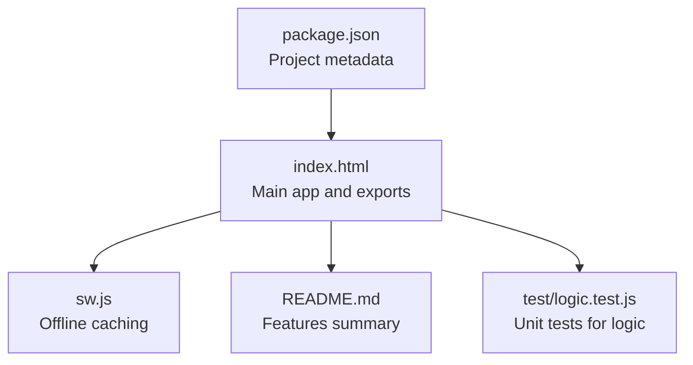
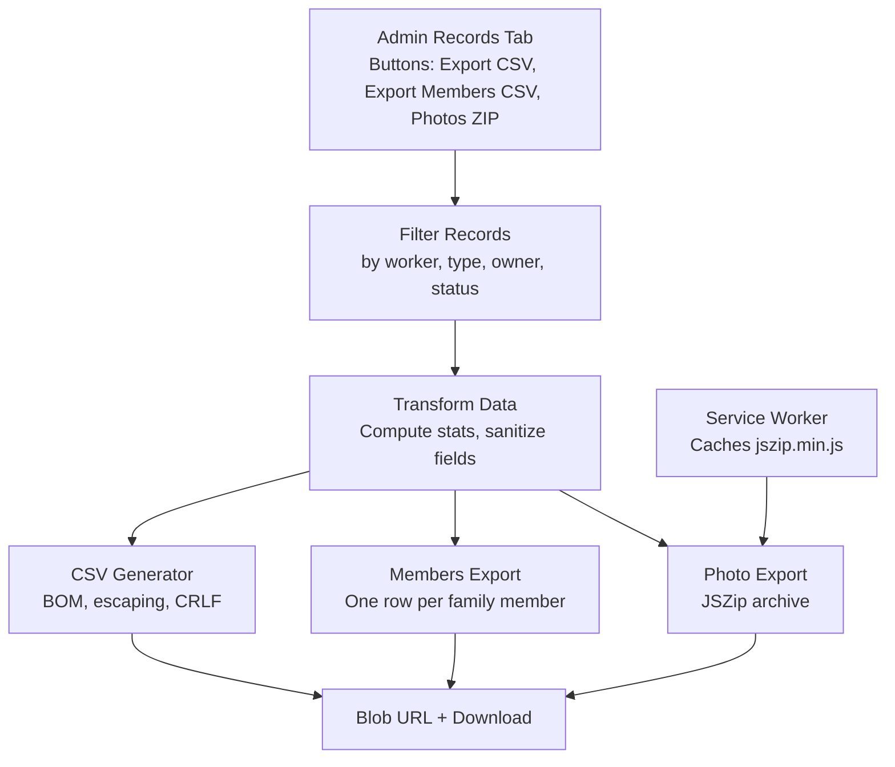
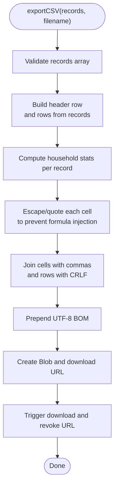
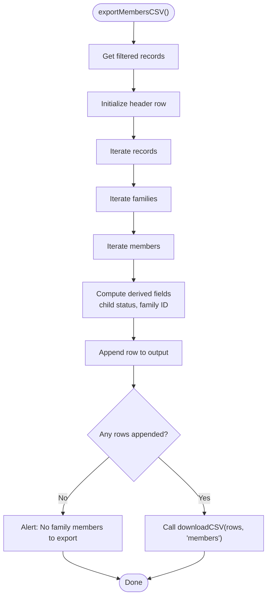
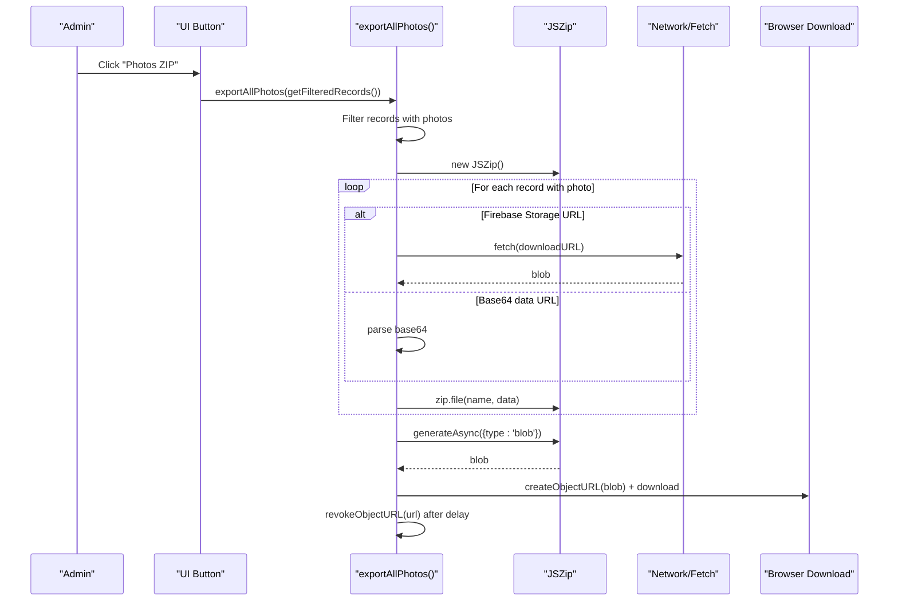
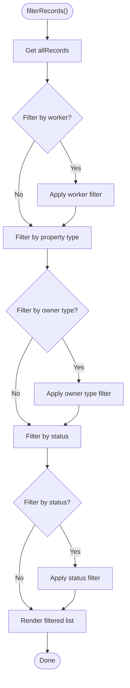
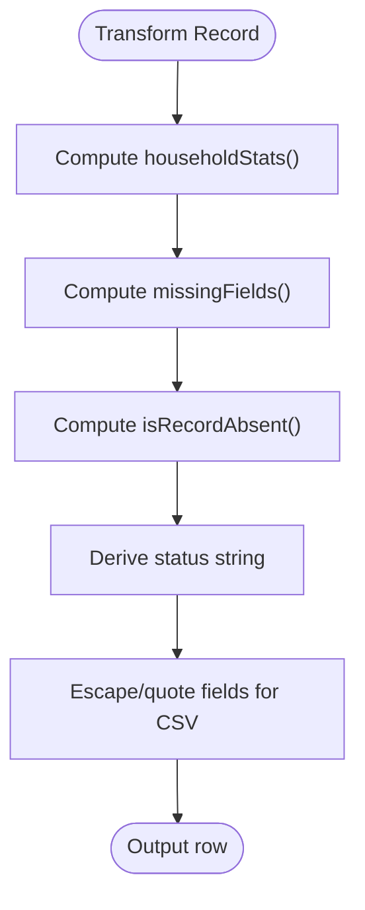
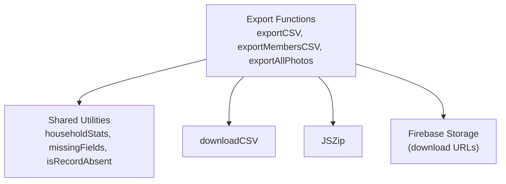

# Data Export & Reporting System

<cite>
**Referenced Files in This Document**
- [index.html](file://index.html)
- [README.md](file://README.md)
- [sw.js](file://sw.js)
- [package.json](file://package.json)
- [test\logic.test.js](file://test/logic.test.js)
</cite>

## Table of Contents
1. [Introduction](#introduction)
2. [Project Structure](#project-structure)
3. [Core Components](#core-components)
4. [Architecture Overview](#architecture-overview)
5. [Detailed Component Analysis](#detailed-component-analysis)
6. [Dependency Analysis](#dependency-analysis)
7. [Performance Considerations](#performance-considerations)
8. [Troubleshooting Guide](#troubleshooting-guide)
9. [Conclusion](#conclusion)

## Introduction
This document describes the data export and reporting system for the Property Tax Collector application. It covers CSV export functionality with UTF-8 BOM handling and formula-injection protection, three export types (property records, household members, and photo archives), filtering mechanisms, data transformation and sanitization, scheduling considerations, and photo ZIP generation using JSZip. It also addresses performance optimization, large dataset handling, and memory management.

## Project Structure
The application is a single-page web app packaged as a self-contained HTML file with embedded logic. Supporting assets include a service worker for caching and a test suite validating core logic.

**Diagram sources**
- [index.html](file://index.html)
- [sw.js](file://sw.js)
- [README.md](file://README.md)
- [test/logic.test.js](file://test/logic.test.js)
- [package.json](file://package.json)

**Section sources**
- [index.html](file://index.html)
- [sw.js](file://sw.js)
- [README.md](file://README.md)
- [package.json](file://package.json)
- [test/logic.test.js](file://test/logic.test.js)

## Core Components
- CSV Export Engine
  - Generates CSV with UTF-8 BOM, CRLF line endings, and formula-injection protection.
  - Provides two export modes: property records and household members.
- Photo Archive Export
  - Creates a ZIP of photos from filtered records using JSZip.
  - Handles both Firebase Storage URLs and legacy base64 data URLs.
- Filtering and Transformation
  - Filters records by worker, property type, owner type, and status.
  - Computes derived statistics (families, population, children, males, females).
  - Sanitizes and escapes CSV cells to prevent formula injection.
- Download Handling
  - Uses Blob URLs and automatic downloads for CSV and ZIP outputs.
- Service Worker
  - Caches core resources including JSZip to support offline photo export.

**Section sources**
- [index.html](file://index.html)
- [sw.js](file://sw.js)

## Architecture Overview
The export system integrates UI controls, filtering logic, data transformation, and download utilities. Photo export leverages JSZip via the service worker’s cached CDN resource.

**Diagram sources**
- [index.html](file://index.html)
- [sw.js](file://sw.js)

**Section sources**
- [index.html](file://index.html)
- [sw.js](file://sw.js)

## Detailed Component Analysis

### CSV Export Engine
- Purpose: Produce standardized CSV exports for administrative reporting.
- UTF-8 BOM and Line Endings
  - Prepend a Byte Order Mark to ensure correct encoding in Excel.
  - Use CRLF line endings for cross-platform compatibility.
- Formula Injection Protection
  - Escape leading equals-signs, plus, minus, at-sign, tabs, and carriage returns by prefixing with an apostrophe.
- Column Mapping (Property Records)
  - Columns include identifiers, locations, types, owner info, status, missing fields, organization/institution details, contact info, GPS accuracy, remarks, derived demographics, worker name, and timestamp.
- Data Sanitization
  - Null/undefined values are converted to empty strings.
  - Text is quoted and internal quotes are escaped for CSV safety.
- Download Handling
  - Creates a Blob with CSV content, generates a temporary URL, triggers a download, and revokes the URL after a short delay.

**Diagram sources**
- [index.html](file://index.html)

**Section sources**
- [index.html](file://index.html)

### Members CSV Export
- Purpose: Export one row per family member across filtered records.
- Output Format
  - Columns include property ID, family ID, head of family, family contact, member details (name, gender, age, child status, relation), and worker name.
- Data Transformation
  - Iterates filtered records and their families/members.
  - Computes child status based on numeric age thresholds.
  - Uses property-scoped family IDs for clarity.

**Diagram sources**
- [index.html](file://index.html)

**Section sources**
- [index.html](file://index.html)

### Photo Archive Export (ZIP)
- Purpose: Package photos from filtered records into a downloadable ZIP.
- Inputs
  - Accepts a record set; defaults to all records if none provided.
  - Filters to records that have a photo.
- Photo Sources
  - Firebase Storage download URLs: fetched as blobs.
  - Legacy base64 data URLs: extracted and added directly to the archive.
- Naming Strategy
  - Uses property ID as the base filename; appends a suffix if duplicates are detected.
- Compression and Download
  - Uses JSZip to generate a Blob asynchronously.
  - Triggers a download with a dated filename and revokes the URL afterward.
- Offline Support
  - JSZip is cached by the service worker to enable offline ZIP creation.

**Diagram sources**
- [index.html](file://index.html)
- [sw.js](file://sw.js)

**Section sources**
- [index.html](file://index.html)
- [sw.js](file://sw.js)

### Filtering Mechanisms
- Filters Supported
  - Worker: filter by assigned worker UID.
  - Property Type: residential, commercial, mixed use, institutional/public.
  - Owner Type: individual, religious, ngo, government.
  - Status: complete, absent, needs correction.
- Implementation
  - Applies filters sequentially to the full records list.
  - Updates the records list display after filtering.

**Diagram sources**
- [index.html](file://index.html)

**Section sources**
- [index.html](file://index.html)

### Data Transformation and Sanitization
- Derived Statistics
  - Families, population, children, males, females computed per record.
- Missing Fields Detection
  - Differentiates between residential and institutional records to report appropriate missing fields.
- Status Computation
  - Determines completion status based on flags and absence criteria.
- Cell Escaping
  - Prevents spreadsheet formula injection by escaping leading special characters.

**Diagram sources**
- [index.html](file://index.html)

**Section sources**
- [index.html](file://index.html)

### Export Scheduling
- Manual Trigger
  - Exports are initiated by clicking buttons in the Admin Records tab.
  - Buttons: Export CSV, Export Members CSV, Photos ZIP.
- No Built-in Scheduler
  - The application does not include automated export scheduling; administrators trigger exports manually after applying desired filters.

**Section sources**
- [index.html](file://index.html)

## Dependency Analysis
- External Dependencies
  - JSZip: Used for ZIP creation in photo export.
  - Firebase: Firestore and Storage integrate with export workflows (download URLs and photo storage).
- Internal Dependencies
  - Filtering and export functions depend on shared transformation utilities (householdStats, missingFields, isRecordAbsent).
  - CSV export depends on the shared downloadCSV routine.

**Diagram sources**
- [index.html](file://index.html)

**Section sources**
- [index.html](file://index.html)

## Performance Considerations
- Large Dataset Handling
  - CSV and Members exports iterate over filtered records; avoid exporting unfiltered datasets to reduce payload.
  - Photo ZIP generation iterates over records with photos; ensure filters are applied to limit scope.
- Memory Management
  - Blob URLs are revoked after a short delay to free memory.
  - JSZip generates the archive asynchronously to avoid blocking the UI.
- Network Efficiency
  - Service worker caches JSZip to support offline ZIP creation.
  - Photo export fetches blobs for remote URLs; consider limiting concurrent fetches for very large selections.
- Encoding and Compatibility
  - UTF-8 BOM ensures correct rendering in Excel; CRLF line endings improve compatibility across platforms.

[No sources needed since this section provides general guidance]

## Troubleshooting Guide
- CSV Not Opening Correctly in Excel
  - Ensure UTF-8 BOM is preserved; verify the file extension is .csv.
  - Confirm CRLF line endings and that no formula-injection prefixes were stripped unintentionally.
- Formula Injection Warnings
  - Leading equals-signs, plus, minus, at-sign, tabs, or carriage returns are escaped; verify the original data and escaping logic.
- Photo ZIP Empty or Partial
  - Verify records have photos; check that JSZip is available (service worker cached).
  - Confirm network connectivity for Firebase Storage URLs; base64 fallback is used when necessary.
- No Records Match Filters
  - Adjust filters to include more records; alerts inform when no records match the current filters.

**Section sources**
- [index.html](file://index.html)
- [sw.js](file://sw.js)

## Conclusion
The Property Tax Collector application provides robust, secure, and compatible export capabilities for administrative reporting. CSV exports use UTF-8 BOM and formula-injection protection, while photo archives are generated efficiently with JSZip. Filtering and transformation utilities ensure accurate, sanitized outputs suitable for downstream analysis. Administrators can trigger exports manually after applying targeted filters, and the service worker enables offline ZIP creation for reliable operation.