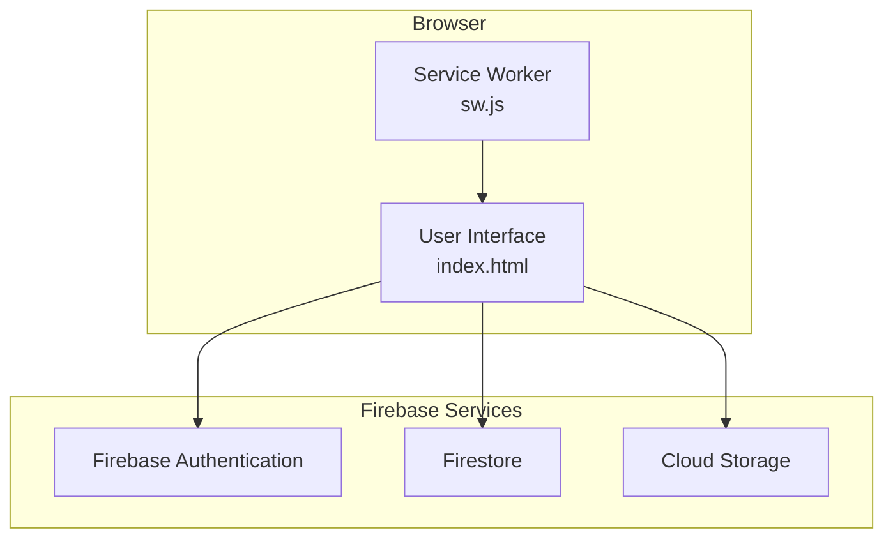
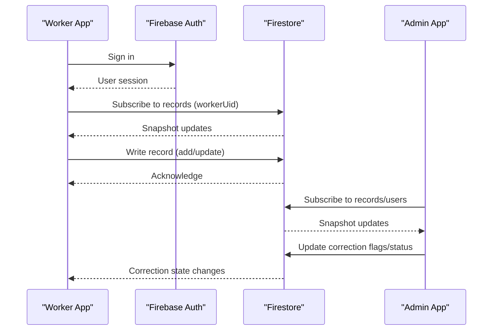
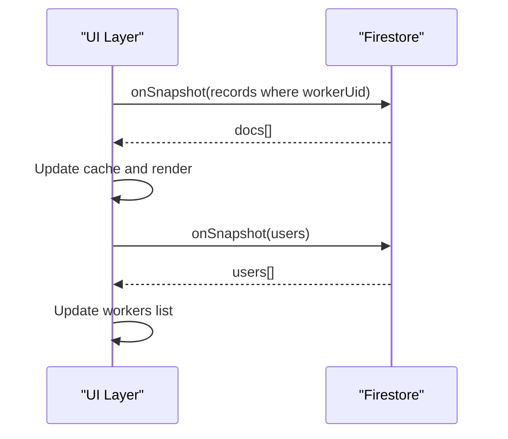
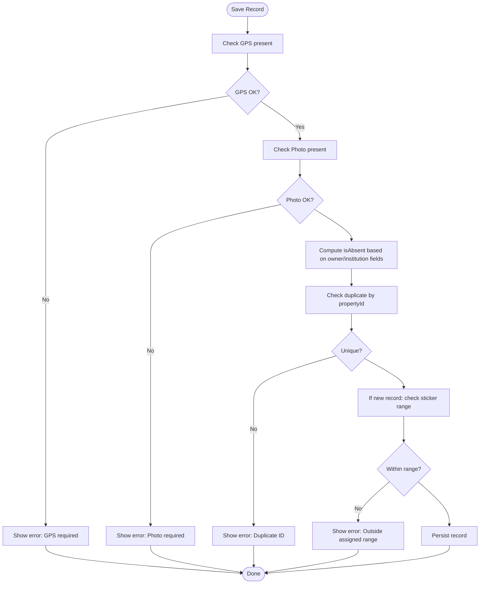
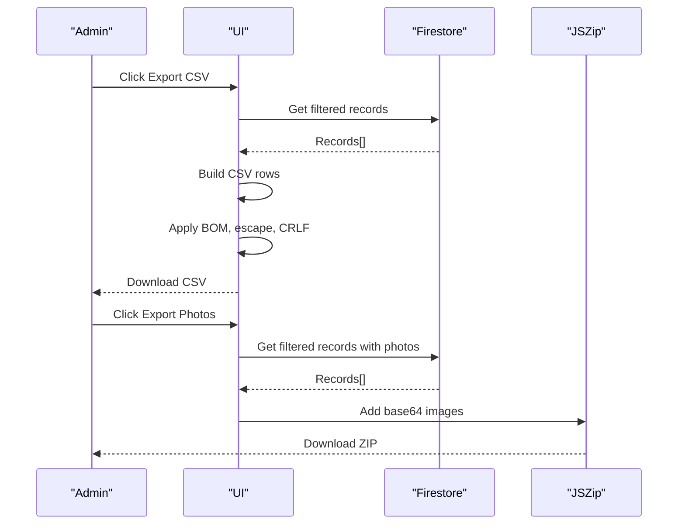
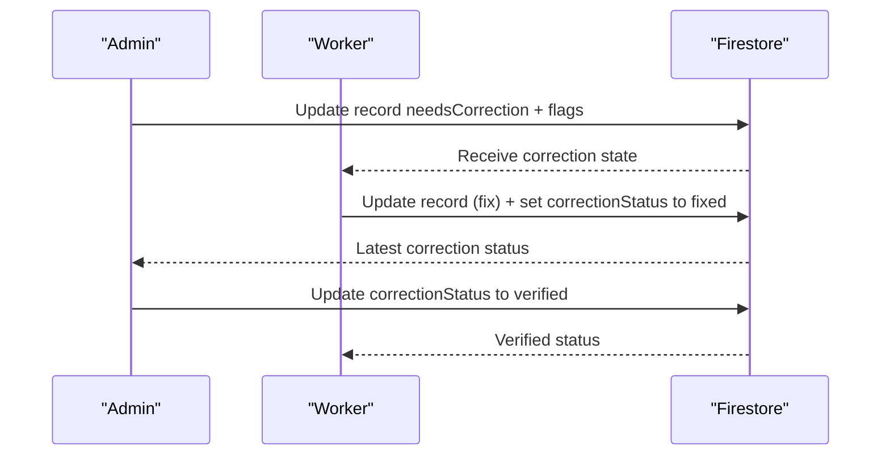
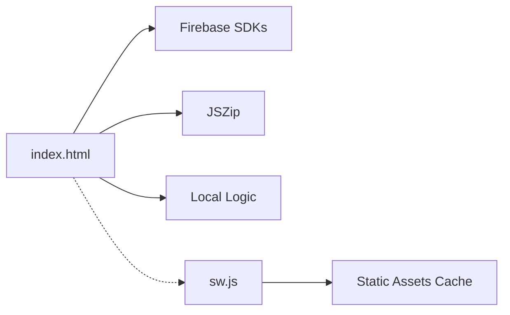
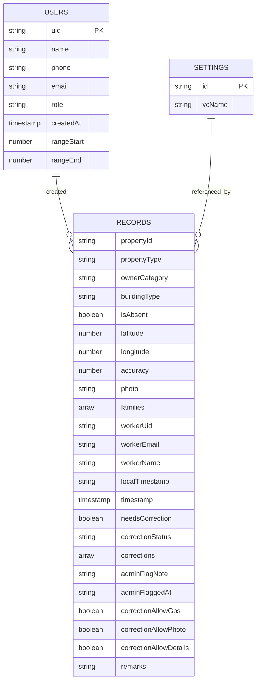

# Data Management

<cite>
**Referenced Files in This Document**
- [index.html](file://index.html)
- [sw.js](file://sw.js)
- [README.md](file://README.md)
- [package.json](file://package.json)
- [test\logic.test.js](file://test\logic.test.js)
</cite>

## Table of Contents
1. [Introduction](#introduction)
2. [Project Structure](#project-structure)
3. [Core Components](#core-components)
4. [Architecture Overview](#architecture-overview)
5. [Detailed Component Analysis](#detailed-component-analysis)
6. [Dependency Analysis](#dependency-analysis)
7. [Performance Considerations](#performance-considerations)
8. [Troubleshooting Guide](#troubleshooting-guide)
9. [Conclusion](#conclusion)
10. [Appendices](#appendices)

## Introduction
This document describes the data management architecture for the Property Tax Collector application. It covers the Firestore database schema design, data models for properties, households, and users, real-time synchronization, validation and quality controls, export systems (including CSV generation with UTF-8 BOM and formula protection), the correction workflow with audit trails, and operational considerations such as security, backups, and performance for large datasets.

## Project Structure
The application is a single-page, offline-capable web app built with vanilla JavaScript and Firebase. Data is stored in Firestore collections and synchronized in real time. A service worker enables offline caching of static assets.

**Diagram sources**
- [index.html](file://index.html)
- [sw.js](file://sw.js)

**Section sources**
- [index.html](file://index.html)
- [sw.js](file://sw.js)

## Core Components
- Real-time listeners for records and users collections
- Validation and quality control logic for completeness and correction states
- Export pipeline for CSV and ZIP photo bundles
- Correction workflow with audit trail and verification
- Offline-first caching via service worker

Key implementation references:
- Real-time listeners and rendering: [index.html](file://index.html)
- Validation helpers: [index.html](file://index.html)
- Export functions: [index.html](file://index.html)
- Service worker caching: [sw.js](file://sw.js)

**Section sources**
- [index.html](file://index.html)
- [sw.js](file://sw.js)

## Architecture Overview
The app uses Firestore collections for persistent storage and Firebase Authentication for identity. Workers and admins subscribe to real-time updates for records and users. Data exports are generated client-side and downloaded to the device.

**Diagram sources**
- [index.html](file://index.html)

**Section sources**
- [index.html](file://index.html)

## Detailed Component Analysis

### Firestore Collections and Schema Design
- records: Stores property records with metadata, geometry, photo, and correction history.
- users: Stores worker/admin profiles and administrative settings.
- settings: Stores app-wide settings (e.g., village council name).

Collections and representative fields:
- records
  - propertyId: string (indexed)
  - propertyType: enum-like string
  - ownerCategory: enum-like string
  - buildingType: enum-like string
  - isAbsent: boolean
  - latitude/longitude: numbers
  - accuracy: number
  - photo: data URL string
  - families: array of objects (headName, contact, members)
  - workerUid/workerEmail/workerName: strings
  - localTimestamp: ISO string
  - timestamp: server timestamp
  - needsCorrection: boolean
  - correctionStatus: enum-like string
  - corrections: array of audit events
  - adminFlagNote, adminFlaggedAt: strings/dates
  - correctionAllowGps/Photo/Details: booleans
  - remarks: string

- users
  - name: string
  - phone: string
  - email: string
  - role: enum-like string
  - createdAt: server timestamp
  - rangeStart/rangeEnd: numbers (optional)

- settings
  - vcName: string

Notes:
- Indexes: Queries filter by workerUid and propertyId; consider adding composite indexes for frequent filters (e.g., workerUid + localTimestamp).
- Security: Access controlled by Firebase Authentication and Firestore Security Rules (not included here).
- Large fields: photo stored as data URL; consider Cloud Storage for larger images in production.

**Section sources**
- [index.html](file://index.html)

### Data Models

#### Property Record Model
- Core identifiers: propertyId, workerUid, localTimestamp
- Classification: propertyType, ownerCategory, buildingType
- Presence: isAbsent flag derived from validation rules
- Location: latitude, longitude, accuracy
- Media: photo (data URL)
- Demographics: families (array of family objects)
- Administrative: needsCorrection, correctionStatus, corrections, adminFlagNote, adminFlaggedAt, correctionAllowGps/Photo/Details
- Metadata: remarks, timestamps

Validation rules:
- GPS and photo required for save
- Owner/institution fields required depending on ownerCategory
- Duplicate detection by propertyId within the collection
- Range enforcement for new records when assigned

Audit trail:
- corrections array captures admin flags and worker fixes with timestamps and permissions

**Section sources**
- [index.html](file://index.html)

#### Household Model
- headName: derived from the first member or tagged Head
- contact: optional phone for the family
- members: array of member objects with name, gender, age, relation

Household statistics:
- Families, population, children (<18), males/females computed from members

**Section sources**
- [index.html](file://index.html)

#### User Model
- name, phone, email, role
- createdAt: server timestamp
- Optional sticker range: rangeStart, rangeEnd

Administrative controls:
- Admin can assign/clear sticker ranges
- Worker profile auto-healing if missing

**Section sources**
- [index.html](file://index.html)

### Real-Time Synchronization
- Worker view subscribes to records filtered by workerUid
- Admin view subscribes to all records and users
- Listeners update cached arrays and trigger UI renders
- Pagination applied for worker lists

**Diagram sources**
- [index.html](file://index.html)

**Section sources**
- [index.html](file://index.html)

### Data Validation and Quality Control
- Required fields enforced at save time:
  - GPS coordinates and photo presence
  - Owner/institution-specific fields based on ownerCategory
- Absent flag computed from presence of owner/institution details
- Duplicate detection by propertyId
- Range enforcement for new records when a sticker range is assigned
- Edit locks during corrections based on admin permissions

**Diagram sources**
- [index.html](file://index.html)

**Section sources**
- [index.html](file://index.html)

### Export System
- CSV export:
  - UTF-8 BOM for Excel compatibility
  - Formula-injection protection by prefixing risky leading characters with '
  - CRLF line endings
  - Dated filename with property-tax- prefix
- Members CSV:
  - One row per family member across filtered records
- Photos ZIP:
  - Client-side generation using JSZip
  - Downloads as dated archive

**Diagram sources**
- [index.html](file://index.html)

**Section sources**
- [index.html](file://index.html)

### Correction Workflow and Audit Trails
- Admin flags records needing correction with notes and allowed redo actions
- Worker updates the record; latest correction marked as fixed
- Admin verifies correction; status updated to verified
- Full audit trail maintained in the corrections array

**Diagram sources**
- [index.html](file://index.html)

**Section sources**
- [index.html](file://index.html)

### Data Security Considerations
- Authentication: Firebase Authentication secures access; only authenticated users can write records.
- Authorization: Firestore Security Rules govern read/write permissions (external to this repository).
- Data protection:
  - CSV escaping prevents formula injection
  - Photos exported as ZIP to reduce exposure
  - Worker profile auto-heal ensures continuity

**Section sources**
- [index.html](file://index.html)

### Backup Strategies
- Firestore snapshots and client-side caching provide resilience against transient failures.
- Admin can export all data as CSV and photos as ZIP for off-device backups.
- Reset operation deletes all records and users in batches; use with caution.

**Section sources**
- [index.html](file://index.html)

## Dependency Analysis
- index.html depends on:
  - Firebase SDKs (auth, firestore, storage)
  - JSZip for photo export
  - Local logic for validation and stats
- sw.js depends on:
  - Static asset caching for offline support

**Diagram sources**
- [index.html](file://index.html)
- [sw.js](file://sw.js)

**Section sources**
- [index.html](file://index.html)
- [sw.js](file://sw.js)

## Performance Considerations
- Real-time listeners:
  - Use onSnapshot for live updates; unsubscribe before re-binding to prevent duplicates
  - Paginate worker lists to limit DOM and memory footprint
- Export performance:
  - Batch deletions for reset operations
  - Client-side ZIP generation; consider progress feedback for large sets
- Data volume:
  - Consider storing large images in Cloud Storage and saving URLs in Firestore
  - Add indexes for frequent queries (workerUid + localTimestamp, propertyId)
- Offline:
  - Service worker caches core scripts and HTML for reliable startup

[No sources needed since this section provides general guidance]

## Troubleshooting Guide
Common issues and resolutions:
- Authentication errors:
  - Verify Firebase config and network connectivity
  - Check user roles and account activation
- Real-time sync issues:
  - Ensure listeners are attached after auth state resolves
  - Confirm Firestore rules permit read/write for the user role
- Export failures:
  - Confirm JSZip is loaded; retry with stable connection
  - For photos, ensure records have photo data URLs
- Correction stuck:
  - Check correctionStatus and corrections array for latest event
  - Admin must verify the latest correction to finalize

**Section sources**
- [index.html](file://index.html)

## Conclusion
The Property Tax Collector app implements a robust, real-time data management system on Firestore with strong validation, correction workflows, and secure exports. The design balances usability with data integrity, enabling efficient field collection and administration. For large deployments, consider Cloud Storage for media, Firestore indexes, and expanded security rules.

[No sources needed since this section summarizes without analyzing specific files]

## Appendices

### Appendix A: Data Model Diagram

**Diagram sources**
- [index.html](file://index.html)

### Appendix B: Test Coverage Highlights
- missingFields: validates required owner/institution fields
- isRecordAbsent: legacy and explicit flags
- needsFollowUp: correction and absence logic
- householdStats: population and gender aggregation
- correctionState: status transitions
- getExifOrientation: JPEG EXIF parsing

**Section sources**
- [test\logic.test.js](file://test\logic.test.js)