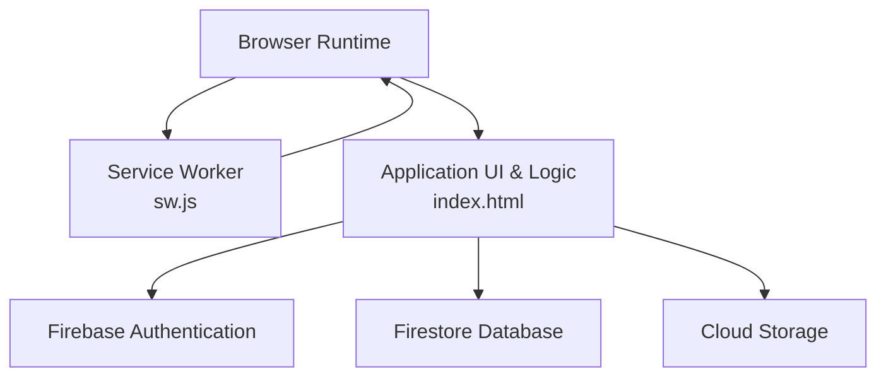
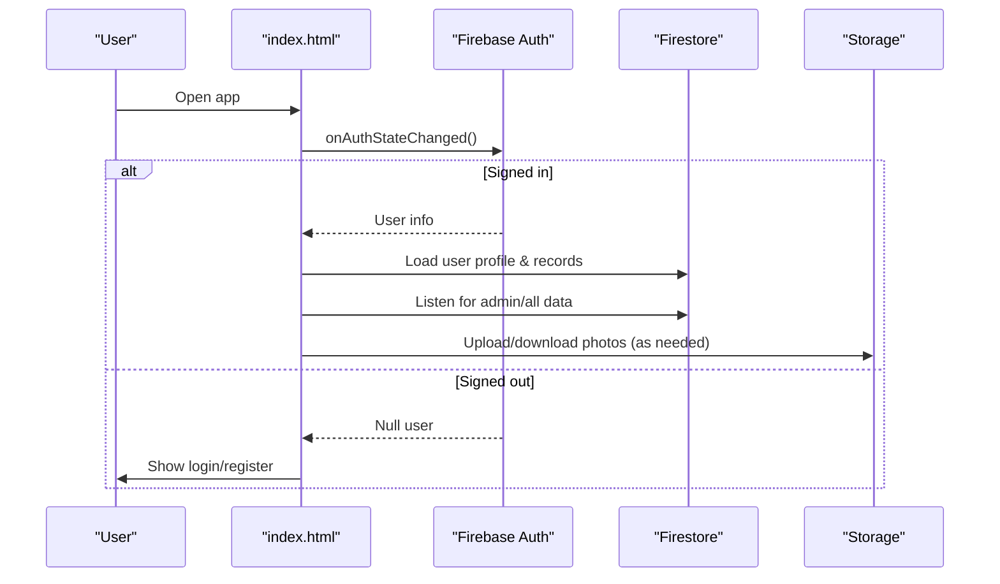
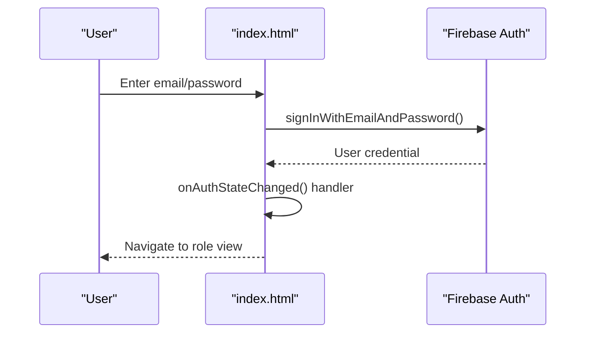
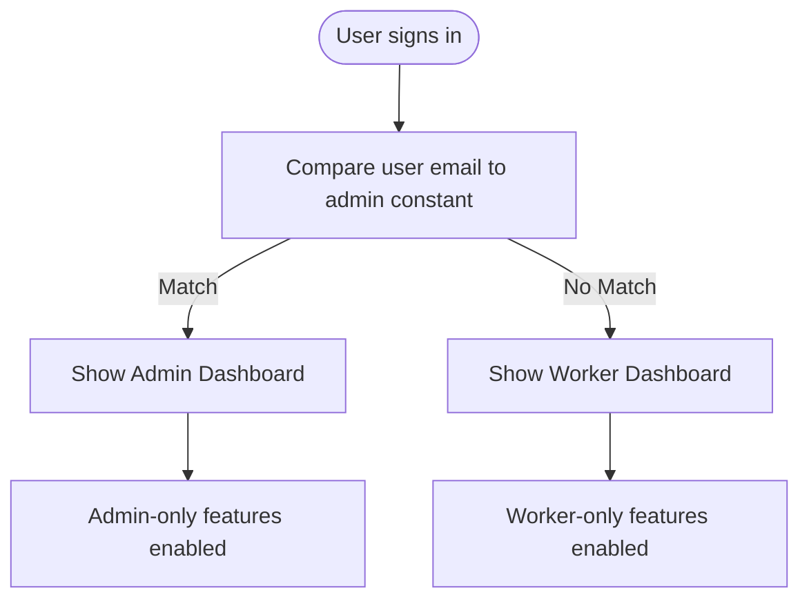
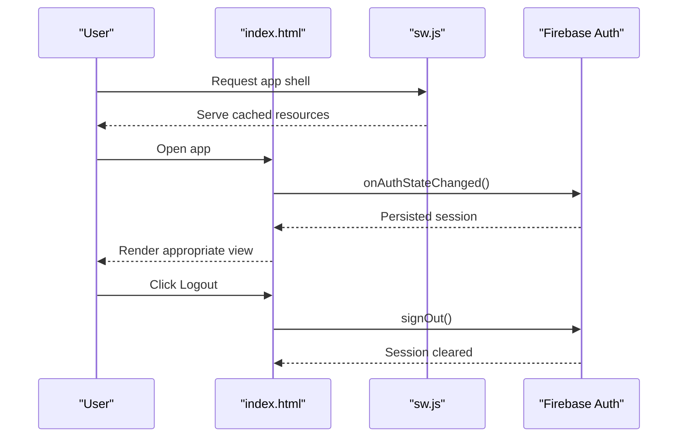
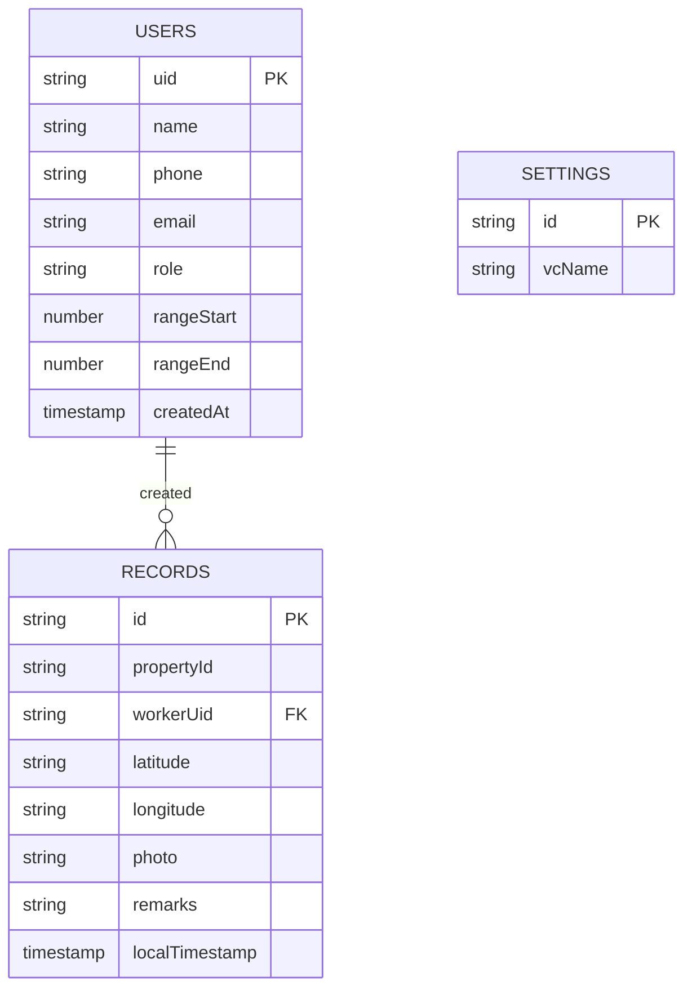
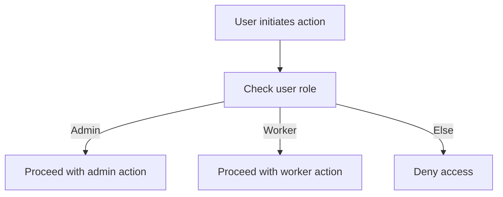
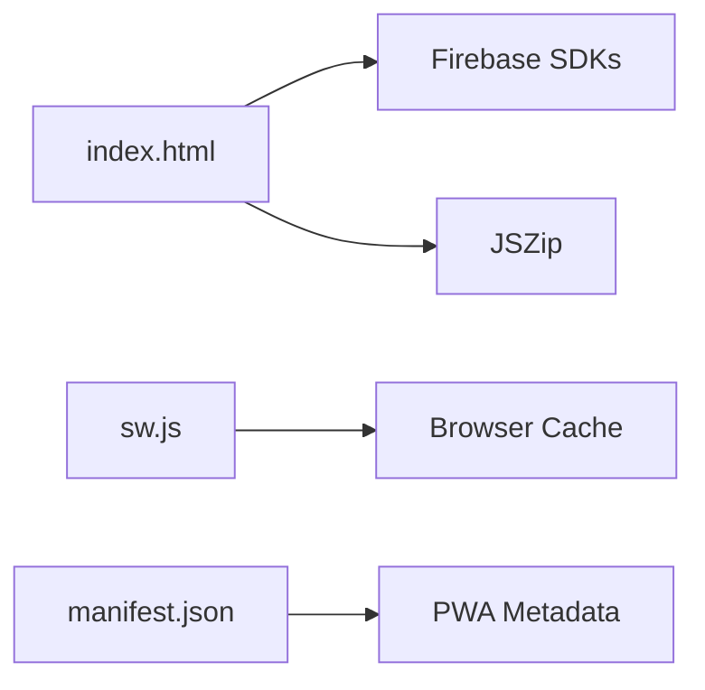

# Data Security & Access Control

<cite>
**Referenced Files in This Document**
- [README.md](file://README.md)
- [index.html](file://index.html)
- [sw.js](file://sw.js)
- [manifest.json](file://manifest.json)
- [package.json](file://package.json)
- [test\logic.test.js](file://test/logic.test.js)
</cite>

## Table of Contents
1. [Introduction](#introduction)
2. [Project Structure](#project-structure)
3. [Core Components](#core-components)
4. [Architecture Overview](#architecture-overview)
5. [Detailed Component Analysis](#detailed-component-analysis)
6. [Dependency Analysis](#dependency-analysis)
7. [Performance Considerations](#performance-considerations)
8. [Troubleshooting Guide](#troubleshooting-guide)
9. [Conclusion](#conclusion)
10. [Appendices](#appendices)

## Introduction
This document analyzes the Property Tax Collector application’s data security and access control measures. It focuses on Firebase Authentication integration, role-based access control (worker vs admin), session management, data segregation, and operational controls. It also outlines encryption considerations, credential handling, authorization patterns, audit logging mechanisms, GDPR considerations, data retention and deletion, and security testing and incident response practices.

## Project Structure
The application is a single-page, offline-capable Progressive Web App (PWA) built with HTML/CSS/JavaScript. It integrates Firebase services for authentication, real-time Firestore database, and Cloud Storage. Security-relevant assets include:
- index.html: Application entry point implementing authentication, authorization, UI routing, and client-side logic
- sw.js: Service worker enabling offline caching and resource retrieval
- manifest.json: PWA configuration
- package.json: Project metadata and test script
- test/logic.test.js: Unit tests for core logic functions

**Diagram sources**
- [index.html](file://index.html)
- [sw.js](file://sw.js)

**Section sources**
- [README.md](file://README.md)
- [index.html](file://index.html)
- [sw.js](file://sw.js)
- [manifest.json](file://manifest.json)
- [package.json](file://package.json)

## Core Components
- Firebase Authentication: Email/password sign-in/sign-up, password reset, and session lifecycle via onAuthStateChanged.
- Role-based access control: Worker and admin roles derived from user email comparison against a configured admin email constant.
- Real-time Firestore: Users and records collections; real-time listeners for admin dashboards; worker-specific record queries.
- Cloud Storage: Photo storage URLs persisted in records; full-size photo preview capability.
- Service Worker: Offline-first caching of static resources and selected external libraries.
- Client-side logic: Validation, correction workflow, export routines, and UI rendering.

Security-relevant highlights:
- Authentication and authorization are enforced in the browser (client-side) using Firebase Auth and Firestore security rules (not included here).
- Session management relies on Firebase Auth persistence and onAuthStateChanged callbacks.
- Data segregation is implicit by user role and Firestore queries; admin has broad access; worker access is constrained by UI logic and Firestore rules.

**Section sources**
- [index.html](file://index.html)
- [sw.js](file://sw.js)

## Architecture Overview
The runtime architecture ties together UI, authentication, and backend services.

**Diagram sources**
- [index.html](file://index.html)

**Section sources**
- [index.html](file://index.html)

## Detailed Component Analysis

### Firebase Authentication Integration
- Initialization and state monitoring:
  - Firebase app initialized with compat SDKs.
  - onAuthStateChanged drives UI transitions and role determination.
- Sign-in and registration:
  - Email/password sign-in and registration with client-side validation.
  - Registration auto-creates a worker profile in the users collection.
- Password reset and change:
  - Password reset email sent via Firebase Auth.
  - Password change requires current credentials re-authentication.
- Logout:
  - Explicit confirmation modal triggers Firebase sign-out.

**Diagram sources**
- [index.html](file://index.html)

**Section sources**
- [index.html](file://index.html)

### Role-Based Access Control (RBAC): Worker vs Admin
- Role determination:
  - Admin role is derived from comparing the signed-in user’s email to a configured admin email constant.
- UI and feature gating:
  - Admin dashboard and administrative actions (add/remove workers, exports, settings) are shown only to admins.
  - Worker view restricts actions to their own records and correction workflow initiated by admins.
- Worker auto-heal:
  - On sign-in, if a worker lacks a Firestore profile, a minimal profile is merged to ensure functional access.

**Diagram sources**
- [index.html](file://index.html)

**Section sources**
- [index.html](file://index.html)

### Session Management
- Persistence and lifecycle:
  - Uses Firebase Auth onAuthStateChanged to manage session state.
  - Logout requires confirmation and invokes Firebase sign-out.
- Offline behavior:
  - Service worker caches static resources and selected external libraries, enabling offline loading of the app shell.

**Diagram sources**
- [index.html](file://index.html)
- [sw.js](file://sw.js)

**Section sources**
- [index.html](file://index.html)
- [sw.js](file://sw.js)

### Authorization Patterns and Data Segregation
- Firestore collections:
  - Users collection stores profiles and roles.
  - Records collection stores property data; each record includes workerUid and timestamps.
  - Settings collection stores app-level configuration (e.g., village council name).
- Worker access:
  - Worker views and lists are filtered by workerUid.
  - Worker can only edit records they created; admin can override and initiate corrections.
- Admin access:
  - Admin listens to all records and users; can export, assign ranges, and manage workers.
- Data segregation:
  - UI logic and Firestore queries enforce segregation by workerUid; Firestore security rules govern enforcement.

**Diagram sources**
- [index.html](file://index.html)

**Section sources**
- [index.html](file://index.html)

### Data Encryption and Secure Credential Handling
- Transport encryption:
  - Firebase SDKs are loaded over HTTPS; Firestore and Storage connections occur over TLS.
- At-rest encryption:
  - Firestore and Storage encryption-at-rest is managed by Firebase; client-side does not implement additional encryption.
- Credential handling:
  - Passwords are transmitted to Firebase Auth endpoints; client-side hashing is not implemented.
  - Password change requires current credentials re-authentication via EmailAuthProvider credential.

Recommendations:
- Enforce strong password policies server-side via Firebase Authentication rules.
- Consider adding client-side hashing and key derivation for sensitive data if storing beyond Firebase.

**Section sources**
- [index.html](file://index.html)

### Audit Logging Mechanisms
- Built-in indicators:
  - Records include localTimestamp for submission time.
  - Admin overview displays totals, completion metrics, and daily activity.
- Suggested enhancements:
  - Add explicit audit logs (e.g., user actions, record edits, corrections) to a dedicated collection with timestamps and actor identifiers.
  - Include structured events for deletions, exports, and administrative actions.

**Section sources**
- [index.html](file://index.html)

### Authentication Token Handling
- Tokens:
  - Firebase Auth manages ID tokens and refresh tokens transparently.
- Client behavior:
  - onAuthStateChanged ensures UI updates without manual token parsing.
  - No custom token handling or JWT verification logic is implemented.

**Section sources**
- [index.html](file://index.html)

### Authorization Checks and Permission Examples
- Example checks:
  - Admin-only action: Add worker account creation uses a secondary Firebase app instance to avoid affecting the admin session.
  - Admin-only action: Reset everything deletes all records and worker profiles; worker credentials may persist in Firebase Authentication and require removal from the Firebase Console.
  - Worker-only action: Edit own profile; change password requires re-authentication with current credentials.

**Diagram sources**
- [index.html](file://index.html)

**Section sources**
- [index.html](file://index.html)

### Data Access Patterns
- Real-time listeners:
  - Admin dashboard subscribes to all records and users for overview and filtering.
  - Worker dashboard subscribes to records filtered by workerUid.
- Export patterns:
  - Admin can export filtered records and photos; worker can export personal records.
- Photo handling:
  - Photos are stored in Cloud Storage; URLs are embedded in records for later retrieval.

**Section sources**
- [index.html](file://index.html)

### Security Best Practices Observed
- HTTPS-only external dependencies.
- Client-side validation for registration and password changes.
- Confirmation modals for destructive actions (logout, delete record, reset).
- Service worker caching for offline resilience.

**Section sources**
- [index.html](file://index.html)
- [sw.js](file://sw.js)

## Dependency Analysis
External dependencies and integrations:
- Firebase SDKs (compat): Authentication, Firestore, Storage
- JSZip: Used for packaging exported photos
- Service worker: Caches app shell and selected libraries

**Diagram sources**
- [index.html](file://index.html)
- [sw.js](file://sw.js)
- [manifest.json](file://manifest.json)

**Section sources**
- [index.html](file://index.html)
- [sw.js](file://sw.js)
- [manifest.json](file://manifest.json)
- [package.json](file://package.json)

## Performance Considerations
- Offline-first design reduces latency and improves reliability in low-connectivity environments.
- Real-time listeners enable near-instant UI updates but should be unsubscribed appropriately to prevent memory leaks.
- Export operations (CSV, ZIP) process large datasets; consider batching and progress feedback.

[No sources needed since this section provides general guidance]

## Troubleshooting Guide
Common issues and resolutions:
- Authentication errors:
  - Friendly error messages are displayed for invalid credentials, weak passwords, and other Auth exceptions.
- Password reset failures:
  - Ensure the email exists in Firebase Authentication; verify spam/junk folders.
- Logout problems:
  - Confirm onAuthStateChanged clears UI and closes modals; check for persistent modal overlays blocking navigation.
- Service worker caching:
  - If updates are not reflected, clear browser cache or reload with cache bypass.

**Section sources**
- [index.html](file://index.html)
- [sw.js](file://sw.js)

## Conclusion
The Property Tax Collector application leverages Firebase Authentication and Firestore to implement role-based access control and session management. Its PWA architecture supports offline operation, while UI logic enforces data segregation and administrative safeguards. While transport encryption is handled by Firebase, additional audit logging, explicit audit trails, and stronger client-side credential handling would further strengthen security posture. Administrative reset and deletion actions require careful coordination with Firebase Authentication to fully purge credentials.

[No sources needed since this section summarizes without analyzing specific files]

## Appendices

### GDPR Compliance Considerations
- Lawfulness, fairness, transparency:
  - Provide clear privacy notices and obtain consent for data processing.
- Purpose limitation and data minimization:
  - Collect only property and household data necessary for tax administration.
- Storage limitation:
  - Define retention periods for records and apply automated deletion policies.
- Integrity and confidentiality:
  - Rely on Firebase encryption; consider additional client-side protections for sensitive data.
- Data subject rights:
  - Enable data portability (CSV exports) and right to erasure (secure deletion procedures).

[No sources needed since this section provides general guidance]

### Data Retention Policies and Secure Deletion Procedures
- Retention:
  - Establish policy for keeping records (e.g., N years post-assessment).
- Deletion:
  - Admin reset deletes records and worker profiles; worker credentials may persist in Firebase Authentication and require manual removal from the Firebase Console.
- Evidence:
  - Maintain audit logs of deletions and exports.

**Section sources**
- [index.html](file://index.html)

### Security Testing Approaches and Vulnerability Assessment
- Unit tests:
  - Core logic tests validate missing fields, absence detection, follow-up logic, and correction states.
- Manual testing:
  - Verify role-based UI gating, admin-only actions, and worker access boundaries.
- Penetration testing:
  - Assess client-side logic bypass attempts, unauthorized Firestore queries, and insecure direct object references.
- Static analysis:
  - Review hardcoded constants (e.g., admin email) and ensure secrets are not exposed.

**Section sources**
- [test/logic.test.js](file://test/logic.test.js)

### Incident Response Procedures
- Immediate steps:
  - Isolate affected accounts, revoke compromised sessions, and monitor for suspicious activity.
- Forensic analysis:
  - Review audit logs (if implemented) and export timelines.
- Remediation:
  - Patch vulnerabilities, rotate credentials, and harden Firestore security rules.
- Communication:
  - Notify stakeholders per policy and document lessons learned.

[No sources needed since this section provides general guidance]