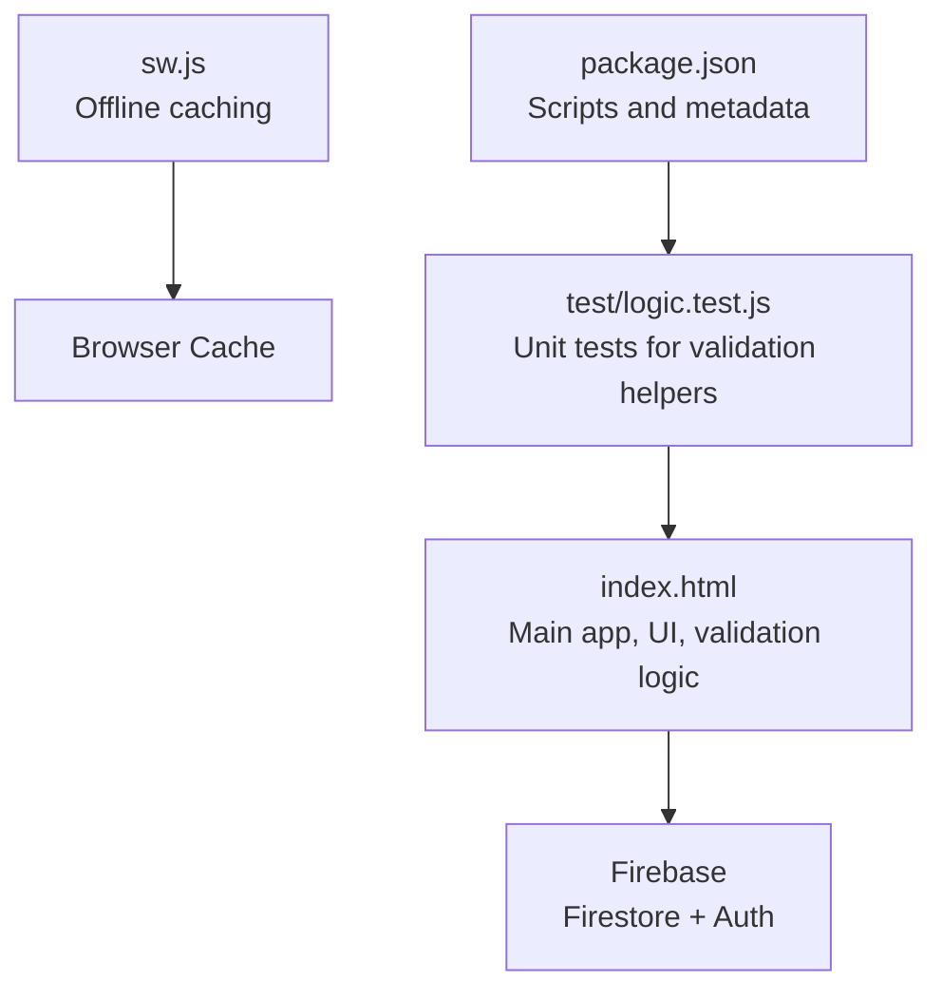
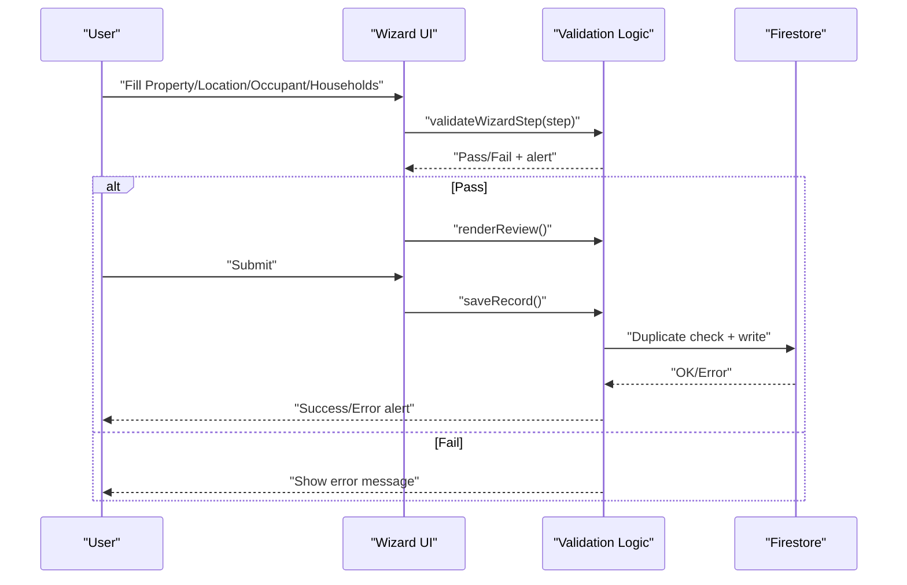
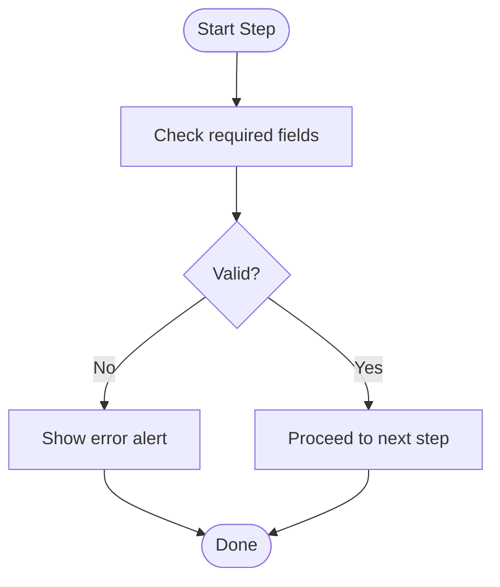
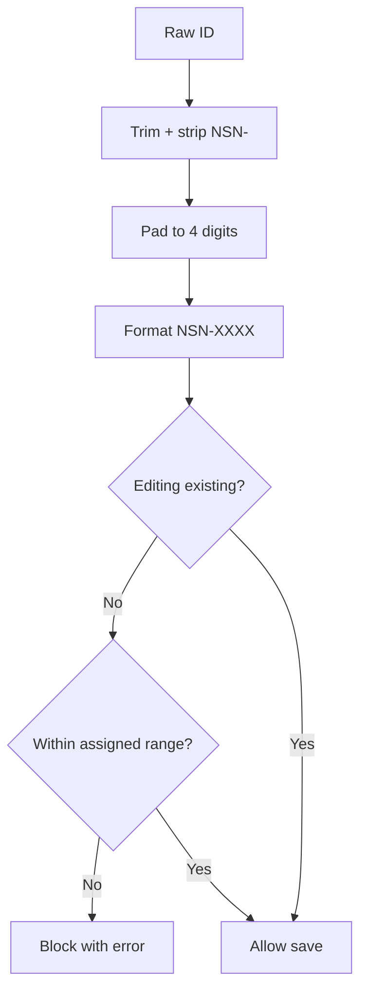
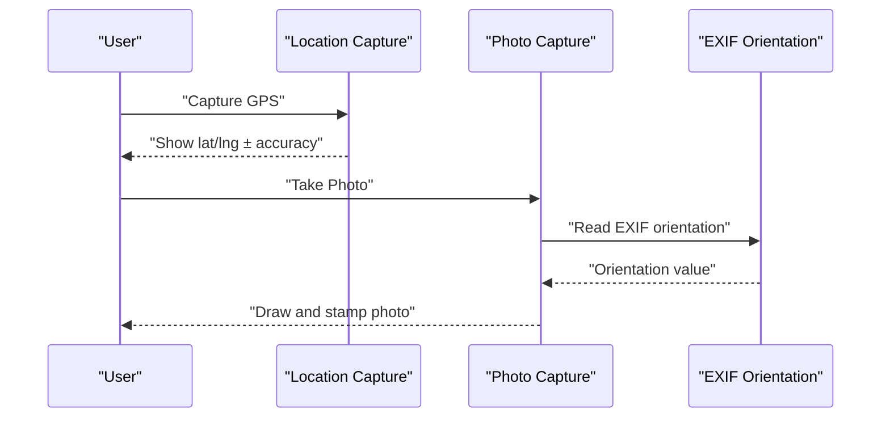
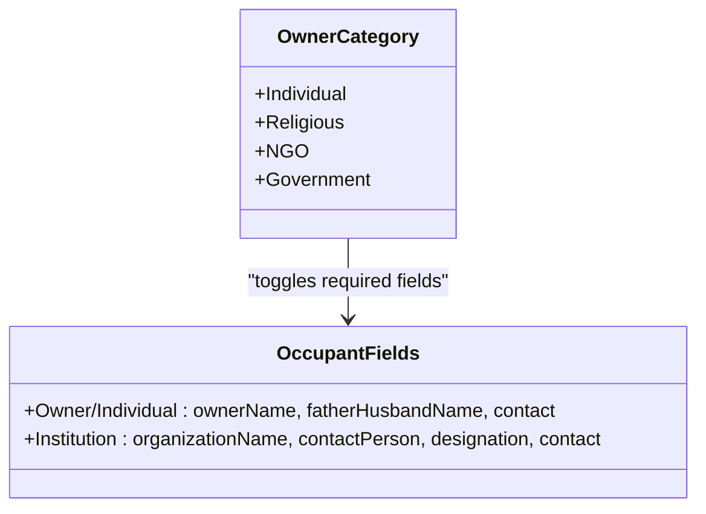
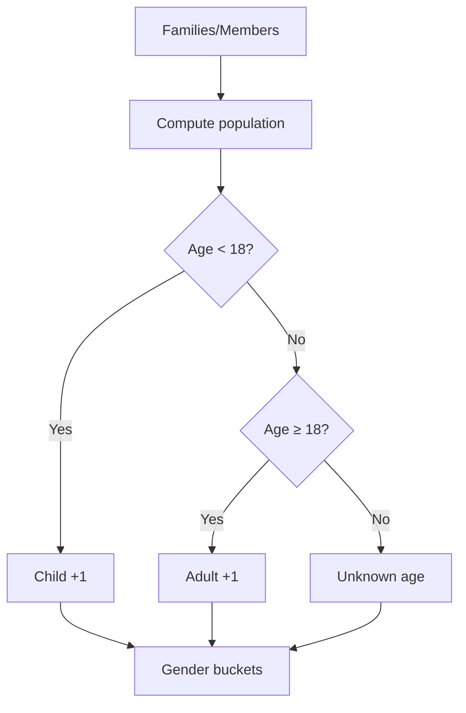
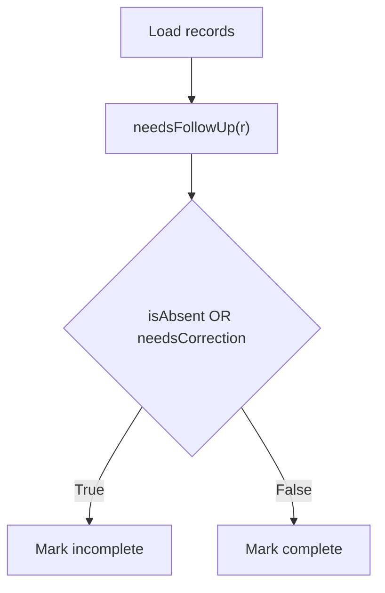
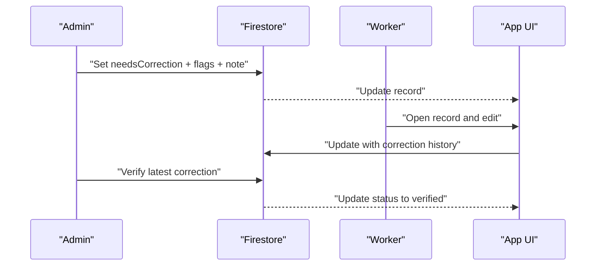
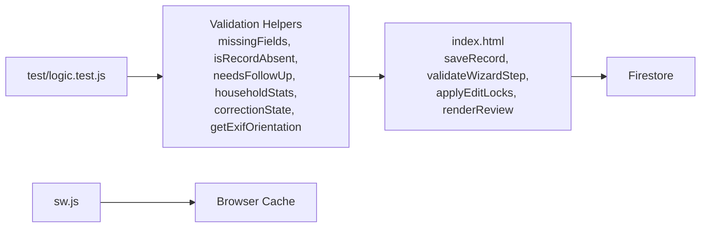

# Data Validation & Quality Control

<cite>
**Referenced Files in This Document**
- [index.html](file://index.html)
- [README.md](file://README.md)
- [test/logic.test.js](file://test/logic.test.js)
- [sw.js](file://sw.js)
- [package.json](file://package.json)
</cite>

## Table of Contents
1. [Introduction](#introduction)
2. [Project Structure](#project-structure)
3. [Core Components](#core-components)
4. [Architecture Overview](#architecture-overview)
5. [Detailed Component Analysis](#detailed-component-analysis)
6. [Dependency Analysis](#dependency-analysis)
7. [Performance Considerations](#performance-considerations)
8. [Troubleshooting Guide](#troubleshooting-guide)
9. [Conclusion](#conclusion)
10. [Appendices](#appendices)

## Introduction
This document describes the data validation and quality control systems in the Property Tax Collector application. It explains the multi-layered validation approach implemented in the client-side application, including:
- Frontend form validation and guided wizard steps
- GPS capture and photo requirements
- Household completeness rules and demographic data validation
- Property ID normalization and sticker range enforcement
- Follow-up system for incomplete records
- Correction workflows initiated by administrators
- Audit trail mechanisms for corrections
- Automated quality checks, manual verification processes, and data consistency enforcement strategies

The application is a single-page, offline-capable web app that validates data locally before saving to Firestore, and provides clear user feedback via alerts and visual indicators.

**Section sources**
- [README.md:1-36](file://README.md#L1-L36)

## Project Structure
The project is organized around a single HTML file that contains all UI, logic, and styling. Supporting assets include a service worker for offline caching, tests for core logic, and basic metadata.

**Diagram sources**
- [index.html:1-2605](file://index.html#L1-L2605)
- [sw.js:1-45](file://sw.js#L1-L45)
- [test/logic.test.js:1-223](file://test/logic.test.js#L1-L223)
- [package.json:1-10](file://package.json#L1-L10)

**Section sources**
- [index.html:1-2605](file://index.html#L1-L2605)
- [sw.js:1-45](file://sw.js#L1-L45)
- [test/logic.test.js:1-223](file://test/logic.test.js#L1-L223)
- [package.json:1-10](file://package.json#L1-L10)

## Core Components
- Wizard-driven form with step gating and review step
- Property ID normalization and sticker range enforcement
- GPS capture and photo stamping with EXIF orientation handling
- Owner category classification and occupant field sets
- Household drafting with family head and member relations
- Automated completeness checks and follow-up determination
- Correction workflow with admin flags and worker re-do permissions
- Audit trail of correction events

Key constants and helpers:
- Owner categories and institution detection
- Relations taxonomy for household members
- Property types supporting households
- Validation helpers for missing fields, absence, follow-up, stats, and correction state

**Section sources**
- [index.html:1229-1248](file://index.html#L1229-L1248)
- [index.html:1255-1262](file://index.html#L1255-L1262)
- [index.html:1315-1333](file://index.html#L1315-L1333)
- [index.html:1785-1835](file://index.html#L1785-L1835)

## Architecture Overview
The validation and quality control pipeline spans UI, client-side logic, and Firestore persistence.

**Diagram sources**
- [index.html:1315-1341](file://index.html#L1315-L1341)
- [index.html:1484-1623](file://index.html#L1484-L1623)

## Detailed Component Analysis

### Multi-Layered Validation Pipeline
- Step gating enforces required fields per step.
- Review step consolidates and flags missing items.
- Save-time validations enforce GPS/photo presence, completeness flags, duplicate prevention, and sticker range checks.

**Diagram sources**
- [index.html:1315-1333](file://index.html#L1315-L1333)

**Section sources**
- [index.html:1315-1333](file://index.html#L1315-L1333)
- [index.html:1343-1375](file://index.html#L1343-L1375)

### Property ID Normalization and Sticker Range Enforcement
- Canonical ID format: NSN-0000
- Range enforcement blocks new records outside assigned sticker range for workers with a range
- Editing existing records bypasses range checks

**Diagram sources**
- [index.html:1379-1382](file://index.html#L1379-L1382)
- [index.html:1518-1525](file://index.html#L1518-L1525)

**Section sources**
- [index.html:1379-1382](file://index.html#L1379-L1382)
- [index.html:1518-1525](file://index.html#L1518-L1525)

### GPS Accuracy Checks and Photo Requirements
- GPS capture requires permission and displays accuracy
- Photo capture stamps ID, GPS coordinates, timestamp, and village council name
- EXIF orientation is detected and corrected to ensure proper display and stamp placement

**Diagram sources**
- [index.html:1926-1942](file://index.html#L1926-L1942)
- [index.html:1838-1916](file://index.html#L1838-L1916)
- [index.html:1752-1784](file://index.html#L1752-L1784)

**Section sources**
- [index.html:1926-1942](file://index.html#L1926-L1942)
- [index.html:1838-1916](file://index.html#L1838-L1916)
- [index.html:1752-1784](file://index.html#L1752-L1784)

### Owner Categories and Occupant Field Sets
- Owner categories include Individual, Religious, NGO, Government
- Institutions use a different set of occupant fields; individuals use owner/father/husband/contact
- UI toggles required fields based on owner category

**Diagram sources**
- [index.html:1229-1238](file://index.html#L1229-L1238)
- [index.html:1494-1504](file://index.html#L1494-L1504)

**Section sources**
- [index.html:1229-1238](file://index.html#L1229-L1238)
- [index.html:1494-1504](file://index.html#L1494-L1504)

### Building Types and Demographics
- Building types include RCC, Semi RCC, Assam Type
- Demographic data includes gender and age; children are defined as age < 18
- Stats computed across families and members

**Diagram sources**
- [index.html:1809-1829](file://index.html#L1809-L1829)

**Section sources**
- [index.html:1809-1829](file://index.html#L1809-L1829)

### Follow-Up System and Incomplete Records
- A record is considered absent if required details are missing
- Legacy fallback logic supports records without explicit absent flag
- Follow-up badge aggregates incomplete records for the worker

**Diagram sources**
- [index.html:1785-1787](file://index.html#L1785-L1787)
- [index.html:1802-1808](file://index.html#L1802-L1808)

**Section sources**
- [index.html:1785-1787](file://index.html#L1785-L1787)
- [index.html:1802-1808](file://index.html#L1802-L1808)

### Correction Workflow and Audit Trail
- Admin can flag a record for correction with optional permissions to re-capture GPS, retake photos, or fix details
- Worker updates the record; the system logs the action as “fixed”
- Admin verifies the correction; the latest correction entry is marked “verified”

**Diagram sources**
- [index.html:2152-2180](file://index.html#L2152-L2180)
- [index.html:2183-2191](file://index.html#L2183-L2191)
- [index.html:1584-1603](file://index.html#L1584-L1603)

**Section sources**
- [index.html:2152-2180](file://index.html#L2152-L2180)
- [index.html:2183-2191](file://index.html#L2183-L2191)
- [index.html:1584-1603](file://index.html#L1584-L1603)

### Validation Rules Summary
- Property step: Property ID, Property Type, Owner Category, Building Type are required
- Location step: GPS coordinates and photo are required
- Completeness: Owner name, father/husband name, and contact are required for non-institution records; organization name, contact person, designation, and contact are required for institutions
- Duplicate prevention: Property ID uniqueness enforced per worker
- Sticker range: New records validated against assigned sticker range for workers with a range

**Section sources**
- [index.html:1315-1333](file://index.html#L1315-L1333)
- [index.html:1506-1515](file://index.html#L1506-L1515)
- [index.html:1530-1545](file://index.html#L1530-L1545)
- [index.html:1518-1525](file://index.html#L1518-L1525)

### User Feedback Patterns and Error Handling
- Alerts use color-coded messages (success, error, info, warning)
- Visual indicators highlight required fields and completion status
- Step gating prevents progression until required fields are satisfied
- Clear messaging for GPS/photo requirements and correction permissions

**Section sources**
- [index.html:1208-1219](file://index.html#L1208-L1219)
- [index.html:1315-1333](file://index.html#L1315-L1333)
- [index.html:1685-1709](file://index.html#L1685-L1709)

### Data Quality Metrics
- Worker dashboards show totals, completions, incompletions, and daily counts
- Admin dashboard shows overall completion percentage and correction backlog
- Population and household metrics aggregated across all records

**Section sources**
- [index.html:1969-2000](file://index.html#L1969-L2000)
- [index.html:2237-2273](file://index.html#L2237-L2273)

## Dependency Analysis
The validation logic is embedded in the main HTML file and tested independently. The service worker enables offline operation, ensuring the app remains functional without network connectivity.

**Diagram sources**
- [test/logic.test.js:12-19](file://test/logic.test.js#L12-L19)
- [index.html:1752-1835](file://index.html#L1752-L1835)
- [index.html:1484-1623](file://index.html#L1484-L1623)
- [sw.js:12-29](file://sw.js#L12-L29)

**Section sources**
- [test/logic.test.js:12-19](file://test/logic.test.js#L12-L19)
- [index.html:1752-1835](file://index.html#L1752-L1835)
- [sw.js:12-29](file://sw.js#L12-L29)

## Performance Considerations
- Local-only computations for validation reduce server load
- Canvas-based photo processing and EXIF parsing occur client-side
- Firestore queries are scoped to current user or filtered by admin selections
- Service worker caching improves offline responsiveness

[No sources needed since this section provides general guidance]

## Troubleshooting Guide
Common issues and resolutions:
- GPS not supported or denied: prompt to enable location services
- Photo not taken: ensure camera access and retake after confirming GPS is captured
- Property ID outside range: verify sticker assignment and correct the ID
- Duplicate ID: resolve conflict with another worker’s submission
- Correction not applied: ensure admin flags are set and worker updates the record accordingly

**Section sources**
- [index.html:1926-1942](file://index.html#L1926-L1942)
- [index.html:1838-1916](file://index.html#L1838-L1916)
- [index.html:1518-1525](file://index.html#L1518-L1525)
- [index.html:1530-1545](file://index.html#L1530-L1545)
- [index.html:2152-2180](file://index.html#L2152-L2180)

## Conclusion
The Property Tax Collector app implements a robust, multi-layered validation and quality control system. It combines frontend wizard gating, GPS and photo requirements, owner category-aware field sets, household completeness rules, and a structured correction workflow with audit trails. The system ensures data integrity, provides clear user feedback, and supports both automated quality checks and manual verification processes.

[No sources needed since this section summarizes without analyzing specific files]

## Appendices

### Test Coverage Highlights
- Validation helpers are unit-tested to ensure correctness across scenarios
- EXIF orientation parsing is tested with various orientations and edge cases

**Section sources**
- [test/logic.test.js:23-223](file://test/logic.test.js#L23-L223)