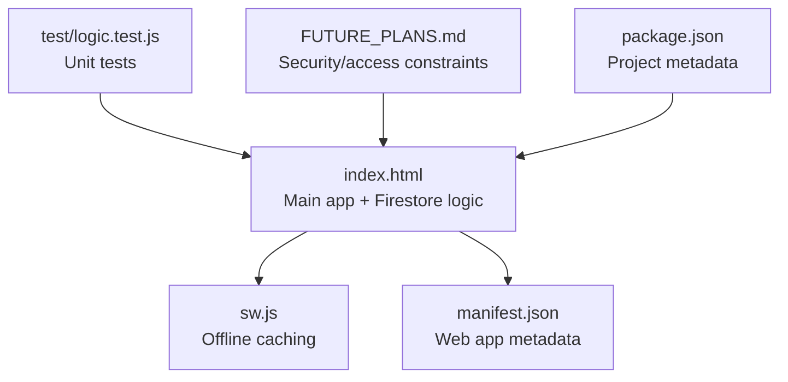
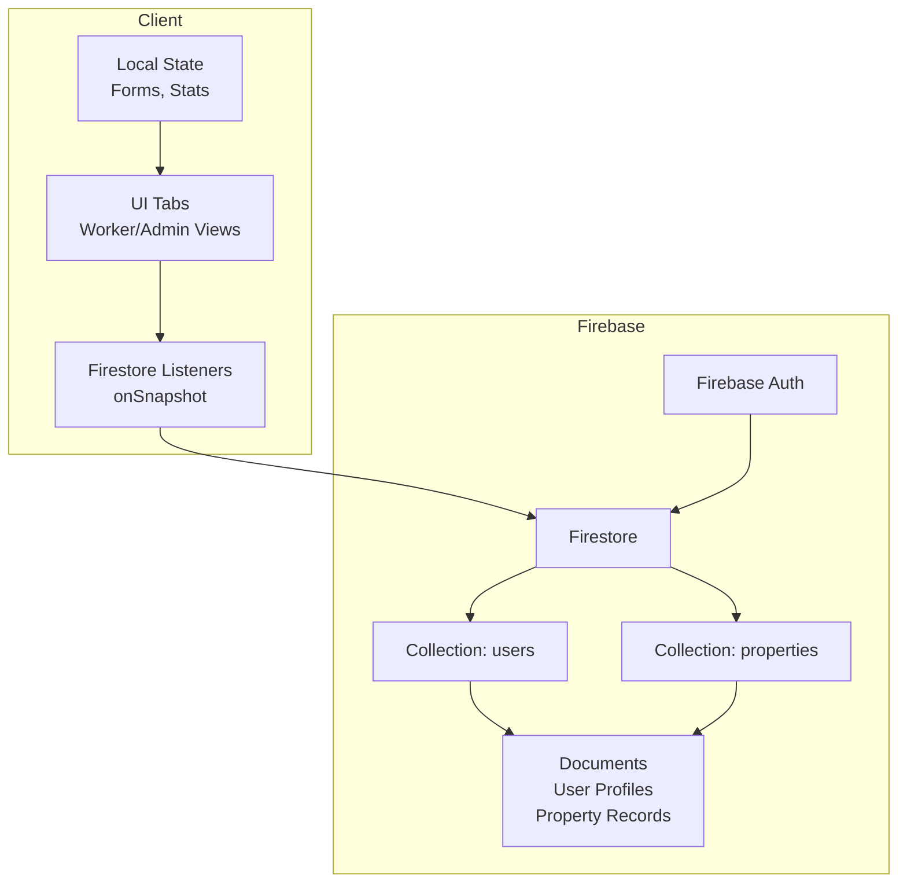
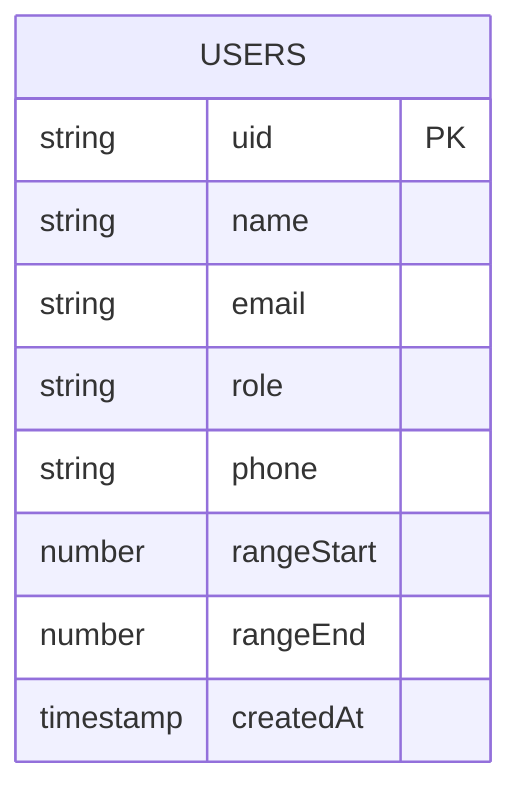
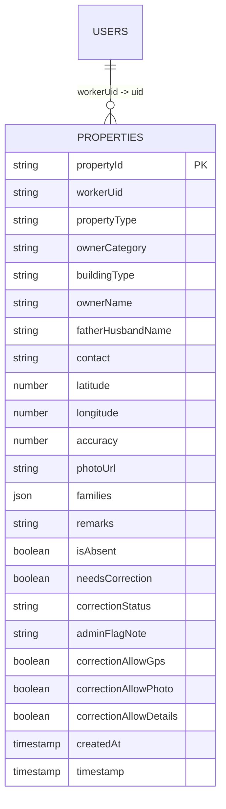
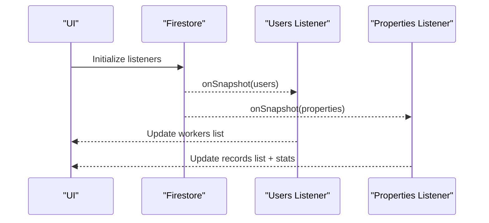
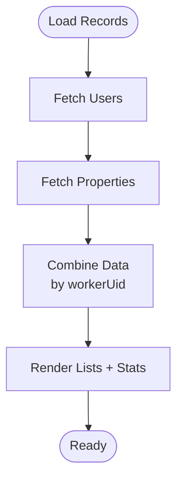
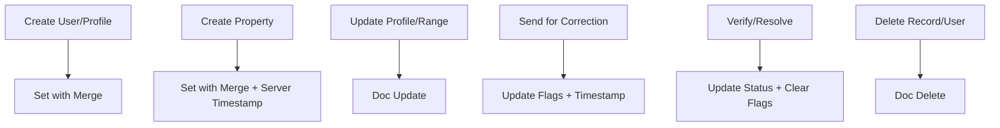
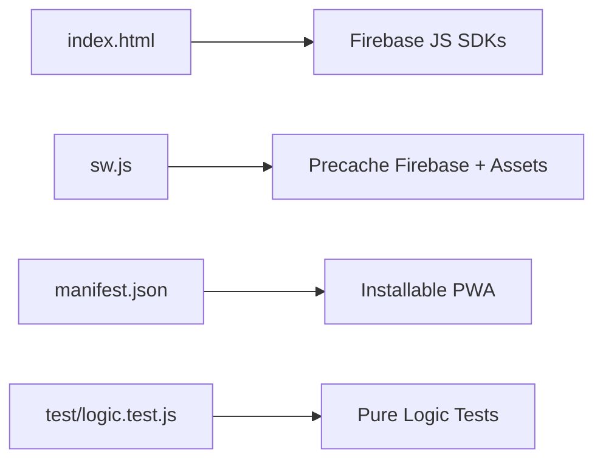

# Database Schema & Firestore Integration

<cite>
**Referenced Files in This Document**
- [index.html](file://index.html)
- [sw.js](file://sw.js)
- [manifest.json](file://manifest.json)
- [package.json](file://package.json)
- [FUTURE_PLANS.md](file://FUTURE_PLANS.md)
- [test/logic.test.js](file://test/logic.test.js)
</cite>

## Table of Contents
1. [Introduction](#introduction)
2. [Project Structure](#project-structure)
3. [Core Components](#core-components)
4. [Architecture Overview](#architecture-overview)
5. [Detailed Component Analysis](#detailed-component-analysis)
6. [Dependency Analysis](#dependency-analysis)
7. [Performance Considerations](#performance-considerations)
8. [Troubleshooting Guide](#troubleshooting-guide)
9. [Conclusion](#conclusion)
10. [Appendices](#appendices)

## Introduction
This document describes the Firestore database schema and integration patterns used by the Property Tax Collector application. It focuses on the three primary collections: users, properties, and workers, detailing document structures, field definitions, and data types inferred from the client-side implementation. It also explains real-time synchronization via Firestore listeners, query and indexing strategies, relationships and denormalization patterns, and CRUD, batch write, and transaction handling as implemented in the codebase. Security rules implications and access control patterns are derived from the application’s documented constraints and client-side usage. Migration and schema evolution guidance is provided with backward compatibility considerations.

## Project Structure
The application is a single-page, offline-capable web app packaged as a self-contained HTML file with supporting assets:
- index.html: Contains Firebase initialization, Firestore integration, UI logic, and offline caching hooks.
- sw.js: Service Worker that precaches core resources including Firebase SDKs.
- manifest.json: Web App Manifest enabling installability and offline presentation.
- package.json: Minimal Node.js project metadata.
- test/logic.test.js: Unit tests for pure logic extracted from index.html.
- FUTURE_PLANS.md: Future roadmap including security rule constraints.

**Diagram sources**
- [index.html](file://index.html)
- [sw.js](file://sw.js)
- [manifest.json](file://manifest.json)
- [package.json](file://package.json)
- [test/logic.test.js](file://test/logic.test.js)
- [FUTURE_PLANS.md](file://FUTURE_PLANS.md)

**Section sources**
- [index.html](file://index.html)
- [sw.js](file://sw.js)
- [manifest.json](file://manifest.json)
- [package.json](file://package.json)
- [test/logic.test.js](file://test/logic.test.js)
- [FUTURE_PLANS.md](file://FUTURE_PLANS.md)

## Core Components
- Firebase initialization and clients:
  - Auth client initialized for user authentication.
  - Firestore client initialized for database operations.
  - Secondary app initialization used for isolated contexts.
- Collections and documents:
  - users: Stores worker/admin profiles and metadata.
  - properties: Stores property records and related details.
  - workers: Not a separate collection; worker identity is represented by user records with role-based access.
- Real-time listeners:
  - Snapshot listeners on users and records to keep UI synchronized.
- Timestamps:
  - Server timestamps used consistently for createdAt and updates.

Key implementation references:
- Firebase config and initialization
- Auth and Firestore clients
- Users collection CRUD and listeners
- Properties collection CRUD and listeners
- Server timestamps and field operations

**Section sources**
- [index.html:815-827](file://index.html#L815-L827)
- [index.html:831](file://index.html#L831)
- [index.html:879](file://index.html#L879)
- [index.html:1003](file://index.html#L1003)
- [index.html:919](file://index.html#L919)
- [index.html:987](file://index.html#L987)
- [index.html:1610](file://index.html#L1610)

## Architecture Overview
The app uses a client-side architecture with Firestore as the backend. Authentication determines access to data, and snapshot listeners maintain real-time synchronization. The UI is structured around tabs for worker and admin views, with data flows between forms, local state, and Firestore.

**Diagram sources**
- [index.html:2225](file://index.html#L2225)
- [index.html:2285](file://index.html#L2285)
- [index.html:929](file://index.html#L929)
- [index.html:949](file://index.html#L949)

## Detailed Component Analysis

### Firestore Collections and Documents

#### users collection
- Purpose: Store worker and admin profiles, roles, and metadata.
- Representative fields observed in code:
  - uid: Document ID (matches authenticated user UID).
  - name: string.
  - email: string.
  - role: string (e.g., "admin").
  - phone: string.
  - rangeStart: number (nullable).
  - rangeEnd: number (nullable).
  - createdAt: server timestamp.
  - Additional fields may exist conditionally (e.g., correction flags).
- Access pattern:
  - Reads via doc.get().
  - Writes via doc.set() with merge.
  - Updates for profile and range assignments.
  - Deletes for removing worker accounts.
- Real-time listener:
  - onSnapshot on users collection to update worker lists and UI.

**Diagram sources**
- [index.html:949](file://index.html#L949)
- [index.html:922](file://index.html#L922)
- [index.html:1108](file://index.html#L1108)
- [index.html:1128](file://index.html#L1128)
- [index.html:1151](file://index.html#L1151)
- [index.html:1039](file://index.html#L1039)
- [index.html:1048](file://index.html#L1048)
- [index.html:1066](file://index.html#L1066)
- [index.html:2225](file://index.html#L2225)

**Section sources**
- [index.html:922](file://index.html#L922)
- [index.html:949](file://index.html#L949)
- [index.html:1039](file://index.html#L1039)
- [index.html:1048](file://index.html#L1048)
- [index.html:1066](file://index.html#L1066)
- [index.html:1108](file://index.html#L1108)
- [index.html:1128](file://index.html#L1128)
- [index.html:1151](file://index.html#L1151)
- [index.html:2225](file://index.html#L2225)

#### properties collection
- Purpose: Store property records captured by workers.
- Representative fields observed in code:
  - workerUid: string (references users.uid).
  - propertyId: string (unique identifier).
  - propertyType: string.
  - ownerCategory: string.
  - buildingType: string.
  - ownerName: string.
  - fatherHusbandName: string.
  - contact: string.
  - latitude: number.
  - longitude: number.
  - accuracy: number.
  - photoUrl: string.
  - families: array of objects (each with headName and members).
  - remarks: string.
  - isAbsent: boolean.
  - needsCorrection: boolean (legacy).
  - correctionStatus: string (e.g., "pending", "fixed", "verified").
  - adminFlagNote: string.
  - correctionAllowGps: boolean.
  - correctionAllowPhoto: boolean.
  - correctionAllowDetails: boolean.
  - createdAt: server timestamp.
  - timestamp: server timestamp (update time).
- Access pattern:
  - Reads via doc.get() and collection queries.
  - Writes via doc.set() with merge.
  - Updates for corrections and verification.
  - Deletes for administrative cleanup.
- Real-time listener:
  - onSnapshot on properties collection to update lists and stats.

**Diagram sources**
- [index.html:985](file://index.html#L985)
- [index.html:1598](file://index.html#L1598)
- [index.html:1610](file://index.html#L1610)
- [index.html:2213](file://index.html#L2213)

**Section sources**
- [index.html:985](file://index.html#L985)
- [index.html:1598](file://index.html#L1598)
- [index.html:1610](file://index.html#L1610)
- [index.html:2213](file://index.html#L2213)

#### workers collection
- Observation: There is no separate workers collection. Worker identities are represented by user documents with role-based access. Administrative actions target user documents for adding/removing workers and assigning sticker ranges.

**Section sources**
- [index.html:1039](file://index.html#L1039)
- [index.html:1048](file://index.html#L1048)
- [index.html:1066](file://index.html#L1066)
- [index.html:2285](file://index.html#L2285)

### Real-Time Synchronization and Listeners
- Users listener:
  - Maintains worker list and enables filtering.
- Properties listener:
  - Keeps records list updated and drives stats computation.
- Combined loading:
  - UI renders only after both users and records have loaded at least once.

**Diagram sources**
- [index.html:2225](file://index.html#L2225)
- [index.html:2213](file://index.html#L2213)
- [index.html:2285](file://index.html#L2285)

**Section sources**
- [index.html:2225](file://index.html#L2225)
- [index.html:2213](file://index.html#L2213)
- [index.html:2285](file://index.html#L2285)

### Query Optimization and Indexing Strategies
- Composite indexes:
  - For admin filtering by workerUid, propertyType, ownerCategory, and status, composite indexes are recommended to avoid “unavailable” errors on complex queries.
- Single-field indexes:
  - Ensure indexes exist for frequently filtered fields (e.g., workerUid, propertyType, ownerCategory, correctionStatus).
- Timestamp ordering:
  - Use createdAt or timestamp for chronological queries and pagination.
- Denormalized stats:
  - Computed stats are maintained in memory; Firestore queries should minimize repeated aggregations.

[No sources needed since this section provides general guidance]

### Relationships, Foreign Keys, and Denormalization
- Relationship model:
  - properties.workerUid references users.uid.
- Denormalization patterns:
  - Users’ name, email, and role are kept in properties documents for rendering without joins.
  - Stats and summaries are computed client-side from aggregated data.
- Correction workflow:
  - Admin flags and worker corrections are tracked via boolean flags and status fields.

**Diagram sources**
- [index.html:2213](file://index.html#L2213)
- [index.html:2225](file://index.html#L2225)
- [index.html:2285](file://index.html#L2285)

**Section sources**
- [index.html:2213](file://index.html#L2213)
- [index.html:2225](file://index.html#L2225)
- [index.html:2285](file://index.html#L2285)

### CRUD Operations, Batch Writes, and Transactions
- Create:
  - User registration and profile creation use doc.set() with merge.
  - Property creation uses doc.set() with merge and server timestamps.
- Read:
  - doc.get() for individual records and user lookup.
  - onSnapshot for real-time lists.
- Update:
  - doc.update() for profile, range assignment, and correction flags.
  - FieldValue.serverTimestamp() for updatedAt fields.
  - FieldValue.delete() for clearing optional fields.
- Delete:
  - User deletion and record deletion supported.
- Batch writes and transactions:
  - No explicit batch writes or transactions are used in the current implementation. For future scalability, wrap related updates in transactions to ensure atomicity.

**Diagram sources**
- [index.html:922](file://index.html#L922)
- [index.html:985](file://index.html#L985)
- [index.html:1108](file://index.html#L1108)
- [index.html:1039](file://index.html#L1039)
- [index.html:1598](file://index.html#L1598)
- [index.html:1610](file://index.html#L1610)
- [index.html:1066](file://index.html#L1066)

**Section sources**
- [index.html:922](file://index.html#L922)
- [index.html:949](file://index.html#L949)
- [index.html:985](file://index.html#L985)
- [index.html:1039](file://index.html#L1039)
- [index.html:1048](file://index.html#L1048)
- [index.html:1066](file://index.html#L1066)
- [index.html:1108](file://index.html#L1108)
- [index.html:1128](file://index.html#L1128)
- [index.html:1151](file://index.html#L1151)
- [index.html:1598](file://index.html#L1598)
- [index.html:1610](file://index.html#L1610)

### Security Rules Implications and Access Control
- Constraint from roadmap:
  - Users can only read/write data for their own Village Council (VC).
- Implementation implication:
  - Enforce VC scoping in Firestore security rules to prevent cross-VC access.
  - Use auth variable (currentUser) and VC identifiers in rules.
- Role-based access:
  - Admins manage workers and data; workers can only manage their own records.
- Recommendations:
  - Enforce field-level permissions (e.g., correctionAllow* flags).
  - Restrict bulk deletions and exports to admins.

**Section sources**
- [FUTURE_PLANS.md:20](file://FUTURE_PLANS.md#L20)
- [FUTURE_PLANS.md:13](file://FUTURE_PLANS.md#L13)

### Data Migration, Schema Evolution, and Backward Compatibility
- Legacy fields:
  - needsCorrection is a legacy boolean; correctionState logic prefers explicit correctionStatus.
- Migration strategy:
  - On read/update, normalize legacy fields to new schema (e.g., derive correctionStatus from needsCorrection).
  - Preserve backward compatibility during transition period.
- Versioning:
  - Introduce a schema version field in documents to guide migrations.
- Incremental rollout:
  - Add new fields with defaults and gradually phase out legacy ones.

**Section sources**
- [test/logic.test.js:151](file://test/logic.test.js#L151)
- [test/logic.test.js:157](file://test/logic.test.js#L157)
- [test/logic.test.js:167](file://test/logic.test.js#L167)

## Dependency Analysis
- Runtime dependencies:
  - Firebase SDKs (compat mode) are loaded via CDN and cached by the Service Worker.
- Offline behavior:
  - Service Worker precaches core URLs including Firebase SDKs to enable offline loading.
- Asset delivery:
  - Web App Manifest defines icons and metadata for installation and presentation.

**Diagram sources**
- [index.html:13-16](file://index.html#L13-L16)
- [sw.js:1-10](file://sw.js#L1-L10)
- [manifest.json:1-28](file://manifest.json#L1-L28)

**Section sources**
- [index.html:13-16](file://index.html#L13-L16)
- [sw.js:1-10](file://sw.js#L1-L10)
- [manifest.json:1-28](file://manifest.json#L1-L28)

## Performance Considerations
- Minimize listener scope:
  - Filter listeners by workerUid and date ranges to reduce payload.
- Efficient queries:
  - Use composite indexes for multi-field filters.
- Debounce UI updates:
  - Coalesce frequent updates to avoid redundant renders.
- Offline-first UX:
  - Precache Firebase SDKs to ensure reliable startup.

[No sources needed since this section provides general guidance]

## Troubleshooting Guide
- Complex query errors:
  - If queries fail with “unavailable” errors, create the required composite indexes as per the filtering logic.
- Timestamp anomalies:
  - Ensure serverTimestamp() is used for createdAt/timestamp fields.
- Correction state mismatches:
  - Verify normalization logic for legacy needsCorrection vs. correctionStatus.
- Listener not firing:
  - Confirm that both users and properties listeners are attached and that combined readiness logic is met.

**Section sources**
- [index.html:2225](file://index.html#L2225)
- [index.html:2213](file://index.html#L2213)
- [index.html:919](file://index.html#L919)
- [index.html:987](file://index.html#L987)
- [index.html:1610](file://index.html#L1610)
- [test/logic.test.js:151](file://test/logic.test.js#L151)
- [test/logic.test.js:157](file://test/logic.test.js#L157)

## Conclusion
The Property Tax Collector app integrates Firestore as a central data store with a clear separation of concerns: users for identities and roles, properties for captured records, and a correction workflow managed through document flags and statuses. Real-time listeners keep the UI responsive, while server timestamps ensure consistency. Security rules should enforce VC scoping and role-based access. For future growth, adopt composite indexes, consider transactions for complex updates, and evolve the schema with backward-compatible migrations.

## Appendices

### Appendix A: Representative Field Definitions
- users
  - uid: string (PK)
  - name: string
  - email: string
  - role: string
  - phone: string
  - rangeStart: number?
  - rangeEnd: number?
  - createdAt: timestamp
- properties
  - propertyId: string (PK)
  - workerUid: string (FK to users.uid)
  - propertyType: string
  - ownerCategory: string
  - buildingType: string
  - ownerName: string
  - fatherHusbandName: string
  - contact: string
  - latitude: number
  - longitude: number
  - accuracy: number
  - photoUrl: string
  - families: array
  - remarks: string
  - isAbsent: boolean
  - needsCorrection: boolean
  - correctionStatus: string
  - adminFlagNote: string
  - correctionAllowGps: boolean
  - correctionAllowPhoto: boolean
  - correctionAllowDetails: boolean
  - createdAt: timestamp
  - timestamp: timestamp

**Section sources**
- [index.html:985](file://index.html#L985)
- [index.html:1598](file://index.html#L1598)
- [index.html:1610](file://index.html#L1610)