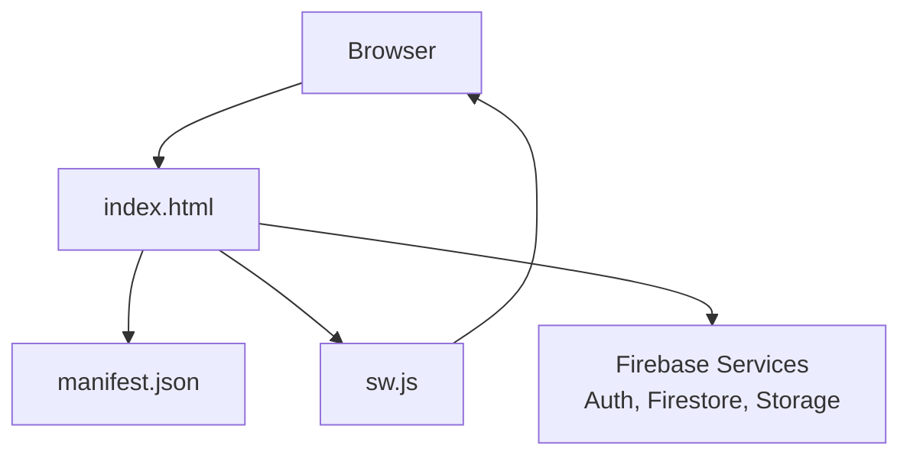
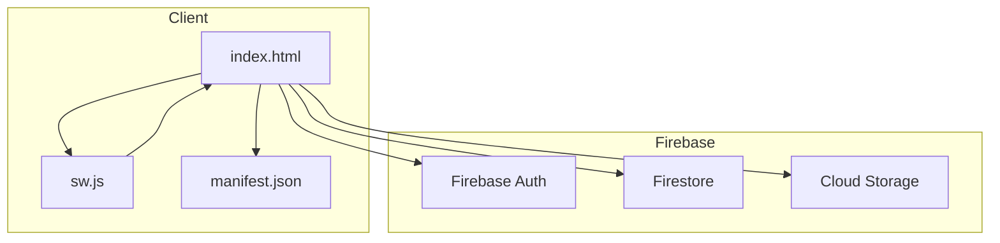
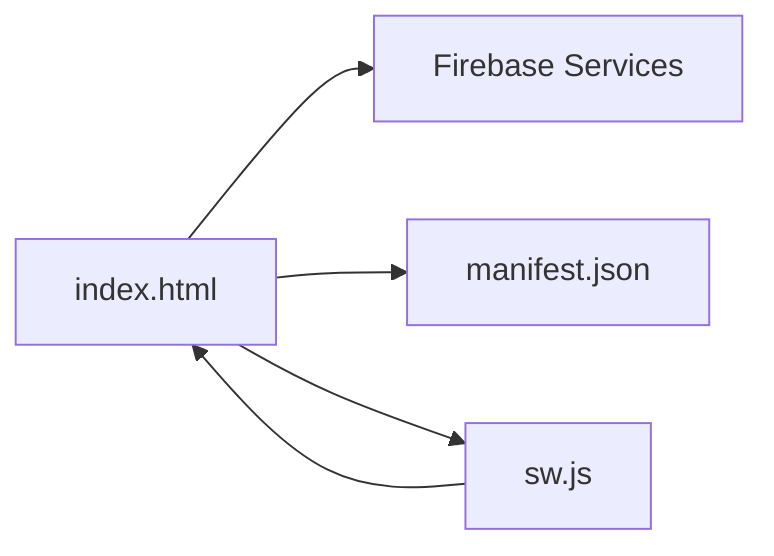

# Deployment and Maintenance

<cite>
**Referenced Files in This Document**
- [README.md](file://README.md)
- [FUTURE_PLANS.md](file://FUTURE_PLANS.md)
- [package.json](file://package.json)
- [manifest.json](file://manifest.json)
- [sw.js](file://sw.js)
- [index.html](file://index.html)
- [.github/workflows/test.yml](file://.github/workflows/test.yml)
- [test/logic.test.js](file://test/logic.test.js)
</cite>

## Table of Contents
1. [Introduction](#introduction)
2. [Project Structure](#project-structure)
3. [Core Components](#core-components)
4. [Architecture Overview](#architecture-overview)
5. [Detailed Component Analysis](#detailed-component-analysis)
6. [Dependency Analysis](#dependency-analysis)
7. [Performance Considerations](#performance-considerations)
8. [Troubleshooting Guide](#troubleshooting-guide)
9. [Conclusion](#conclusion)
10. [Appendices](#appendices)

## Introduction
This document provides comprehensive deployment and maintenance guidance for the Property Tax Collector application. It covers Firebase Hosting configuration, Progressive Web App (PWA) deployment, domain and SSL setup, update and maintenance processes, version management and rollback, monitoring and logging, performance optimization, troubleshooting, backup and recovery, security updates, maintenance schedules, and scaling considerations. The guidance is tailored to the current repository state and the application’s client-side architecture.

## Project Structure
The application is delivered as a single-page, self-contained web app with a static front end and Firebase backend integration. Key elements include:
- A static HTML entry point that initializes Firebase and registers a service worker for offline caching.
- A manifest file enabling PWA installation and offline behavior.
- A service worker that precaches critical resources for offline availability.
- A minimal CI pipeline configured for automated tests.

**Diagram sources**
- [index.html](file://index.html)
- [manifest.json](file://manifest.json)
- [sw.js](file://sw.js)

**Section sources**
- [README.md](file://README.md)
- [package.json](file://package.json)
- [manifest.json](file://manifest.json)
- [sw.js](file://sw.js)
- [index.html](file://index.html)

## Core Components
- Static assets and app shell: index.html serves as the SPA entry, embedding Firebase initialization and PWA registration.
- PWA configuration: manifest.json defines app metadata, icons, and display mode.
- Offline caching: sw.js precaches core assets and serves them via a basic cache-first strategy.
- Backend integration: Firebase Authentication, Firestore, and Storage are initialized and used throughout the app lifecycle.

Key implementation references:
- Firebase config and initialization: [index.html](file://index.html)
- PWA registration and manifest link: [index.html](file://index.html)
- PWA manifest definition: [manifest.json](file://manifest.json)
- Service worker caching strategy: [sw.js](file://sw.js)

**Section sources**
- [index.html](file://index.html)
- [manifest.json](file://manifest.json)
- [sw.js](file://sw.js)

## Architecture Overview
The runtime architecture combines a static client with Firebase services. The SPA loads, registers the service worker, and connects to Firebase for authentication and data persistence. The service worker ensures offline readiness by caching essential resources.

**Diagram sources**
- [index.html](file://index.html)
- [manifest.json](file://manifest.json)
- [sw.js](file://sw.js)

## Detailed Component Analysis

### Firebase Hosting Configuration
- Hosting model: Single-page app served statically; routing is handled client-side.
- Recommended approach: Configure Firebase Hosting to serve index.html for all routes to support client-side routing.
- Versioning: Use distinct hosting channels for pre-production and production deployments to facilitate safe rollouts and rollbacks.
- Domain and SSL: Point a custom domain to Firebase Hosting; SSL is managed automatically by Firebase.

Operational references:
- Firebase project identifiers and initialization: [index.html](file://index.html)
- Hosting channel strategy for staged releases: [README.md](file://README.md)

**Section sources**
- [index.html](file://index.html)
- [README.md](file://README.md)

### PWA Deployment Checklist
- Manifest completeness: Ensure manifest.json includes name, short_name, description, start_url, display, theme_color, background_color, and icon assets.
- Service worker registration: Verify the service worker is registered and active.
- Offline behavior: Confirm critical assets are precached and cache-first logic is effective.
- Testing: Validate installability using browser devtools and test offline behavior with throttling.

References:
- Manifest definition: [manifest.json](file://manifest.json)
- PWA registration: [index.html](file://index.html)
- Service worker caching: [sw.js](file://sw.js)

**Section sources**
- [manifest.json](file://manifest.json)
- [index.html](file://index.html)
- [sw.js](file://sw.js)

### Domain and SSL Setup Procedures
- DNS configuration: Set up a CNAME or ANAME record to point the custom domain to Firebase’s canonical hostname.
- Verification: Complete domain verification through Firebase Console.
- SSL provisioning: SSL certificates are issued and renewed automatically by Firebase.

References:
- Hosting and domain management: [README.md](file://README.md)

**Section sources**
- [README.md](file://README.md)

### Update and Maintenance Processes
- Version management: The app embeds a version string used for display and auditing. Increment the version consistently across releases.
- Release channels: Use Firebase Hosting channels to stage updates before promoting to production.
- Rollback procedure: Re-route the production channel to a previous hosting version to perform a rollback.

References:
- Version string usage: [index.html](file://index.html)
- Channel-based releases: [README.md](file://README.md)

**Section sources**
- [index.html](file://index.html)
- [README.md](file://README.md)

### Monitoring and Logging Approaches
- Client-side diagnostics: Use browser devtools console to monitor initialization, authentication, and Firestore operations.
- Error reporting: Wrap critical operations in try/catch blocks and surface user-facing alerts.
- Test coverage: Maintain unit tests for core logic to detect regressions early.

References:
- Test harness and logic extraction: [test/logic.test.js](file://test/logic.test.js)
- CI pipeline for automated tests: [.github/workflows/test.yml](file://.github/workflows/test.yml)

**Section sources**
- [test/logic.test.js](file://test/logic.test.js)
- [.github/workflows/test.yml](file://.github/workflows/test.yml)

### Performance Optimization Techniques
- Resource caching: Precache critical assets in the service worker to reduce load times and enable offline access.
- Asset delivery: Serve images and libraries from CDN-backed URLs already present in the app.
- Minimize payload: Keep index.html self-contained to reduce HTTP requests.
- Lazy initialization: Defer non-critical initialization until after the app shell is ready.

References:
- Service worker caching strategy: [sw.js](file://sw.js)
- PWA registration and resource links: [index.html](file://index.html)

**Section sources**
- [sw.js](file://sw.js)
- [index.html](file://index.html)

### Troubleshooting Common Deployment Issues
- Service worker not registering: Verify HTTPS, correct path to sw.js, and absence of JavaScript errors.
- Offline failures: Confirm cached URLs match runtime paths and that the activation phase cleans stale caches.
- Authentication errors: Validate Firebase configuration and network connectivity.
- CI test failures: Inspect logs from the test job and ensure Node version compatibility.

References:
- Service worker registration: [index.html](file://index.html)
- Service worker lifecycle: [sw.js](file://sw.js)
- CI test job: [.github/workflows/test.yml](file://.github/workflows/test.yml)

**Section sources**
- [index.html](file://index.html)
- [sw.js](file://sw.js)
- [.github/workflows/test.yml](file://.github/workflows/test.yml)

### Backup and Recovery Procedures
- Data backup: Regularly export Firestore collections and maintain backups of Cloud Storage assets.
- Recovery plan: Restore Firestore from backups and re-upload storage assets as needed; reinitialize app state post-restore.
- Testing: Periodically practice restore drills to validate backup integrity.

References:
- Data stores: [index.html](file://index.html)

**Section sources**
- [index.html](file://index.html)

### Security Updates and Maintenance Schedules
- Library updates: Monitor CDN-hosted libraries (e.g., Firebase JS SDK) for security advisories and update accordingly.
- Access controls: Rotate Firebase credentials and review security rules periodically.
- Maintenance cadence: Schedule monthly reviews of dependencies, security rules, and hosting configurations.

References:
- Firebase SDK references: [index.html](file://index.html)

**Section sources**
- [index.html](file://index.html)

### Scaling Considerations and Capacity Planning
- Traffic scaling: Firebase Hosting scales automatically; plan for peak usage during field campaigns.
- Storage and bandwidth: Estimate growth from photos and exports; consider offloading large assets to Cloud Storage.
- Firestore throughput: Plan for concurrent workers and batch operations; monitor quotas and adjust indexing as needed.

References:
- Future plans and capacity concerns: [FUTURE_PLANS.md](file://FUTURE_PLANS.md)

**Section sources**
- [FUTURE_PLANS.md](file://FUTURE_PLANS.md)

## Dependency Analysis
The app depends on Firebase services and CDN-hosted libraries. The service worker depends on the precache list and runtime cache strategy.

**Diagram sources**
- [index.html](file://index.html)
- [sw.js](file://sw.js)
- [manifest.json](file://manifest.json)

**Section sources**
- [index.html](file://index.html)
- [sw.js](file://sw.js)
- [manifest.json](file://manifest.json)

## Performance Considerations
- Precaching: Ensure the service worker precaches index.html, manifest, and critical library URLs.
- Cache strategy: Use a cache-first approach for static assets and a network fallback for dynamic data.
- Bundle size: Keep the app self-contained to minimize requests; externalize only essential libraries.
- Network resilience: Implement retry logic for transient failures and graceful degradation when offline.

References:
- Precache list and caching: [sw.js](file://sw.js)
- PWA registration: [index.html](file://index.html)

**Section sources**
- [sw.js](file://sw.js)
- [index.html](file://index.html)

## Troubleshooting Guide
- Registration failures: Check console logs for service worker registration errors and verify HTTPS.
- Authentication issues: Validate Firebase configuration and confirm network access.
- Test failures: Review CI logs and ensure Node version and test environment match expectations.

References:
- Service worker registration: [index.html](file://index.html)
- CI pipeline: [.github/workflows/test.yml](file://.github/workflows/test.yml)
- Test logic: [test/logic.test.js](file://test/logic.test.js)

**Section sources**
- [index.html](file://index.html)
- [.github/workflows/test.yml](file://.github/workflows/test.yml)
- [test/logic.test.js](file://test/logic.test.js)

## Conclusion
The Property Tax Collector application is designed for straightforward deployment and maintenance. By leveraging Firebase Hosting channels, ensuring robust PWA caching, and maintaining a disciplined release process, teams can deploy reliably and recover quickly from incidents. Regular audits of Firebase configurations, security rules, and capacity planning will support long-term stability and scalability.

## Appendices
- Version management: Track releases with the embedded version string and promote through hosting channels.
- CI/CD: Automated tests run on pushes and pull requests to catch regressions early.

References:
- Version usage: [index.html](file://index.html)
- CI job: [.github/workflows/test.yml](file://.github/workflows/test.yml)

**Section sources**
- [index.html](file://index.html)
- [.github/workflows/test.yml](file://.github/workflows/test.yml)