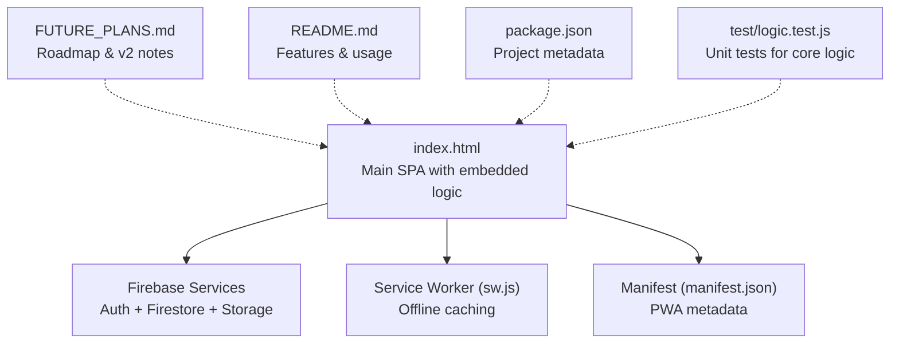
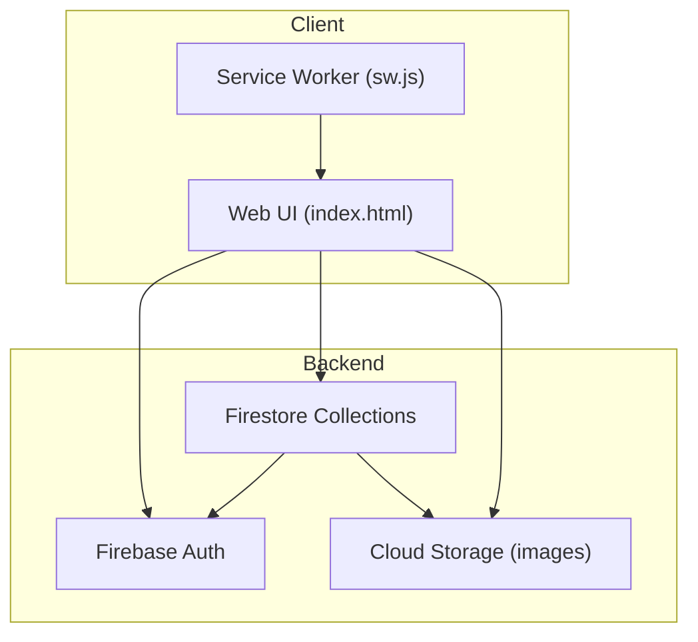
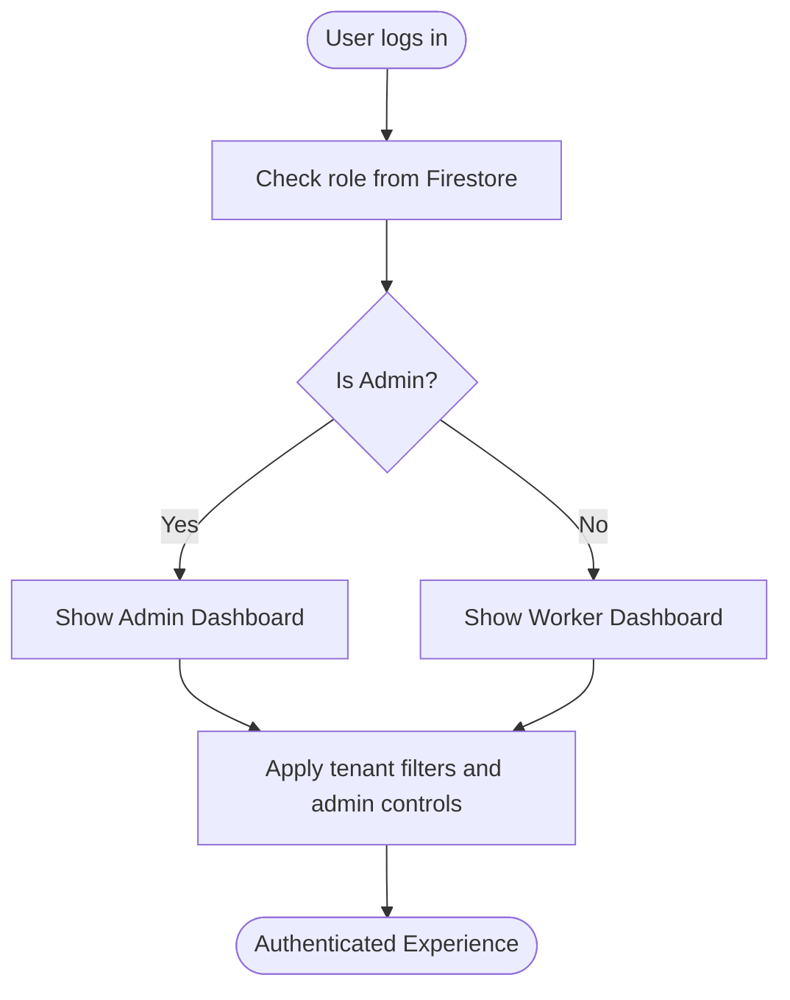
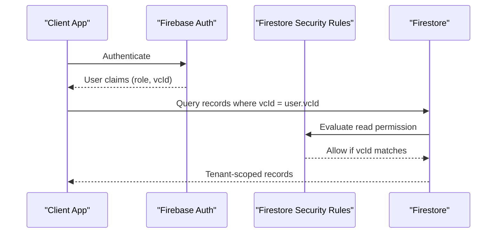
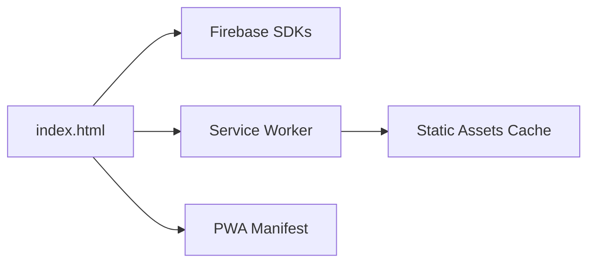

# Future Development Plans

<cite>
**Referenced Files in This Document**
- [FUTURE_PLANS.md](file://FUTURE_PLANS.md)
- [README.md](file://README.md)
- [index.html](file://index.html)
- [sw.js](file://sw.js)
- [manifest.json](file://manifest.json)
- [package.json](file://package.json)
- [test/logic.test.js](file://test/logic.test.js)
</cite>

## Table of Contents
1. [Introduction](#introduction)
2. [Project Structure](#project-structure)
3. [Core Components](#core-components)
4. [Architecture Overview](#architecture-overview)
5. [Detailed Component Analysis](#detailed-component-analysis)
6. [Dependency Analysis](#dependency-analysis)
7. [Performance Considerations](#performance-considerations)
8. [Troubleshooting Guide](#troubleshooting-guide)
9. [Conclusion](#conclusion)
10. [Appendices](#appendices)

## Introduction
This document outlines the future development roadmap for the Property Tax Collector application, focusing on the v2 multi-tenancy initiative and related enhancements. It consolidates the official notes from the repository’s future plans, current architecture, and practical implications for deployment, security, and extensibility. The roadmap covers:
- Multi-tenant architecture for multiple village councils
- Role tiers and administrative boundaries
- Data separation and security considerations
- Planned enhancements such as tax exemption handling, analytics, mobile app integration, and API development
- Timeline expectations, prioritization, migration strategies, and community contribution opportunities

## Project Structure
The application is delivered as a single-page, offline-capable Progressive Web App (PWA) with a self-contained HTML file and supporting assets. The structure emphasizes simplicity and portability for field deployment.

**Diagram sources**
- [index.html:814-880](file://index.html#L814-L880)
- [sw.js:1-45](file://sw.js#L1-L45)
- [manifest.json:1-28](file://manifest.json#L1-L28)
- [FUTURE_PLANS.md:1-51](file://FUTURE_PLANS.md#L1-L51)
- [README.md:1-36](file://README.md#L1-L36)
- [package.json:1-10](file://package.json#L1-L10)
- [test/logic.test.js:1-223](file://test/logic.test.js#L1-L223)

**Section sources**
- [index.html:814-880](file://index.html#L814-L880)
- [sw.js:1-45](file://sw.js#L1-L45)
- [manifest.json:1-28](file://manifest.json#L1-L28)
- [FUTURE_PLANS.md:1-51](file://FUTURE_PLANS.md#L1-L51)
- [README.md:1-36](file://README.md#L1-L36)
- [package.json:1-10](file://package.json#L1-L10)
- [test/logic.test.js:1-223](file://test/logic.test.js#L1-L223)

## Core Components
- Single-page application (SPA) with embedded client-side logic for form collection, offline behavior, and data export
- Firebase integration for authentication, real-time data synchronization, and storage
- Service Worker enabling offline-first behavior and cached static assets
- Manifest enabling PWA installation and standalone display
- Unit tests isolating core logic blocks for reliability and regression prevention

Key characteristics:
- Offline-first with a Service Worker caching critical resources
- Real-time collaboration via Firestore listeners for admin dashboards
- Built-in CSV export and photo ZIP export for reporting
- Test suite validating core logic independently of the DOM and Firebase

**Section sources**
- [index.html:814-880](file://index.html#L814-L880)
- [index.html:1751-1836](file://index.html#L1751-L1836)
- [sw.js:1-45](file://sw.js#L1-L45)
- [manifest.json:1-28](file://manifest.json#L1-L28)
- [test/logic.test.js:1-223](file://test/logic.test.js#L1-L223)

## Architecture Overview
The current architecture centers on a Firebase backend with Firestore collections for users, records, and settings. The client enforces role-based access and data visibility, while Firebase Security Rules provide enforcement boundaries.

**Diagram sources**
- [index.html:814-880](file://index.html#L814-L880)
- [sw.js:1-45](file://sw.js#L1-L45)

**Section sources**
- [index.html:814-880](file://index.html#L814-L880)
- [index.html:2363-2395](file://index.html#L2363-L2395)
- [sw.js:1-45](file://sw.js#L1-L45)

## Detailed Component Analysis

### v2 Multi-Tenancy Roadmap
The repository’s future plans outline a comprehensive v2 multi-tenancy strategy to support multiple village councils on a single instance while maintaining strict data isolation.

- Goal: Enable multiple councils to use the same app with fully separated datasets
- Role tiers:
  - Super Admin: creates councils, assigns Admins, oversees all
  - Admin: manages one council’s workers and data
  - Worker: belongs to one council, collects data for that council only
  - Promotion: role changes within a council
- Technical approach:
  - Tag every record, worker, and setting with a council identifier (vcId)
  - Filter all data by vcId so users only see their council’s data
  - Enforce read/write rules in Firestore Security Rules; Super Admin can see across councils
- Current status:
  - Not yet built; focus remains on proving v1 in the field
  - Data-layer rebuild is preferred over retrofitting live data
  - Real-world usage will inform v2 design decisions

Security and governance considerations highlighted:
- Data ownership/hosting: current setup uses a personal Firebase project; multi-council hosting raises privacy and jurisdiction concerns
- Service provider responsibilities: ongoing support, uptime, and account issues for government data
- Free tier limits: storage and bandwidth may be exceeded with multiple councils and photo uploads
- Security complexity: multi-council rules increase risk of cross-data exposure

Migration perspective:
- Existing data can be tagged with vcId and migrated cleanly into v2 structure

**Section sources**
- [FUTURE_PLANS.md:7-37](file://FUTURE_PLANS.md#L7-L37)

### Role Tier Implementation
Role-based access is central to multi-tenancy. The current code demonstrates a simple admin check and user roles in Firestore documents. v2 will formalize role tiers and enforce them across UI and backend.

- Admin detection via email comparison
- Users stored with role field; workers and admins differentiated
- UI tabs and capabilities vary by role

**Diagram sources**
- [index.html:892-947](file://index.html#L892-L947)
- [index.html:993-1019](file://index.html#L993-L1019)

**Section sources**
- [index.html:892-947](file://index.html#L892-L947)
- [index.html:993-1019](file://index.html#L993-L1019)

### Data Separation Strategies
Data isolation is achieved through vcId tagging and tenant-aware queries. The current code already demonstrates filtering by workerUid; v2 will extend this to vcId.

- Tag all records, users, and settings with vcId
- Enforce vcId filtering in Firestore queries and UI rendering
- Firestore Security Rules must restrict reads/writes to vcId
- Super Admin role bypasses vcId filtering

**Diagram sources**
- [FUTURE_PLANS.md:18-22](file://FUTURE_PLANS.md#L18-L22)
- [index.html:1951-1967](file://index.html#L1951-L1967)

**Section sources**
- [FUTURE_PLANS.md:18-22](file://FUTURE_PLANS.md#L18-L22)
- [index.html:1951-1967](file://index.html#L1951-L1967)

### Tax Exemption Handling (Planned)
- Current policy: all properties taxable
- Future capability: optional “Tax Exempt” toggle or exemption logic based on owner type
- Flexibility: exemptions can be applied retroactively to existing records

**Section sources**
- [FUTURE_PLANS.md:42-46](file://FUTURE_PLANS.md#L42-L46)

### Enhanced Analytics (Planned)
- Current analytics: worker summaries, admin dashboards, and exportable metrics
- Future enhancements: richer dashboards, drill-downs, and trend reporting across councils

[No sources needed since this section provides conceptual enhancement guidance]

### Mobile App Integration (Planned)
- Current PWA behavior: installable, offline-capable, and responsive
- Future: native app wrappers or deep-linking integrations for field teams

[No sources needed since this section provides conceptual enhancement guidance]

### API Development (Planned)
- Current export APIs: CSV and ZIP photo exports
- Future: REST-like endpoints for external systems, standardized data formats, and webhook triggers

[No sources needed since this section provides conceptual enhancement guidance]

### Timeline Expectations and Prioritization
- v1 proof-of-concept remains the priority until field validation is complete
- v2 multi-tenancy is deferred until a second council commits and requests it
- Migration strategy: tag existing data with vcId and migrate into v2 structure

**Section sources**
- [FUTURE_PLANS.md:24-27](file://FUTURE_PLANS.md#L24-L27)
- [FUTURE_PLANS.md:35-36](file://FUTURE_PLANS.md#L35-L36)

### Migration Strategies for Existing Deployments
- Tagging: existing records can be retrofitted with vcId for clean migration
- Data model: extend current documents to include vcId and tenant-aware fields
- Security: update Firestore Security Rules to enforce vcId-based access
- Testing: validate tenant isolation and admin oversight before rollout

**Section sources**
- [FUTURE_PLANS.md:35-36](file://FUTURE_PLANS.md#L35-L36)
- [FUTURE_PLANS.md:18-22](file://FUTURE_PLANS.md#L18-L22)

### Community Contribution Opportunities
- Code contributions: improve UI, add analytics, enhance export formats, and extend role management
- Extension points: modularize core logic, add plugin hooks for custom fields, and expand export formats
- Testing: expand unit tests and add integration tests for multi-tenant scenarios

**Section sources**
- [test/logic.test.js:1-223](file://test/logic.test.js#L1-L223)
- [index.html:1751-1836](file://index.html#L1751-L1836)

## Dependency Analysis
The application depends on Firebase services and a Service Worker for offline behavior. Dependencies are declared in the HTML and manifest.

**Diagram sources**
- [index.html:814-880](file://index.html#L814-L880)
- [sw.js:1-45](file://sw.js#L1-L45)
- [manifest.json:1-28](file://manifest.json#L1-L28)

**Section sources**
- [index.html:814-880](file://index.html#L814-L880)
- [sw.js:1-45](file://sw.js#L1-L45)
- [manifest.json:1-28](file://manifest.json#L1-L28)

## Performance Considerations
- Offline-first delivery reduces server load and improves field team productivity
- Photo processing and stamping occur client-side; consider compression and caching strategies
- Firestore listeners provide real-time updates; manage subscription lifecycles to avoid leaks
- Export operations (CSV/ZIP) should be batched and streamed for large datasets

[No sources needed since this section provides general guidance]

## Troubleshooting Guide
Common areas to inspect:
- Authentication failures: verify email/password and Firebase Auth configuration
- Firestore permission errors: ensure vcId-based queries and Security Rules align with role tiers
- Export issues: confirm network availability for ZIP library and sufficient storage space
- Service Worker caching: clear caches and reload to resolve stale asset issues

**Section sources**
- [index.html:1208-1219](file://index.html#L1208-L1219)
- [index.html:2399-2432](file://index.html#L2399-L2432)
- [sw.js:19-29](file://sw.js#L19-L29)

## Conclusion
The Property Tax Collector application is positioned for a strategic v2 evolution toward multi-tenancy and enhanced operational capabilities. The roadmap balances pragmatic field validation with robust architectural foundations for scalability, security, and extensibility. By formalizing role tiers, enforcing vcId-based data separation, and preparing for future enhancements like tax exemptions, analytics, and APIs, the project can serve multiple councils while preserving data integrity and user trust.

[No sources needed since this section summarizes without analyzing specific files]

## Appendices

### Appendix A: Current Feature Highlights
- Offline-first PWA with installable UI
- GPS capture and photo stamping with EXIF orientation handling
- Household/family survey with auto-population and counts
- CSV export with UTF-8 BOM, formula-injection protection, and CRLF line endings
- Correction workflow with admin flags, worker fixes, and verification
- Follow-up badges and guided collection wizard

**Section sources**
- [README.md:5-18](file://README.md#L5-L18)
- [index.html:1751-1836](file://index.html#L1751-L1836)
- [index.html:2461-2499](file://index.html#L2461-L2499)

### Appendix B: Test Coverage
- Core logic extracted and tested independently to ensure correctness across environments
- Tests cover missing fields, absence determination, household statistics, correction states, and EXIF orientation parsing

**Section sources**
- [test/logic.test.js:1-223](file://test/logic.test.js#L1-L223)