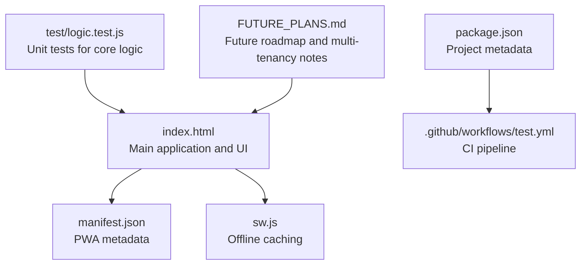
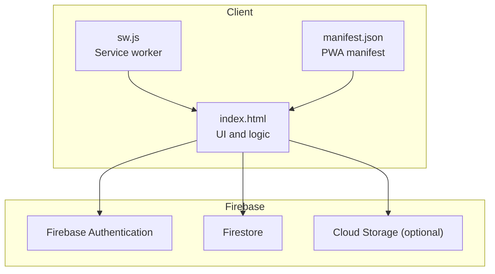
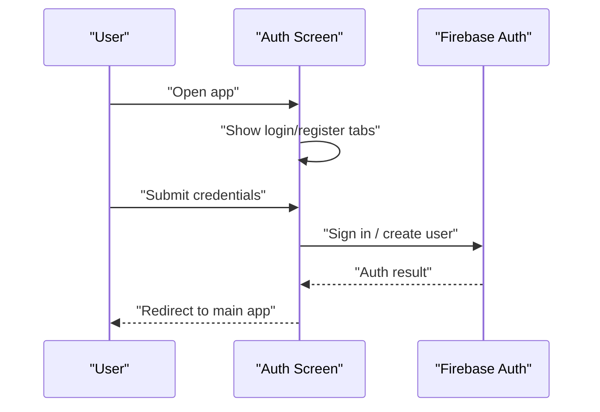
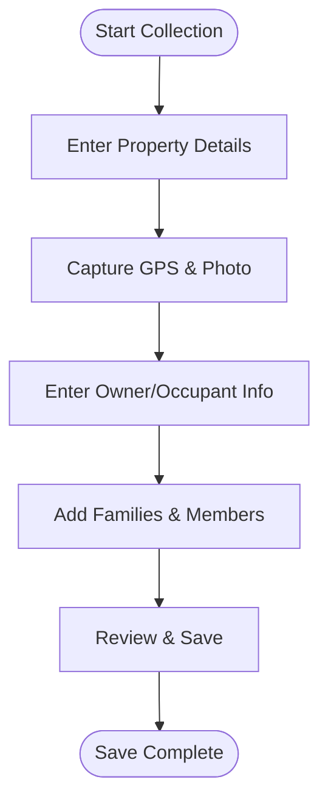
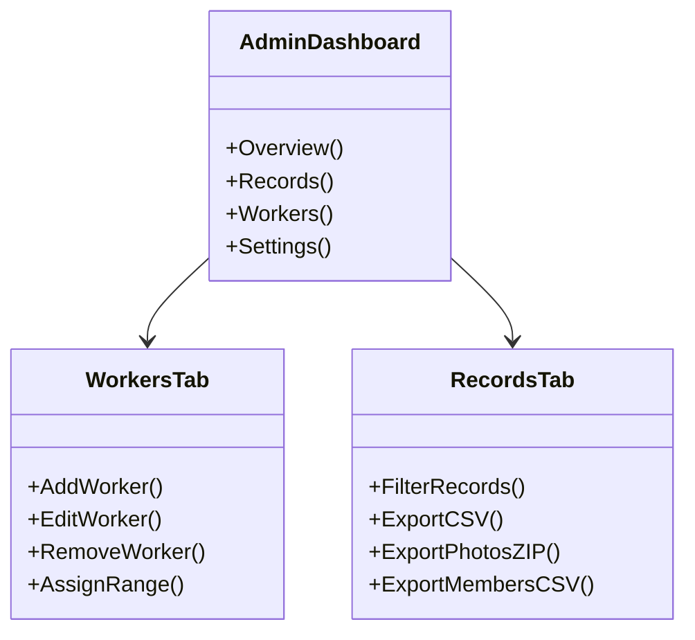
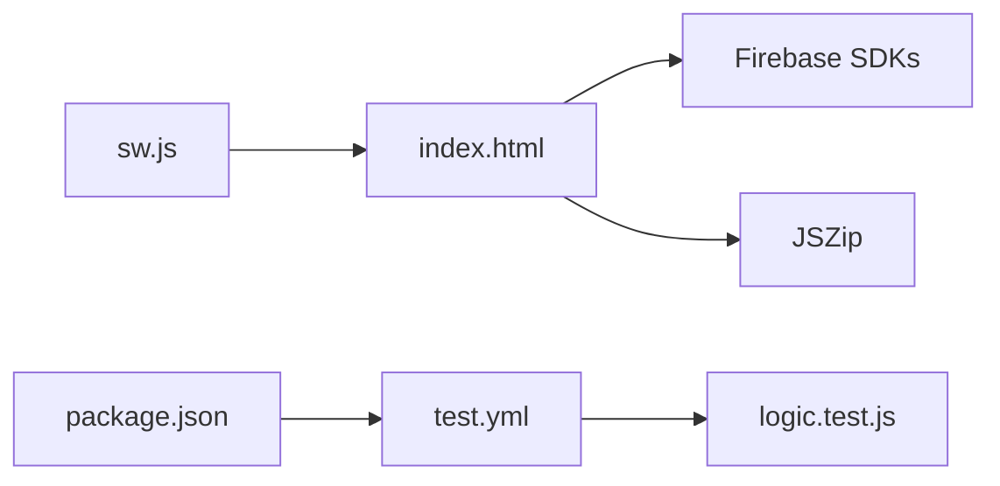

# Getting Started

<cite>
**Referenced Files in This Document**
- [README.md](file://README.md)
- [index.html](file://index.html)
- [manifest.json](file://manifest.json)
- [sw.js](file://sw.js)
- [package.json](file://package.json)
- [test.yml](file://.github/workflows/test.yml)
- [logic.test.js](file://test/logic.test.js)
- [FUTURE_PLANS.md](file://FUTURE_PLANS.md)
</cite>

## Table of Contents
1. [Introduction](#introduction)
2. [Project Structure](#project-structure)
3. [Prerequisites and System Requirements](#prerequisites-and-system-requirements)
4. [Installation and Setup](#installation-and-setup)
5. [Initial Configuration](#initial-configuration)
6. [Firebase Setup Requirements](#firebase-setup-requirements)
7. [Environment Preparation](#environment-preparation)
8. [First-Time User Tutorials](#first-time-user-tutorials)
9. [Quick Start Guides](#quick-start-guides)
10. [Architecture Overview](#architecture-overview)
11. [Detailed Component Analysis](#detailed-component-analysis)
12. [Dependency Analysis](#dependency-analysis)
13. [Performance Considerations](#performance-considerations)
14. [Troubleshooting Guide](#troubleshooting-guide)
15. [Conclusion](#conclusion)

## Introduction
Property Tax Collector is a mobile-first, offline-capable web application designed for door-to-door property tax data collection. It enables field workers to capture property details, GPS location, photos, and household/family information, while administrators can manage workers, monitor progress, and export reports. The app is optimized for smartphones and works without an internet connection thanks to a service worker caching strategy.

Key capabilities include:
- Offline-first operation with a service worker
- GPS location capture and photo capture
- Property and household data collection with guided steps
- CSV export with safety measures and formula-injection protection
- Correction workflow for admin-flagged corrections with audit history
- Bottom-navigation interface suitable for touch devices

**Section sources**
- [README.md:1-36](file://README.md#L1-L36)

## Project Structure
The application is distributed as a single HTML file with embedded styles and logic, complemented by a manifest and a service worker for PWA behavior and offline support.

**Diagram sources**
- [index.html:1-20](file://index.html#L1-L20)
- [manifest.json:1-28](file://manifest.json#L1-L28)
- [sw.js:1-41](file://sw.js#L1-L41)
- [package.json:1-10](file://package.json#L1-L10)
- [test.yml:1-19](file://.github/workflows/test.yml#L1-L19)
- [logic.test.js:1-20](file://test/logic.test.js#L1-L20)
- [FUTURE_PLANS.md:1-10](file://FUTURE_PLANS.md#L1-L10)

**Section sources**
- [index.html:1-20](file://index.html#L1-L20)
- [manifest.json:1-28](file://manifest.json#L1-L28)
- [sw.js:1-41](file://sw.js#L1-L41)
- [package.json:1-10](file://package.json#L1-L10)
- [test.yml:1-19](file://.github/workflows/test.yml#L1-L19)
- [logic.test.js:1-20](file://test/logic.test.js#L1-L20)
- [FUTURE_PLANS.md:1-10](file://FUTURE_PLANS.md#L1-L10)

## Prerequisites and System Requirements
- Device: Smartphone or tablet with a modern mobile browser
- Connectivity: Works offline; requires internet only for initial loading and Firebase operations
- Permissions:
  - Camera for taking property photos
  - Location services for capturing GPS coordinates
  - Storage for cached assets and offline data
- Operating systems: iOS Safari and Android Chrome are supported; PWA install prompts are enabled

**Section sources**
- [README.md:5-18](file://README.md#L5-L18)
- [index.html:11-17](file://index.html#L11-L17)
- [manifest.json:6-9](file://manifest.json#L6-L9)

## Installation and Setup
There are two primary ways to deploy the application:

Option A: Host the single-page app on a static hosting platform
- Upload the following files to your static host:
  - index.html
  - manifest.json
  - sw.js
- Ensure the service worker is served from the site root and the start URL points to index.html
- Verify PWA installation prompts appear on supported browsers

Option B: Run locally for testing
- Clone or download the repository
- Serve the files from a local HTTP server (e.g., Python’s http.server, Node’s http-server, or a local development server)
- Access the app via localhost in a mobile browser

Important note: The application does not include a backend server. All data is stored client-side until Firebase is configured.

**Section sources**
- [README.md:19-28](file://README.md#L19-L28)
- [manifest.json:5-6](file://manifest.json#L5-L6)
- [sw.js:1-6](file://sw.js#L1-L6)

## Initial Configuration
Before enabling authentication and data synchronization, configure the following:

- PWA metadata
  - Update the app name, short name, description, and theme color in manifest.json
  - Ensure icons are accessible and sized appropriately

- Service worker caching
  - Confirm the cache includes index.html, manifest.json, and the root path
  - Adjust cache strategy if you add additional assets

- Versioning
  - Increment the cache name/version in sw.js when updating assets to force cache refresh

- CI/CD (optional)
  - The repository includes a GitHub Actions workflow that runs Node tests on pushes and pull requests

**Section sources**
- [manifest.json:1-28](file://manifest.json#L1-L28)
- [sw.js:1-6](file://sw.js#L1-L6)
- [test.yml:1-19](file://.github/workflows/test.yml#L1-L19)

## Firebase Setup Requirements
The application integrates Firebase for authentication and data persistence. Configure the following Firebase services:

- Firebase SDK scripts
  - The app loads Firebase SDKs for app, auth, and Firestore compat modules from CDN
  - Ensure these URLs remain accessible and stable

- Firebase project configuration
  - Initialize Firebase with your project’s configuration in the app
  - Enable Email/Password authentication for worker and admin accounts
  - Enable Firestore for storing records and worker profiles

- Security rules
  - Implement Firestore security rules to protect data
  - Restrict access to authenticated users
  - Enforce write/read permissions for records and worker profiles
  - Consider role-based access (worker vs admin) using Firestore documents or custom claims

- Storage (optional)
  - Store photos in Cloud Storage if Firestore bandwidth/storage becomes constrained
  - Update the app to upload/download images from Storage and persist only references in Firestore

- Environment variables
  - Keep Firebase configuration secure; avoid exposing credentials in client-side code
  - Use a reverse proxy or backend endpoint to serve configuration if necessary

Note: The application currently relies on Firebase Authentication and Firestore. If you plan to expand to multiple Village Councils, consider multi-tenancy with separate Firestore databases or collections per council.

**Section sources**
- [index.html:14-16](file://index.html#L14-L16)
- [FUTURE_PLANS.md:7-37](file://FUTURE_PLANS.md#L7-L37)

## Environment Preparation
Prepare your environment for production deployment:

- Static hosting
  - Choose a static hosting provider (e.g., Firebase Hosting, Netlify, Vercel)
  - Configure HTTPS and custom domains if needed
  - Ensure CORS and security headers are set appropriately

- Service worker lifecycle
  - Test cache updates by incrementing the cache version in sw.js
  - Verify that the service worker activates and serves cached assets offline

- Testing
  - Run the included Node tests to validate core logic
  - Use the CI workflow to automate testing on pushes and pull requests

- Monitoring
  - Monitor Firebase usage and costs
  - Track Firestore reads/writes and authentication events
  - Consider adding analytics or crash reporting if desired

**Section sources**
- [package.json:6-8](file://package.json#L6-L8)
- [test.yml:1-19](file://.github/workflows/test.yml#L1-L19)
- [sw.js:27-40](file://sw.js#L27-L40)

## First-Time User Tutorials
### Field Worker Tutorial
1. Open the app in your mobile browser
2. On the authentication screen, choose “Register” and enter your details
3. Enter your full name, phone number, email, and password
4. Submit registration; your supervisor will activate your account
5. Log in with your credentials
6. Navigate to the Collect tab and start a new record
7. Enter Property ID (auto-prefixed with NSN-), Property Type, Owner Type, and Building Type
8. Capture GPS location and take a photo of the property
9. Fill in Owner/Occupant details (or leave optional fields blank if absent)
10. Add families and members for residential/mixed-use properties
11. Review the summary and save the record
12. Use the Follow Up tab to address missing details or corrections

### Administrator Tutorial
1. Log in as an administrator
2. Go to the Workers tab and add worker accounts
3. Assign sticker ranges to workers for property ID tracking
4. Monitor progress in the Overview tab
5. Export CSV data from the Records tab for reporting
6. Manage corrections by sending records back to workers with notes
7. Update app settings (e.g., Village Council name) in the Settings tab

**Section sources**
- [README.md:19-32](file://README.md#L19-L32)
- [index.html:222-258](file://index.html#L222-L258)
- [index.html:264-486](file://index.html#L264-L486)
- [index.html:489-634](file://index.html#L489-L634)

## Quick Start Guides
### Add a New Worker
1. Log in as an administrator
2. Go to the Workers tab
3. Fill in the worker’s name, phone number, email, and password
4. Click “Create Worker Account”
5. Optionally assign a sticker range to the worker

### Collect Property Data
1. Log in as a field worker
2. Tap the Collect tab
3. Enter Property ID, Property Type, Owner Type, and Building Type
4. Capture GPS and take a photo
5. Enter Owner/Occupant details
6. Add families and members for residential/mixed-use properties
7. Review and save the record

### Export Reports
1. Log in as an administrator
2. Go to the Records tab
3. Apply filters (worker, property type, owner type, status)
4. Click “Export CSV” to download a CSV file with UTF-8 BOM and CRLF line endings
5. Use “Photos ZIP” to export photos as a compressed archive

**Section sources**
- [index.html:599-611](file://index.html#L599-L611)
- [index.html:282-423](file://index.html#L282-L423)
- [index.html:559-596](file://index.html#L559-L596)

## Architecture Overview
The application follows a client-side architecture with Firebase for authentication and data storage. The UI is structured around tabs for workers and administrators, with a wizard-driven form for data collection.

**Diagram sources**
- [index.html:14-16](file://index.html#L14-L16)
- [sw.js:1-6](file://sw.js#L1-L6)
- [manifest.json:1-28](file://manifest.json#L1-L28)

## Detailed Component Analysis
### Authentication Screen
- Supports login and registration tabs
- Uses Firebase Authentication for user management
- Provides “Forgot password” functionality

**Diagram sources**
- [index.html:222-258](file://index.html#L222-L258)
- [index.html:14-16](file://index.html#L14-L16)

**Section sources**
- [index.html:222-258](file://index.html#L222-L258)

### Data Collection Wizard
- Five-step guided form: Property → Location & Photo → Occupant → Households → Review
- Real-time validation and required-field highlighting
- GPS capture and photo capture with preview and status indicators

**Diagram sources**
- [index.html:292-423](file://index.html#L292-L423)

**Section sources**
- [index.html:292-423](file://index.html#L292-L423)

### Administration Dashboard
- Overview tab: statistics and completion metrics
- Records tab: filtering, CSV export, and photo ZIP export
- Workers tab: add/edit/remove workers and assign sticker ranges
- Settings tab: update Village Council name and reset data

**Diagram sources**
- [index.html:489-634](file://index.html#L489-L634)
- [index.html:599-611](file://index.html#L599-L611)
- [index.html:559-596](file://index.html#L559-L596)

**Section sources**
- [index.html:489-634](file://index.html#L489-L634)

## Dependency Analysis
- Firebase SDKs: loaded from CDN for app, auth, and Firestore compat modules
- JSZip: used for compressing photos into ZIP archives for export
- Service worker: caches index.html, manifest.json, and root path for offline availability
- Tests: Node-based tests validate core logic extracted from the HTML file

**Diagram sources**
- [index.html:14-17](file://index.html#L14-L17)
- [sw.js:1-6](file://sw.js#L1-L6)
- [package.json:6-8](file://package.json#L6-L8)
- [test.yml:1-19](file://.github/workflows/test.yml#L1-L19)
- [logic.test.js:1-20](file://test/logic.test.js#L1-L20)

**Section sources**
- [index.html:14-17](file://index.html#L14-L17)
- [sw.js:1-6](file://sw.js#L1-L6)
- [package.json:6-8](file://package.json#L6-L8)
- [test.yml:1-19](file://.github/workflows/test.yml#L1-L19)
- [logic.test.js:1-20](file://test/logic.test.js#L1-L20)

## Performance Considerations
- Offline-first design reduces latency and improves reliability in low-connectivity areas
- Service worker caching minimizes repeated downloads of static assets
- Photo exports are handled via ZIP compression to reduce transfer overhead
- Keep Firebase security rules efficient to minimize read/write costs
- Consider moving large media assets to Cloud Storage to reduce Firestore bandwidth

[No sources needed since this section provides general guidance]

## Troubleshooting Guide
Common setup and runtime issues:

- Authentication fails
  - Ensure Firebase Authentication is enabled and Email/Password provider is active
  - Verify that user accounts are created and activated by an administrator
  - Check console logs for Firebase initialization errors

- GPS not captured
  - Confirm device location services are enabled
  - Allow camera and location permissions in the browser
  - Retry GPS capture at the property boundary

- Photos not uploading or missing
  - Verify camera permissions are granted
  - Ensure Firestore security rules permit uploads and reads
  - Consider migrating photos to Cloud Storage for scalability

- Service worker not caching assets
  - Clear browser cache and reload the page
  - Confirm the service worker is registered and active
  - Increment the cache version in sw.js to force refresh

- Export CSV issues
  - Ensure UTF-8 BOM and CRLF line endings are preserved
  - Filter records before export to reduce payload size

- Multi-tenant expansion concerns
  - Review the multi-tenancy notes and security implications
  - Plan for separate Firestore databases or strict security rules per council

**Section sources**
- [index.html:14-16](file://index.html#L14-L16)
- [sw.js:1-6](file://sw.js#L1-L6)
- [FUTURE_PLANS.md:7-37](file://FUTURE_PLANS.md#L7-L37)

## Conclusion
Property Tax Collector provides a robust, offline-capable solution for property tax data collection. By configuring Firebase for authentication and data storage, preparing a static hosting environment, and following the provided tutorials, administrators and field workers can quickly deploy and operate the system. The included tests and CI workflow help ensure code quality, while the PWA architecture and service worker enable reliable offline usage on mobile devices.

[No sources needed since this section summarizes without analyzing specific files]