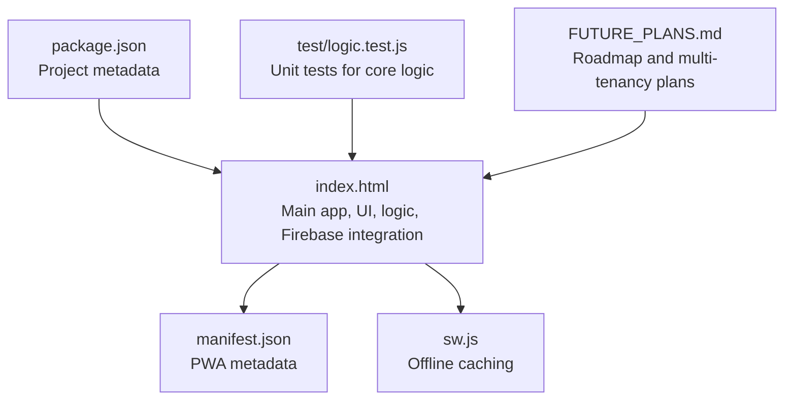
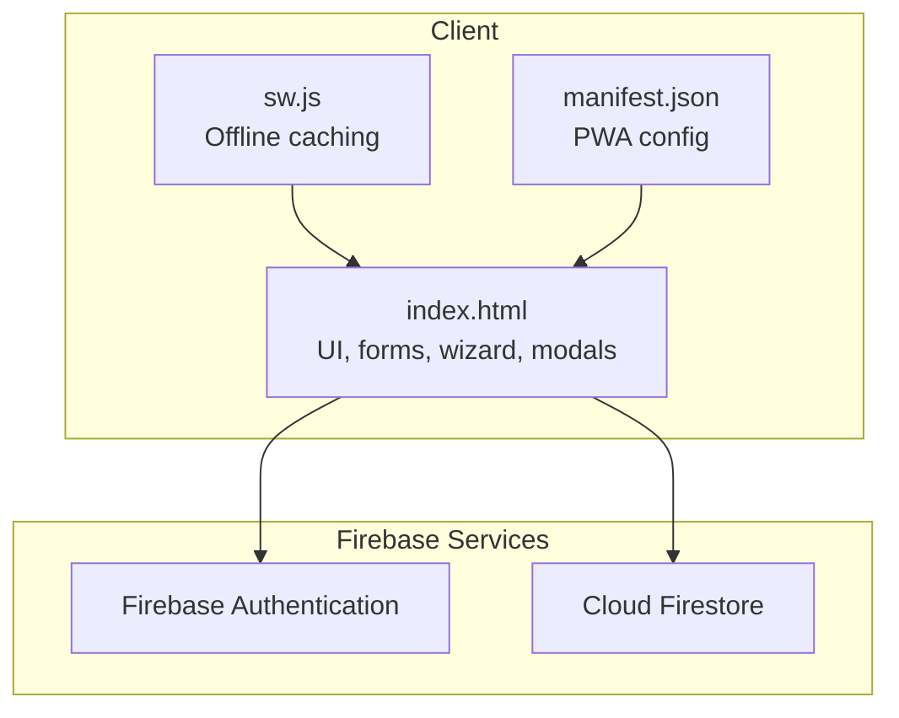
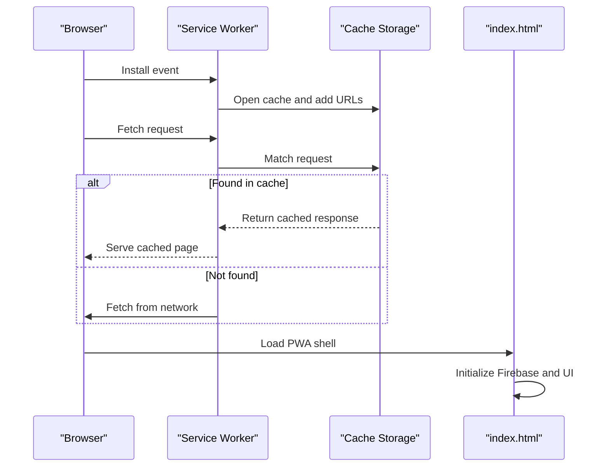
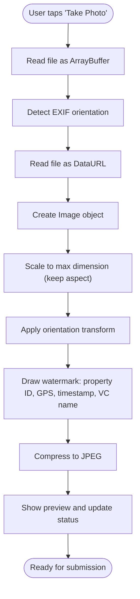
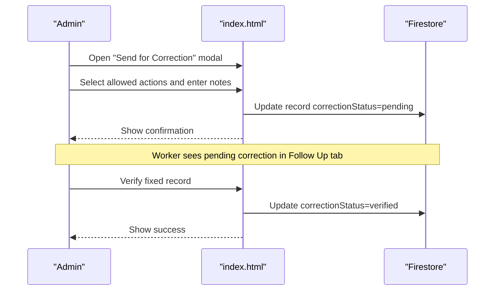
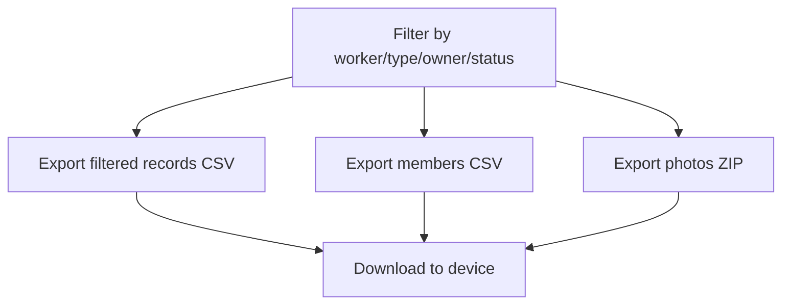
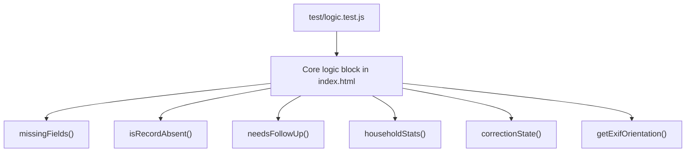
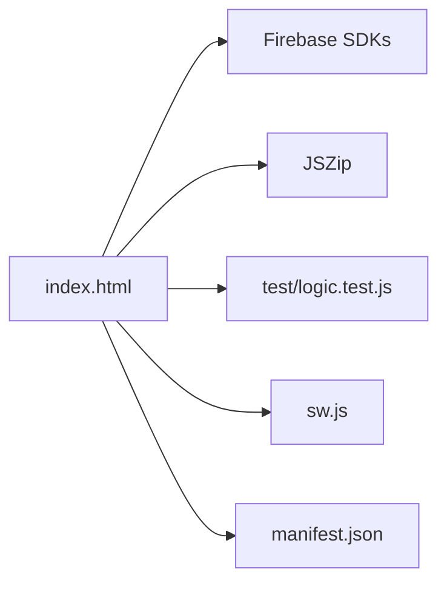

# Project Overview

<cite>
**Referenced Files in This Document**
- [README.md](file://README.md)
- [index.html](file://index.html)
- [manifest.json](file://manifest.json)
- [sw.js](file://sw.js)
- [package.json](file://package.json)
- [test/logic.test.js](file://test/logic.test.js)
- [FUTURE_PLANS.md](file://FUTURE_PLANS.md)
</cite>

## Table of Contents
1. [Introduction](#introduction)
2. [Project Structure](#project-structure)
3. [Core Components](#core-components)
4. [Architecture Overview](#architecture-overview)
5. [Detailed Component Analysis](#detailed-component-analysis)
6. [Dependency Analysis](#dependency-analysis)
7. [Performance Considerations](#performance-considerations)
8. [Troubleshooting Guide](#troubleshooting-guide)
9. [Conclusion](#conclusion)
10. [Appendices](#appendices)

## Introduction
Property Tax Collector is a mobile-first Progressive Web App designed for door-to-door property tax data collection in rural settings. It enables field workers to capture property details, GPS location, and household demographics directly from smartphones, with offline-first capabilities and a streamlined correction workflow. Administrators can monitor progress, export data, and manage users.

Key goals:
- Enable reliable data collection in low-connectivity environments
- Provide a guided, step-by-step form process
- Support photo capture with automatic geotagging stamps
- Offer robust offline support via a service worker
- Deliver a modern, government-appropriate interface optimized for small screens

Target audience:
- Village councils and local governments
- Field workers who collect data in the field
- Administrators who validate, export, and manage workflows

Use cases:
- Property registration and classification (Residential, Commercial, Mixed Use, Institutional/Public)
- Owner/occupant information capture
- Household enumeration with auto-calculated family IDs and demographic summaries
- GPS capture and photo stamping for verification
- Correction workflow: admin flags → worker fixes → admin verification
- Bulk CSV export for reporting and tax administration

**Section sources**
- [README.md:1-36](file://README.md#L1-L36)

## Project Structure
The project is intentionally lightweight and self-contained:
- Single-page application built in a single HTML file with embedded styles and logic
- Progressive Web App assets: manifest and service worker
- Minimal Node-based testing harness for core logic extracted from the HTML

**Diagram sources**
- [index.html:1-2595](file://index.html#L1-L2595)
- [manifest.json:1-28](file://manifest.json#L1-L28)
- [sw.js:1-41](file://sw.js#L1-L41)
- [package.json:1-10](file://package.json#L1-L10)
- [test/logic.test.js:1-212](file://test/logic.test.js#L1-L212)
- [FUTURE_PLANS.md:1-51](file://FUTURE_PLANS.md#L1-L51)

**Section sources**
- [index.html:1-2595](file://index.html#L1-L2595)
- [manifest.json:1-28](file://manifest.json#L1-L28)
- [sw.js:1-41](file://sw.js#L1-L41)
- [package.json:1-10](file://package.json#L1-L10)
- [test/logic.test.js:1-212](file://test/logic.test.js#L1-L212)
- [FUTURE_PLANS.md:1-51](file://FUTURE_PLANS.md#L1-L51)

## Core Components
- Authentication and roles
  - Worker and administrator login/registration
  - Password reset flow
  - Profile management for workers and admins
- Data collection wizard
  - Property details (ID, type, owner category, building type)
  - Location capture with GPS accuracy feedback
  - Photo capture with automatic geotag stamping and orientation handling
  - Occupant details (owner or institutional contact)
  - Household enumeration with auto-generated family IDs and demographic stats
  - Review and save with optional remarks
- Offline-first
  - Service worker precaches core assets
  - Local UI state and submission queue for eventual sync
- Correction workflow
  - Admin flags records needing correction with configurable actions
  - Worker revises details and resubmits
  - Admin verifies and marks correction complete
- Administration dashboard
  - Summary statistics and completion metrics
  - Filtered record lists with export capabilities
  - Worker management and range assignment
  - Settings and administrative controls

**Section sources**
- [README.md:5-18](file://README.md#L5-L18)
- [index.html:282-423](file://index.html#L282-L423)
- [index.html:1752-1836](file://index.html#L1752-L1836)
- [index.html:1838-1948](file://index.html#L1838-L1948)
- [index.html:1950-2000](file://index.html#L1950-L2000)
- [index.html:2151-2198](file://index.html#L2151-L2198)
- [index.html:2353-2388](file://index.html#L2353-L2388)

## Architecture Overview
The application follows a Progressive Web App architecture with client-side logic and Firebase for identity and data persistence. The design emphasizes reliability in offline conditions and a native-app-like experience on mobile devices.

**Diagram sources**
- [index.html:13-17](file://index.html#L13-L17)
- [index.html:815-887](file://index.html#L815-L887)
- [sw.js:1-41](file://sw.js#L1-L41)
- [manifest.json:1-28](file://manifest.json#L1-L28)

**Section sources**
- [index.html:13-17](file://index.html#L13-L17)
- [index.html:815-887](file://index.html#L815-L887)
- [sw.js:1-41](file://sw.js#L1-L41)
- [manifest.json:1-28](file://manifest.json#L1-L28)

## Detailed Component Analysis

### Offline-First Workflow
The service worker precaches essential resources and serves cached pages when offline. On first launch, the app displays a splash screen while initializing Firebase and loading UI components.

**Diagram sources**
- [sw.js:8-25](file://sw.js#L8-L25)
- [index.html:215-221](file://index.html#L215-L221)

**Section sources**
- [sw.js:1-41](file://sw.js#L1-L41)
- [index.html:215-221](file://index.html#L215-L221)

### GPS and Photo Capture Pipeline
The photo capture pipeline reads EXIF orientation, normalizes the image, stamps property ID, GPS coordinates, timestamp, and village council name, then compresses and previews the result. GPS capture uses high-accuracy settings and displays accuracy.

**Diagram sources**
- [index.html:1838-1916](file://index.html#L1838-L1916)

**Section sources**
- [index.html:1838-1916](file://index.html#L1838-L1916)

### Correction Workflow
Administrators can flag records for correction with specific actions (re-capture GPS, re-take photo, fix details). Workers receive notifications via the Follow Up tab and can resubmit corrected data. Administrators verify and mark corrections complete.

**Diagram sources**
- [index.html:2151-2198](file://index.html#L2151-L2198)

**Section sources**
- [index.html:2151-2198](file://index.html#L2151-L2198)

### Data Export and Reporting
Administrators can filter records and export:
- CSV of property records
- CSV of household members
- ZIP of photos (with safeguards against formula injection and proper encoding)

**Diagram sources**
- [index.html:558-596](file://index.html#L558-L596)

**Section sources**
- [index.html:558-596](file://index.html#L558-L596)

### Test Coverage for Core Logic
Tests validate:
- Missing fields detection for both residential and institutional records
- Absent record determination with backward compatibility
- Follow-up needs computation
- Household statistics aggregation
- Correction state resolution
- EXIF orientation parsing from JPEG buffers

**Diagram sources**
- [test/logic.test.js:1-212](file://test/logic.test.js#L1-L212)
- [index.html:1752-1836](file://index.html#L1752-L1836)

**Section sources**
- [test/logic.test.js:1-212](file://test/logic.test.js#L1-L212)
- [index.html:1752-1836](file://index.html#L1752-L1836)

## Dependency Analysis
- Client runtime
  - Firebase SDKs for app initialization, authentication, and Firestore
  - JSZip for packaging photos into ZIP archives
- PWA infrastructure
  - Web App Manifest defines app metadata and icons
  - Service Worker manages caching and offline behavior
- Testing
  - Node-based tests isolate and execute core logic extracted from the HTML

**Diagram sources**
- [index.html:13-17](file://index.html#L13-L17)
- [index.html:16](file://index.html#L16)
- [sw.js:1-41](file://sw.js#L1-L41)
- [manifest.json:1-28](file://manifest.json#L1-L28)
- [test/logic.test.js:1-212](file://test/logic.test.js#L1-L212)

**Section sources**
- [index.html:13-17](file://index.html#L13-L17)
- [index.html:16](file://index.html#L16)
- [sw.js:1-41](file://sw.js#L1-L41)
- [manifest.json:1-28](file://manifest.json#L1-L28)
- [test/logic.test.js:1-212](file://test/logic.test.js#L1-L212)

## Performance Considerations
- Image optimization
  - Downscale images to a maximum dimension while preserving aspect ratio
  - Normalize orientation using EXIF data to avoid runtime transforms
  - Compress to JPEG with moderate quality to balance fidelity and file size
- Offline readiness
  - Precache core HTML and manifest to reduce first-load latency
  - Minimize external dependencies to improve resilience
- Data operations
  - Batch queries and snapshots for worker and admin views
  - Use Firestore indexes implicitly via common query patterns (worker UID, timestamps)
- Mobile UX
  - Bottom navigation and large touch targets
  - Progress indicators for GPS and photo capture
  - Clear status messages and warnings for required fields

[No sources needed since this section provides general guidance]

## Troubleshooting Guide
Common issues and resolutions:
- GPS not supported or permission denied
  - Ensure device supports Geolocation API and location permissions are granted
  - Use high-accuracy mode with appropriate timeouts
- Photo capture fails or orientation incorrect
  - Verify camera permissions and try again
  - Confirm EXIF orientation is detected and applied
- Offline behavior
  - Confirm service worker installed and cache populated
  - Reload the app to trigger activation and cache updates
- Export failures
  - Check browser support for Blob and download APIs
  - Validate filtering criteria and record completeness before exporting

**Section sources**
- [index.html:1926-1942](file://index.html#L1926-L1942)
- [index.html:1838-1916](file://index.html#L1838-L1916)
- [sw.js:8-25](file://sw.js#L8-L25)
- [index.html:583-591](file://index.html#L583-L591)

## Conclusion
Property Tax Collector delivers a practical, offline-first solution for rural property tax data collection. Its mobile-first design, guided forms, and robust correction workflow streamline field operations, while Firebase integration and PWA capabilities ensure reliability and accessibility. Administrators gain powerful reporting and export tools to support transparent governance and efficient tax administration.

[No sources needed since this section summarizes without analyzing specific files]

## Appendices

### Technology Stack Overview
- Progressive Web App
  - Standalone display mode, theme color, and app icons
  - Service worker for offline caching
- Client-side framework
  - Vanilla HTML/CSS/JavaScript in a single-page app
- Backend services
  - Firebase Authentication for secure login
  - Cloud Firestore for structured data storage
- Utilities
  - JSZip for photo exports

**Section sources**
- [manifest.json:1-28](file://manifest.json#L1-L28)
- [sw.js:1-41](file://sw.js#L1-L41)
- [index.html:13-17](file://index.html#L13-L17)
- [index.html:16](file://index.html#L16)

### Roadmap and Multi-Tenancy
Future enhancements include multi-tenancy to support multiple village councils with role tiers and data separation. Decisions around hosting, scaling, and security are being carefully considered to meet governance and privacy requirements.

**Section sources**
- [FUTURE_PLANS.md:7-37](file://FUTURE_PLANS.md#L7-L37)