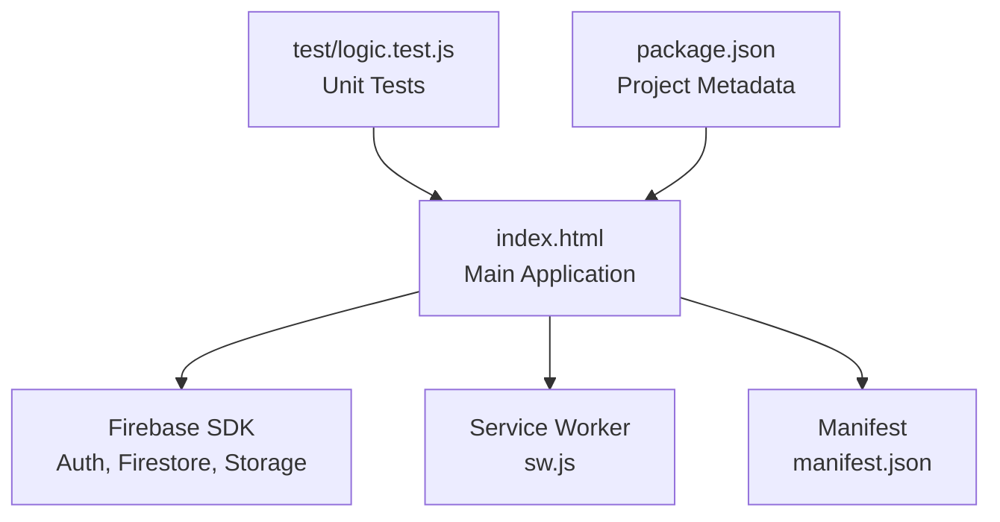
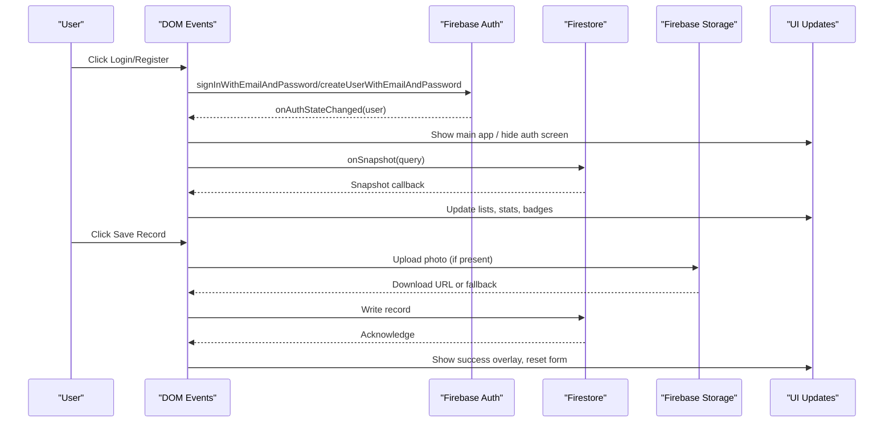
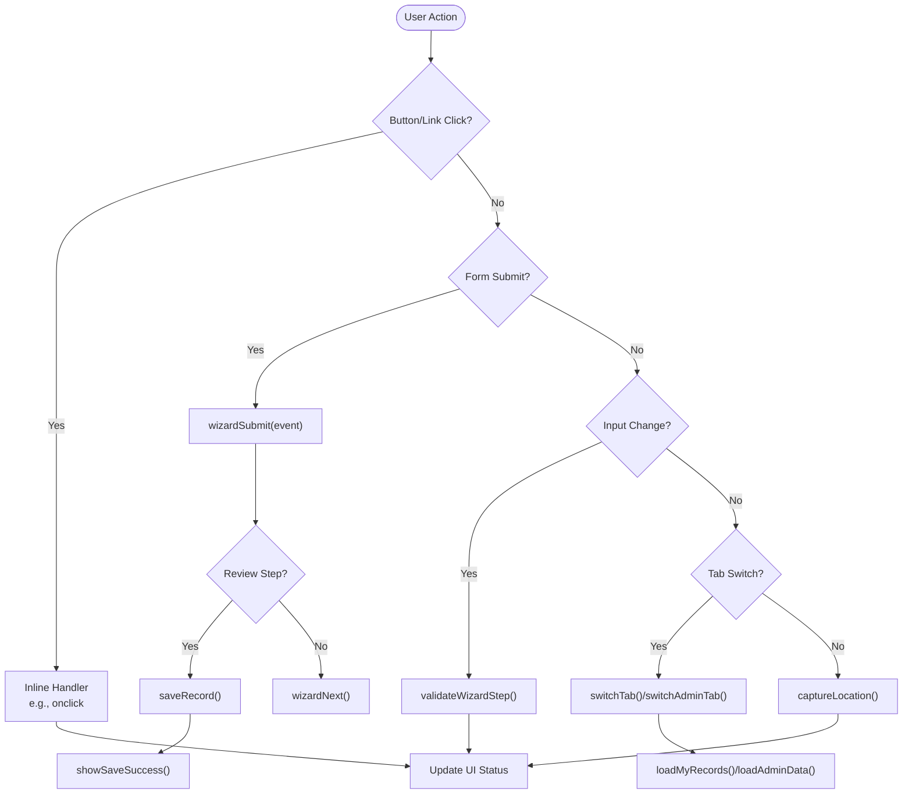
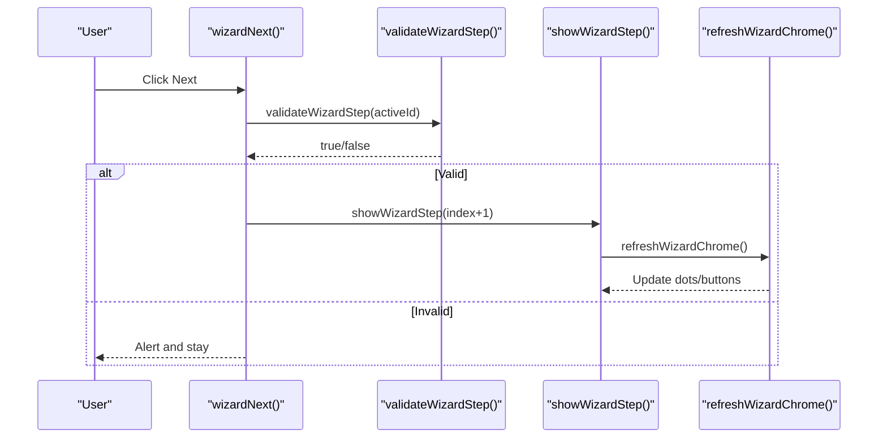
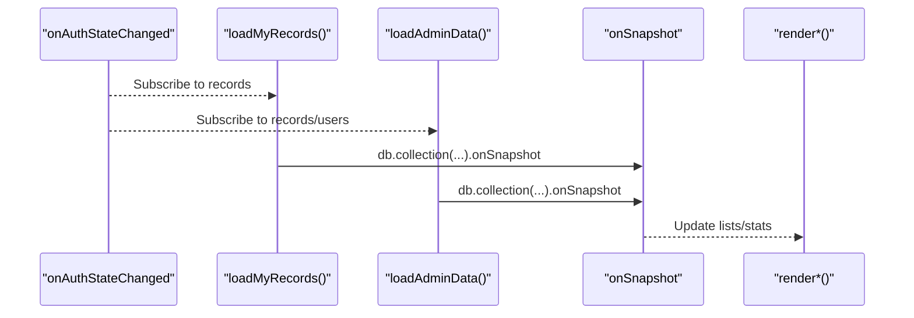
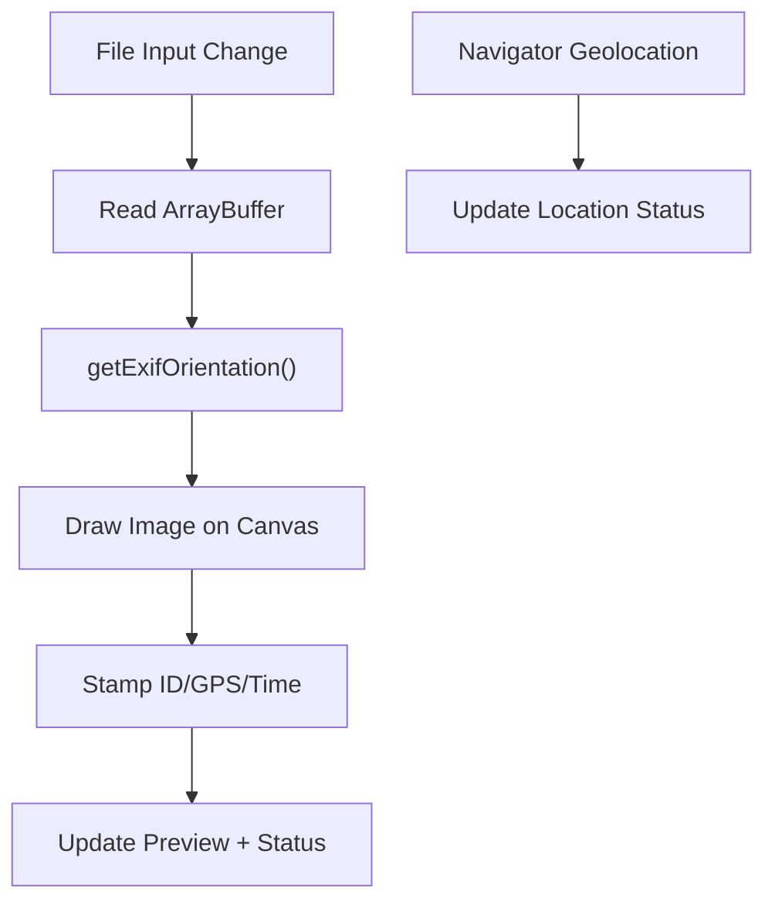
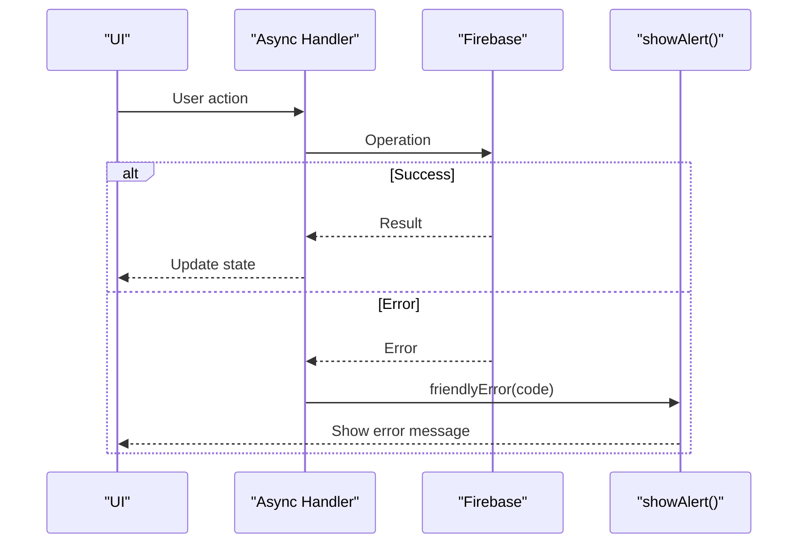
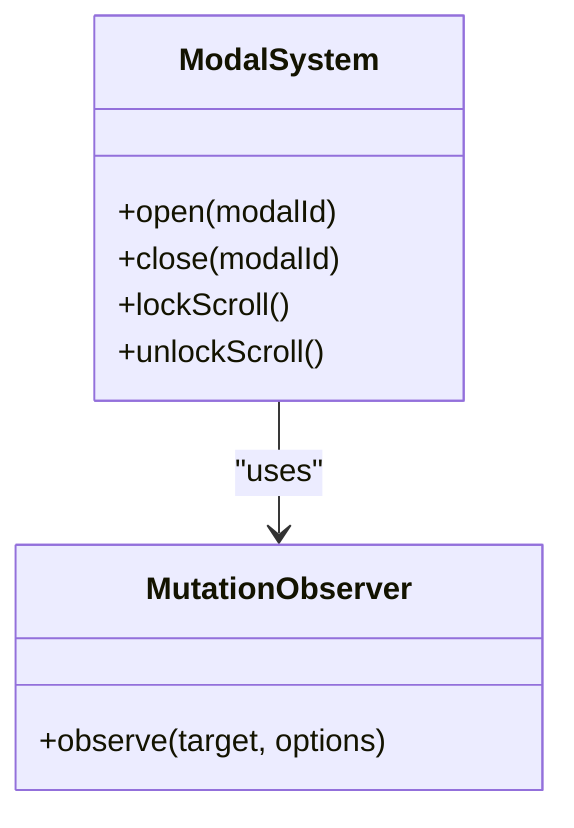
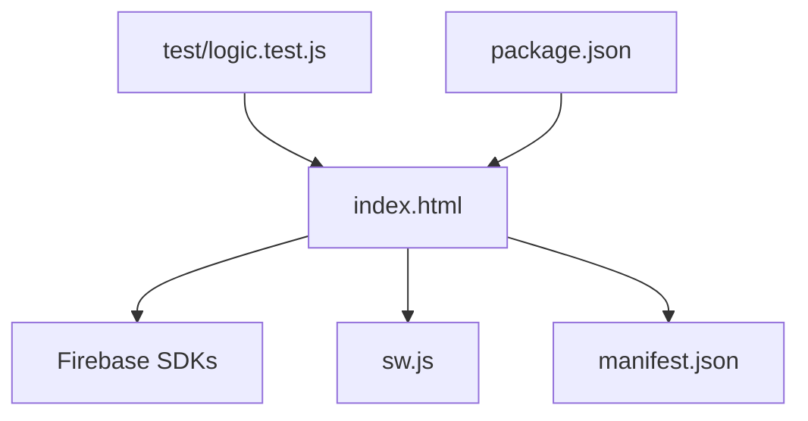

# Event-Driven Programming Model

<cite>
**Referenced Files in This Document**
- [index.html](file://index.html)
- [sw.js](file://sw.js)
- [manifest.json](file://manifest.json)
- [package.json](file://package.json)
- [test\logic.test.js](file://test/logic.test.js)
- [FUTURE_PLANS.md](file://FUTURE_PLANS.md)
</cite>

## Table of Contents
1. [Introduction](#introduction)
2. [Project Structure](#project-structure)
3. [Core Components](#core-components)
4. [Architecture Overview](#architecture-overview)
5. [Detailed Component Analysis](#detailed-component-analysis)
6. [Dependency Analysis](#dependency-analysis)
7. [Performance Considerations](#performance-considerations)
8. [Troubleshooting Guide](#troubleshooting-guide)
9. [Conclusion](#conclusion)

## Introduction
This document explains the event-driven programming model used throughout the Property Tax Collector application. It covers DOM event handling patterns for forms, buttons, inputs, and navigation; the wizard navigation system with step validation and UI updates; real-time event handling via Firebase for authentication state changes and Firestore snapshots; custom modal management; and performance considerations for listeners and dynamic content. The analysis focuses on the single-file architecture of index.html and its supporting assets.

## Project Structure
The application is a Progressive Web App (PWA) contained in a single HTML file with embedded JavaScript, CSS, and Firebase integration. Supporting files include a service worker for caching, a web app manifest, and unit tests for shared logic.

**Diagram sources**
- [index.html:816-882](file://index.html#L816-L882)
- [sw.js:1-45](file://sw.js#L1-L45)
- [manifest.json:1-28](file://manifest.json#L1-L28)
- [test\logic.test.js:1-223](file://test/logic.test.js#L1-L223)
- [package.json:1-10](file://package.json#L1-L10)

**Section sources**
- [index.html:1-2650](file://index.html#L1-L2650)
- [sw.js:1-45](file://sw.js#L1-L45)
- [manifest.json:1-28](file://manifest.json#L1-L28)
- [package.json:1-10](file://package.json#L1-L10)

## Core Components
- Authentication and routing: Firebase Authentication state listener controls visibility of auth screens and main app views, switching between worker and admin modes.
- Wizard navigation: A multi-step form with validation gates, dynamic step rendering, and progress indicators.
- Real-time data binding: Firestore onSnapshot listeners update UI for worker records and admin dashboards.
- Modal system: Multiple overlays for dialogs, photo preview, and notifications, with scroll locking behavior.
- Media capture: Photo capture with EXIF orientation handling and automatic stamping; GPS capture with accuracy feedback.
- Tab switching: Navigation between main sections with lazy loading of data.

**Section sources**
- [index.html:896-950](file://index.html#L896-L950)
- [index.html:1259-1344](file://index.html#L1259-L1344)
- [index.html:1984-2000](file://index.html#L1984-L2000)
- [index.html:2251-2268](file://index.html#L2251-L2268)
- [index.html:1869-1981](file://index.html#L1869-L1981)
- [index.html:2601-2616](file://index.html#L2601-L2616)

## Architecture Overview
The event-driven architecture centers on DOM events, Firebase SDK callbacks, and reactive UI updates. Authentication state determines which views are shown and which data is loaded. Firestore snapshots drive real-time updates for lists and dashboards. Modals and overlays are controlled via class toggles and mutation observers.

**Diagram sources**
- [index.html:896-950](file://index.html#L896-L950)
- [index.html:1984-2000](file://index.html#L1984-L2000)
- [index.html:2251-2268](file://index.html#L2251-L2268)
- [index.html:1552-1651](file://index.html#L1552-L1651)

## Detailed Component Analysis

### DOM Event Handling Patterns
- Inline event handlers: Buttons and form elements use onclick/onsubmit attributes to trigger functions directly.
- Form submission: The wizard form uses onsubmit to validate and save on the Review step, otherwise advancing steps.
- Input validation: Real-time checks for required fields and conditional requirements (e.g., GPS and photo required in Location step).
- Navigation: Tab switching functions toggle active classes and load data lazily for specific tabs.

**Diagram sources**
- [index.html:288-423](file://index.html#L288-L423)
- [index.html:1318-1344](file://index.html#L1318-L1344)
- [index.html:1487-1651](file://index.html#L1487-L1651)
- [index.html:2601-2616](file://index.html#L2601-L2616)
- [index.html:1959-1981](file://index.html#L1959-L1981)

**Section sources**
- [index.html:288-423](file://index.html#L288-L423)
- [index.html:1318-1344](file://index.html#L1318-L1344)
- [index.html:1487-1651](file://index.html#L1487-L1651)
- [index.html:2601-2616](file://index.html#L2601-L2616)
- [index.html:1959-1981](file://index.html#L1959-L1981)

### Wizard Navigation System
The wizard uses a step array with optional conditions (e.g., households step appears only for certain property types). Navigation is controlled by:
- Step progression: Next validates the current step, then moves forward.
- Progress dots: Dynamically rendered with click-to-jump behavior for completed steps.
- Conditional rendering: The Households step renders family inputs; Review step compiles a summary.

**Diagram sources**
- [index.html:1311-1316](file://index.html#L1311-L1316)
- [index.html:1319-1336](file://index.html#L1319-L1336)
- [index.html:1270-1304](file://index.html#L1270-L1304)

**Section sources**
- [index.html:1259-1344](file://index.html#L1259-L1344)
- [index.html:1270-1304](file://index.html#L1270-L1304)

### Real-Time Event Handling (Firebase)
- Authentication state: onAuthStateChanged controls app-wide visibility and loads appropriate data.
- Worker records: onSnapshot for user’s records updates lists and follow-up badges.
- Admin dashboard: onSnapshot for all records and users updates overview and filters.
- Profile updates: onSnapshot on user doc listens for range/profile changes.

**Diagram sources**
- [index.html:896-950](file://index.html#L896-L950)
- [index.html:1984-2000](file://index.html#L1984-L2000)
- [index.html:2251-2268](file://index.html#L2251-L2268)

**Section sources**
- [index.html:896-950](file://index.html#L896-L950)
- [index.html:1984-2000](file://index.html#L1984-L2000)
- [index.html:2251-2268](file://index.html#L2251-L2268)

### Custom Event Creation and Propagation
- Modal management: Classes like "modal.active" control visibility; a MutationObserver locks scrolling when overlays are open.
- Photo capture: The file input change triggers handlePhotoCapture, which internally uses FileReader and Canvas APIs to process images and stamp metadata.
- GPS capture: Navigator Geolocation API provides coordinates; errors are surfaced via UI alerts.

**Diagram sources**
- [index.html:1869-1981](file://index.html#L1869-L1981)
- [index.html:1784-1867](file://index.html#L1784-L1867)

**Section sources**
- [index.html:1869-1981](file://index.html#L1869-L1981)
- [index.html:1784-1867](file://index.html#L1784-L1867)

### Asynchronous Event Handling and Error Propagation
- Async operations: Login/register, photo upload, Firestore writes, and exports use async/await with try/catch blocks.
- Error messages: friendlyError maps Firebase error codes to user-friendly strings; alerts are displayed and auto-dismissed.
- Validation: Early returns with alertFalse prevent invalid submissions and guide users to correct fields.

**Diagram sources**
- [index.html:965-994](file://index.html#L965-L994)
- [index.html:1552-1651](file://index.html#L1552-L1651)
- [index.html:1211-1222](file://index.html#L1211-L1222)

**Section sources**
- [index.html:965-994](file://index.html#L965-L994)
- [index.html:1552-1651](file://index.html#L1552-L1651)
- [index.html:1211-1222](file://index.html#L1211-L1222)

### Modal Dialog Management
- Multiple modals: Login, Registration, Profile, Correction, Delete, Assign Range, Change Password, Full Photo Viewer, and Logout confirmation.
- Scroll lock: MutationObserver detects active modals/photos and prevents background scrolling.
- Accessibility: Close buttons and backdrop clicks dismiss modals.

**Diagram sources**
- [index.html:835-859](file://index.html#L835-L859)
- [index.html:642-770](file://index.html#L642-L770)

**Section sources**
- [index.html:835-859](file://index.html#L835-L859)
- [index.html:642-770](file://index.html#L642-L770)

## Dependency Analysis
The application depends on:
- Firebase SDKs for authentication, Firestore, and Storage.
- Service Worker for caching and offline support.
- Web App Manifest for PWA installation and presentation.
- Unit tests for shared logic extraction.

**Diagram sources**
- [index.html:13-18](file://index.html#L13-L18)
- [sw.js:1-45](file://sw.js#L1-L45)
- [manifest.json:1-28](file://manifest.json#L1-L28)
- [test\logic.test.js:1-223](file://test/logic.test.js#L1-L223)
- [package.json:1-10](file://package.json#L1-L10)

**Section sources**
- [index.html:13-18](file://index.html#L13-L18)
- [sw.js:1-45](file://sw.js#L1-L45)
- [manifest.json:1-28](file://manifest.json#L1-L28)
- [test\logic.test.js:1-223](file://test/logic.test.js#L1-L223)
- [package.json:1-10](file://package.json#L1-L10)

## Performance Considerations
- Event listener lifecycle: Firestore onSnapshot subscriptions are unsubscribed before re-subscribing to prevent duplicates. Consider centralizing subscription management to avoid leaks.
- DOM updates: Batched rendering for lists and summaries reduces layout thrashing.
- Image processing: Canvas resizing and JPEG compression occur client-side; consider debouncing repeated captures to reduce CPU usage.
- Memory management: Blobs for uploads are held in memory until committed; clear pendingPhotoBlob after upload or failure.
- Modal scroll lock: MutationObserver runs continuously; ensure it targets only necessary nodes to minimize overhead.

[No sources needed since this section provides general guidance]

## Troubleshooting Guide
Common issues and remedies:
- Authentication failures: friendlyError maps Firebase codes to user-friendly messages; verify network connectivity and credential validity.
- Duplicate record detection: On save, the app queries Firestore for existing IDs and prevents duplicates; adjust sticker ranges if needed.
- Photo upload fallback: If Storage upload fails, the app falls back to base64; ensure Firestore quotas are considered.
- GPS permission: If geolocation fails, instruct users to enable location services and retry.
- Modal stuck open: Ensure closeModal() is called on logout and error paths; verify MutationObserver is observing body class changes.

**Section sources**
- [index.html:1211-1222](file://index.html#L1211-L1222)
- [index.html:1534-1548](file://index.html#L1534-L1548)
- [index.html:1552-1573](file://index.html#L1552-L1573)
- [index.html:1959-1975](file://index.html#L1959-L1975)
- [index.html:942-949](file://index.html#L942-L949)

## Conclusion
The Property Tax Collector employs a cohesive event-driven model centered on DOM events, Firebase callbacks, and reactive UI updates. The wizard navigation, modal system, media capture, and real-time synchronization work together to deliver a responsive field data collection experience. Proper attention to listener lifecycle, error propagation, and performance ensures maintainability and scalability.