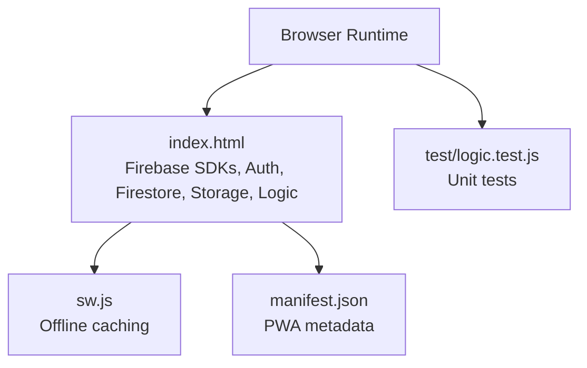
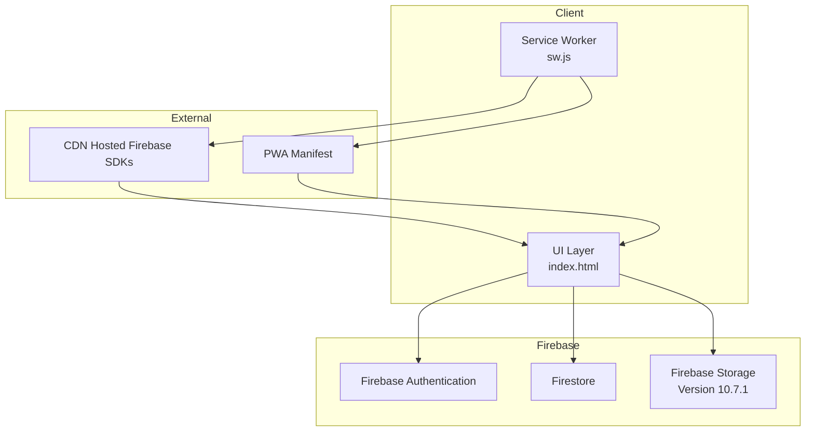
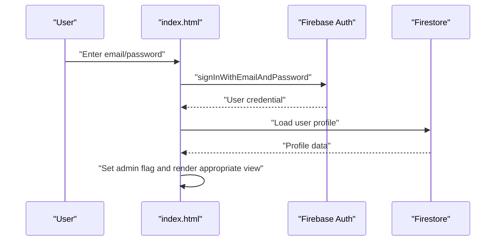
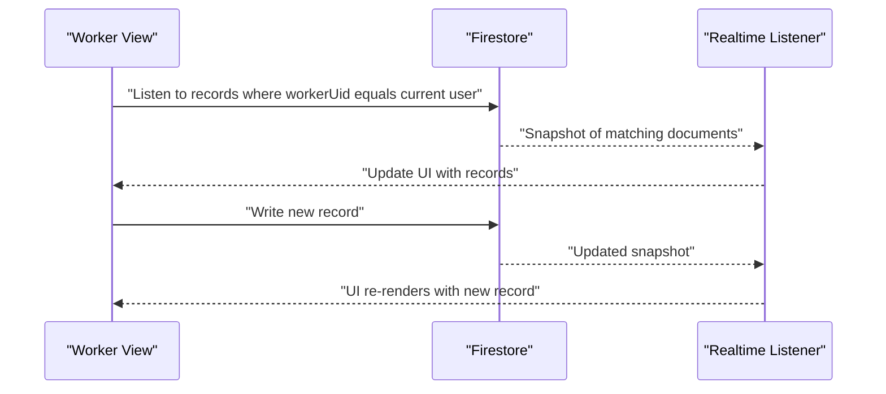
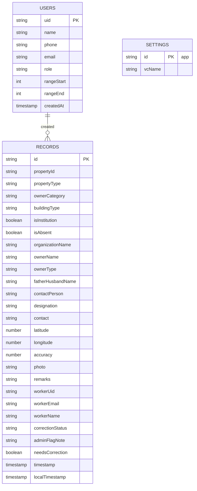
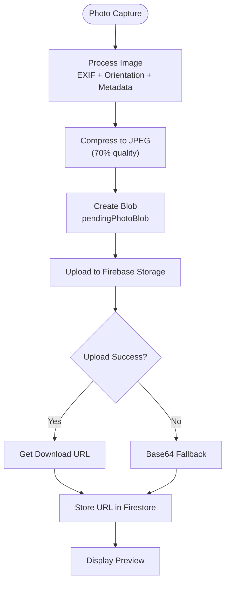
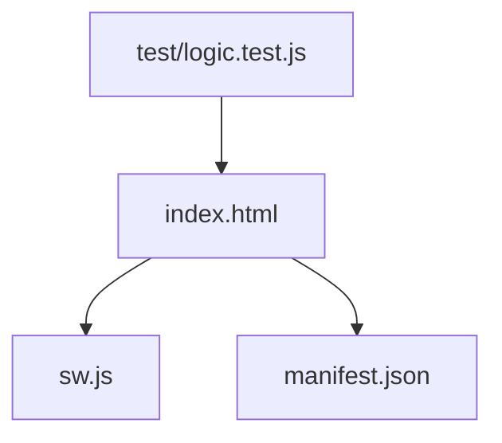

# Firebase Integration

<cite>
**Referenced Files in This Document**
- [index.html](file://index.html)
- [sw.js](file://sw.js)
- [manifest.json](file://manifest.json)
- [package.json](file://package.json)
- [README.md](file://README.md)
- [test/logic.test.js](file://test/logic.test.js)
</cite>

## Update Summary
**Changes Made**
- Updated Firebase Storage integration section to reflect version 10.7.1 implementation
- Added comprehensive documentation for pendingPhotoBlob variable and dual-path upload approach
- Enhanced photo upload process documentation with intelligent URL detection
- Updated Firebase Storage initialization and configuration details
- Added base64 fallback mechanism documentation

## Table of Contents
1. [Introduction](#introduction)
2. [Project Structure](#project-structure)
3. [Core Components](#core-components)
4. [Architecture Overview](#architecture-overview)
5. [Detailed Component Analysis](#detailed-component-analysis)
6. [Dependency Analysis](#dependency-analysis)
7. [Performance Considerations](#performance-considerations)
8. [Troubleshooting Guide](#troubleshooting-guide)
9. [Conclusion](#conclusion)

## Introduction
This document explains the Firebase integration patterns used in the Property Tax Collector application. It covers SDK initialization, authentication flows (email/password), role-based access control, Firestore database operations for real-time synchronization, offline-first behavior via a service worker, and comprehensive Firebase Storage integration for photo management. The system now features intelligent photo URL detection, dual-path upload approach with base64 fallback, and enhanced photo export capabilities. It also outlines query strategies, data modeling decisions, and operational examples for user registration, property record creation, and worker management queries.

## Project Structure
The application is a single-page, offline-capable web app built with vanilla JavaScript and Firebase. Firebase services are loaded via CDN and initialized in the HTML page. A service worker enables caching and offline availability. The app's UI and logic are contained within a single HTML file, with tests validating core logic independently.

**Diagram sources**
- [index.html:814-880](file://index.html#L814-L880)
- [sw.js:1-45](file://sw.js#L1-L45)
- [manifest.json:1-28](file://manifest.json#L1-L28)
- [test/logic.test.js:1-223](file://test/logic.test.js#L1-L223)

**Section sources**
- [README.md:1-36](file://README.md#L1-L36)
- [package.json:1-10](file://package.json#L1-L10)
- [index.html:814-880](file://index.html#L814-L880)
- [sw.js:1-45](file://sw.js#L1-L45)
- [manifest.json:1-28](file://manifest.json#L1-L28)

## Core Components
- Firebase SDK initialization and configuration (version 10.7.1)
- Authentication with email/password and role-based access control
- Firestore collections for users, records, and settings
- Real-time listeners for synchronized views
- Offline-first behavior via service worker
- Comprehensive Firebase Storage integration for photo management
- Intelligent photo URL detection and dual-path upload approach
- Base64 fallback mechanism for offline scenarios
- Client-side photo capture, EXIF orientation handling, and compression
- Data validation and correction workflow

**Section sources**
- [index.html:14-17](file://index.html#L14-L17)
- [index.html:814-880](file://index.html#L814-L880)
- [index.html:881-883](file://index.html#L881-L883)
- [index.html:892-947](file://index.html#L892-L947)
- [index.html:975-991](file://index.html#L975-L991)
- [index.html:1484-1623](file://index.html#L1484-L1623)
- [index.html:1567-1588](file://index.html#L1567-L1588)
- [index.html:1838-1916](file://index.html#L1838-L1916)
- [index.html:1948-1950](file://index.html#L1948-L1950)
- [index.html:2218-2235](file://index.html#L2218-L2235)
- [sw.js:1-45](file://sw.js#L1-L45)

## Architecture Overview
The app initializes Firebase SDKs (version 10.7.1), authenticates users, and synchronizes data through Firestore. Real-time listeners keep worker dashboards and admin views up to date. A service worker caches assets and enables offline usage. Photos are processed client-side and uploaded to Firebase Storage with intelligent URL detection and base64 fallback mechanisms.

**Diagram sources**
- [index.html:14-17](file://index.html#L14-L17)
- [index.html:814-823](file://index.html#L814-L823)
- [sw.js:6-9](file://sw.js#L6-L9)
- [manifest.json:1-28](file://manifest.json#L1-L28)

## Detailed Component Analysis

### Firebase Initialization and Configuration
- Firebase SDKs are loaded from CDN in the HTML head, including the latest Storage SDK (version 10.7.1).
- A configuration object defines project identifiers and storage bucket.
- The SDK is initialized, and references to auth, firestore, and storage are created.
- A secondary app instance is created for administrative worker creation to avoid logging out the admin.

Key implementation references:
- SDK imports: [index.html:14-17](file://index.html#L14-L17)
- Config and initialization: [index.html:814-828](file://index.html#L814-L828)
- Storage initialization: [index.html:881-883](file://index.html#L881-L883)
- Secondary app for admin operations: [index.html:1003-1012](file://index.html#L1003-L1012)

**Section sources**
- [index.html:14-17](file://index.html#L14-L17)
- [index.html:814-828](file://index.html#L814-L828)
- [index.html:881-883](file://index.html#L881-L883)
- [index.html:1003-1012](file://index.html#L1003-L1012)

### Authentication Flow: Email/Password and Role-Based Access Control
- Email/password sign-in and registration use Firebase Authentication.
- Registration writes a user profile document with role and timestamps.
- Role-based access control is implemented by checking the admin email constant and toggling UI and capabilities.
- Password reset is supported via Firebase Auth.
- Re-authentication is used when changing passwords.

Key implementation references:
- Sign-in: [index.html:962-973](file://index.html#L962-L973)
- Registration: [index.html:975-991](file://index.html#L975-L991)
- Role check and UI routing: [index.html:892-947](file://index.html#L892-L947)
- Password reset: [index.html:1072-1089](file://index.html#L1072-L1089)
- Change password with re-auth: [index.html:1174-1197](file://index.html#L1174-L1197)

**Diagram sources**
- [index.html:962-973](file://index.html#L962-L973)
- [index.html:892-947](file://index.html#L892-L947)

**Section sources**
- [index.html:962-973](file://index.html#L962-L973)
- [index.html:975-991](file://index.html#L975-L991)
- [index.html:892-947](file://index.html#L892-L947)
- [index.html:1072-1089](file://index.html#L1072-L1089)
- [index.html:1174-1197](file://index.html#L1174-L1197)

### Firestore Database Operations and Real-Time Listeners
- Users, records, and settings are stored in Firestore collections.
- Real-time listeners keep worker and admin dashboards synchronized.
- Worker dashboard listens to their own records.
- Admin dashboard listens to all records and users.
- Batch deletion supports bulk cleanup operations.

Key implementation references:
- Worker records listener: [index.html:1951-1967](file://index.html#L1951-L1967)
- Admin data listeners: [index.html:2218-2235](file://index.html#L2218-L2235)
- Record write/update: [index.html:1484-1623](file://index.html#L1484-L1623)
- Batch delete: [index.html:2434-2459](file://index.html#L2434-L2459)

**Diagram sources**
- [index.html:1951-1967](file://index.html#L1951-L1967)
- [index.html:1484-1623](file://index.html#L1484-L1623)

**Section sources**
- [index.html:1951-1967](file://index.html#L1951-L1967)
- [index.html:2218-2235](file://index.html#L2218-L2235)
- [index.html:1484-1623](file://index.html#L1484-L1623)
- [index.html:2434-2459](file://index.html#L2434-L2459)

### Data Modeling and Validation Rules
- Users collection stores profile documents with role, timestamps, and optional sticker ranges.
- Records collection stores property data, ownership info, GPS, photo (now supports both Storage URLs and base64), and correction state.
- Settings collection stores app-level configuration (e.g., village council name).
- Validation occurs both on the client (wizard steps) and server-side via Firestore rules.

Key implementation references:
- User profile write: [index.html:975-991](file://index.html#L975-L991)
- Record write/update: [index.html:1484-1623](file://index.html#L1484-L1623)
- Settings read/write: [index.html:2364-2395](file://index.html#L2364-L2395)

**Diagram sources**
- [index.html:975-991](file://index.html#L975-L991)
- [index.html:1484-1623](file://index.html#L1484-L1623)
- [index.html:2364-2395](file://index.html#L2364-L2395)

**Section sources**
- [index.html:975-991](file://index.html#L975-L991)
- [index.html:1484-1623](file://index.html#L1484-L1623)
- [index.html:2364-2395](file://index.html#L2364-L2395)

### Security Rules and Query Optimization Strategies
- The code demonstrates targeted queries using equality filters (e.g., workerUid) and ordering for efficient snapshots.
- Duplicate prevention uses a compound query on propertyId.
- Sorting by localTimestamp ensures recent records appear first.
- Range checks restrict new record entry to assigned sticker ranges for workers.

Key implementation references:
- Worker records query: [index.html:1956](file://index.html#L1956)
- Duplicate check: [index.html:1532-1545](file://index.html#L1532-L1545)
- Sorting and pagination: [index.html:1958-1961](file://index.html#L1958-L1961)
- Range enforcement: [index.html:1519-1525](file://index.html#L1519-L1525)

**Section sources**
- [index.html:1956](file://index.html#L1956)
- [index.html:1532-1545](file://index.html#L1532-L1545)
- [index.html:1958-1961](file://index.html#L1958-L1961)
- [index.html:1519-1525](file://index.html#L1519-L1525)

### Firebase Storage Integration for Photo Management
**Updated** Enhanced with comprehensive Firebase Storage integration (version 10.7.1) featuring intelligent photo URL detection and dual-path upload approach.

The system now provides a sophisticated photo management solution with the following capabilities:

#### Dual-Path Upload Approach
- **Primary Path**: Direct upload to Firebase Storage with automatic URL generation
- **Fallback Path**: Base64 data URL storage for offline scenarios or permission failures
- **Intelligent Detection**: Automatic recognition of existing Storage URLs vs legacy base64 data URLs

#### Pending Photo Blob Management
- `pendingPhotoBlob` variable stores processed image blobs awaiting Storage upload
- Maintains image data in memory until successful upload completion
- Supports graceful fallback when Storage upload fails

#### Intelligent Photo URL Detection
- Automatic detection of existing photo URLs using `r.photo.startsWith('http')`
- Seamless handling of both Firebase Storage download URLs and legacy base64 data URLs
- Optimized export process that fetches Storage URLs directly or processes base64 data

#### Enhanced Photo Processing Pipeline
- Client-side image processing with EXIF orientation handling
- Automatic metadata stamping (property ID, GPS coordinates, timestamp, village council)
- JPEG compression with quality optimization (70% quality)
- Canvas-based transformation preserving image integrity

#### Storage Upload Implementation
- Unique file naming: `photos/{userId}/{propertyId}_{timestamp}.jpg`
- Automatic content type specification (`image/jpeg`)
- Download URL retrieval for seamless integration
- Error handling with immediate base64 fallback

Key implementation references:
- Storage initialization: [index.html:881-883](file://index.html#L881-L883)
- Pending photo blob variable: [index.html:882](file://index.html#L882)
- Dual-path upload logic: [index.html:1567-1588](file://index.html#L1567-L1588)
- Intelligent URL detection: [index.html:2458](file://index.html#L2458)
- Photo processing pipeline: [index.html:1838-1916](file://index.html#L1838-L1916)
- Base64 fallback mechanism: [index.html:1577-1580](file://index.html#L1577-L1580)
- Photo export enhancement: [index.html:2445-2493](file://index.html#L2445-L2493)

**Diagram sources**
- [index.html:1567-1588](file://index.html#L1567-L1588)
- [index.html:1838-1916](file://index.html#L1838-L1916)
- [index.html:2458](file://index.html#L2458)

**Section sources**
- [index.html:881-883](file://index.html#L881-L883)
- [index.html:882](file://index.html#L882)
- [index.html:1567-1588](file://index.html#L1567-L1588)
- [index.html:1838-1916](file://index.html#L1838-L1916)
- [index.html:2445-2493](file://index.html#L2445-L2493)

### Real-Time Listeners Setup and Offline Persistence
- Real-time listeners are established for worker records and admin dashboards.
- A service worker caches critical resources and serves them offline.
- The app remains functional without network connectivity thanks to caching and local rendering.

Key implementation references:
- Worker listener: [index.html:1951-1967](file://index.html#L1951-L1967)
- Admin listeners: [index.html:2218-2235](file://index.html#L2218-L2235)
- Service worker caching: [sw.js:1-45](file://sw.js#L1-L45)

**Section sources**
- [index.html:1951-1967](file://index.html#L1951-L1967)
- [index.html:2218-2235](file://index.html#L2218-L2235)
- [sw.js:1-45](file://sw.js#L1-L45)

### Examples of Common Firebase Operations
- User registration: [index.html:975-991](file://index.html#L975-L991)
- Property record creation with enhanced photo handling: [index.html:1484-1623](file://index.html#L1484-L1623)
- Worker management queries (range assignment, edits): [index.html:1021-1070](file://index.html#L1021-L1070)
- Admin correction workflow: [index.html:2141-2191](file://index.html#L2141-L2191)
- Enhanced bulk photo export with intelligent URL detection: [index.html:2353-2520](file://index.html#L2353-L2520)

**Section sources**
- [index.html:975-991](file://index.html#L975-L991)
- [index.html:1484-1623](file://index.html#L1484-L1623)
- [index.html:1021-1070](file://index.html#L1021-L1070)
- [index.html:2141-2191](file://index.html#L2141-L2191)
- [index.html:2353-2520](file://index.html#L2353-L2520)

## Dependency Analysis
- The HTML file depends on CDN-hosted Firebase SDKs (version 10.7.1) including Storage, Authentication, Firestore, and the service worker for offline behavior.
- The app uses a single-file architecture with embedded logic, tests, and assets.
- Dependencies are minimal and explicit, reducing external coupling.

**Diagram sources**
- [index.html:14-17](file://index.html#L14-L17)
- [sw.js:1-45](file://sw.js#L1-L45)
- [manifest.json:1-28](file://manifest.json#L1-L28)
- [test/logic.test.js:1-223](file://test/logic.test.js#L1-L223)

**Section sources**
- [index.html:14-17](file://index.html#L14-L17)
- [sw.js:1-45](file://sw.js#L1-L45)
- [manifest.json:1-28](file://manifest.json#L1-L28)
- [test/logic.test.js:1-223](file://test/logic.test.js#L1-L223)

## Performance Considerations
- Real-time listeners are scoped to reduce bandwidth and improve responsiveness.
- Client-side image processing avoids server overhead and reduces latency.
- Batch operations (e.g., bulk deletions) minimize transaction costs.
- Pagination and sorting optimize UI rendering and user experience.
- **Enhanced** Firebase Storage integration reduces data transfer by storing images in cloud storage rather than Firestore documents.
- Intelligent URL detection optimizes export performance by fetching directly from Storage when possible.
- Base64 fallback ensures reliability even when Storage upload fails.

## Troubleshooting Guide
- Authentication errors: Friendly messages map Firebase error codes to user-friendly text.
- Duplicate record prevention: Queries ensure uniqueness by propertyId.
- Correction workflow: Clear flags and histories are maintained to track worker fixes and admin verification.
- Service worker caching: Ensures offline availability of critical assets.
- **Enhanced** Storage upload issues: Automatic base64 fallback prevents data loss when Storage upload fails.
- Photo export problems: Intelligent URL detection handles both Storage URLs and legacy base64 data URLs seamlessly.

Key implementation references:
- Friendly error mapping: [index.html:1208-1219](file://index.html#L1208-L1219)
- Duplicate check: [index.html:1532-1545](file://index.html#L1532-L1545)
- Correction state transitions: [index.html:1588-1603](file://index.html#L1588-L1603)
- Service worker lifecycle: [sw.js:12-44](file://sw.js#L12-L44)
- Storage upload fallback: [index.html:1577-1580](file://index.html#L1577-L1580)
- Photo export URL detection: [index.html:2458](file://index.html#L2458)

**Section sources**
- [index.html:1208-1219](file://index.html#L1208-L1219)
- [index.html:1532-1545](file://index.html#L1532-L1545)
- [index.html:1588-1603](file://index.html#L1588-L1603)
- [sw.js:12-44](file://sw.js#L12-L44)
- [index.html:1577-1580](file://index.html#L1577-L1580)
- [index.html:2458](file://index.html#L2458)

## Conclusion
The Property Tax Collector integrates Firebase to deliver a robust, offline-first field data collection solution. Authentication and role-based access control secure the platform, while Firestore real-time listeners synchronize data across worker and admin views. The enhanced Firebase Storage integration provides intelligent photo management with dual-path upload approach, automatic URL detection, and seamless base64 fallback. Client-side photo processing streamlines uploads while maintaining image quality, and targeted queries ensure efficient performance. The service worker guarantees usability without connectivity, and the single-file architecture simplifies deployment and maintenance. The comprehensive Storage integration represents a significant improvement in scalability, performance, and reliability for photo-heavy applications.