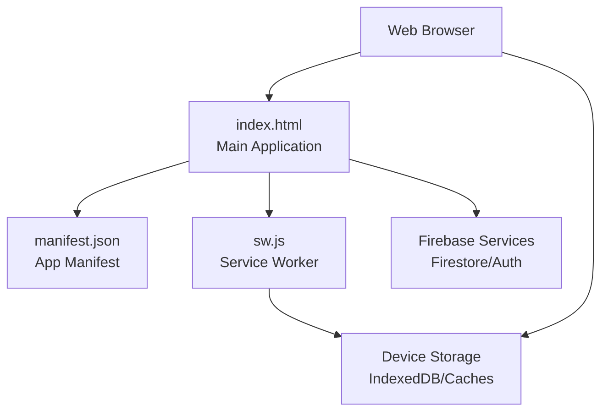
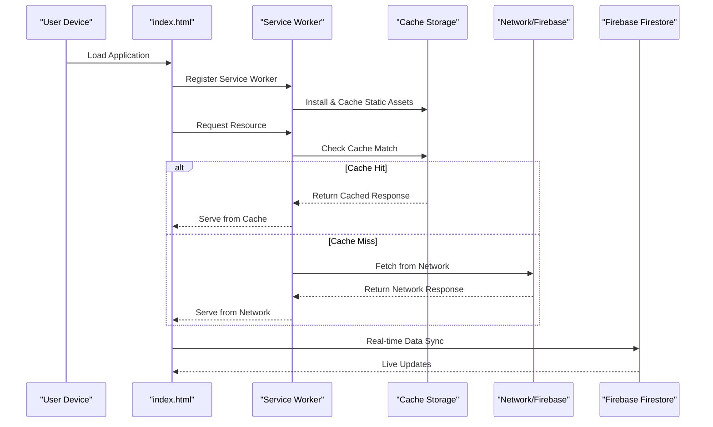
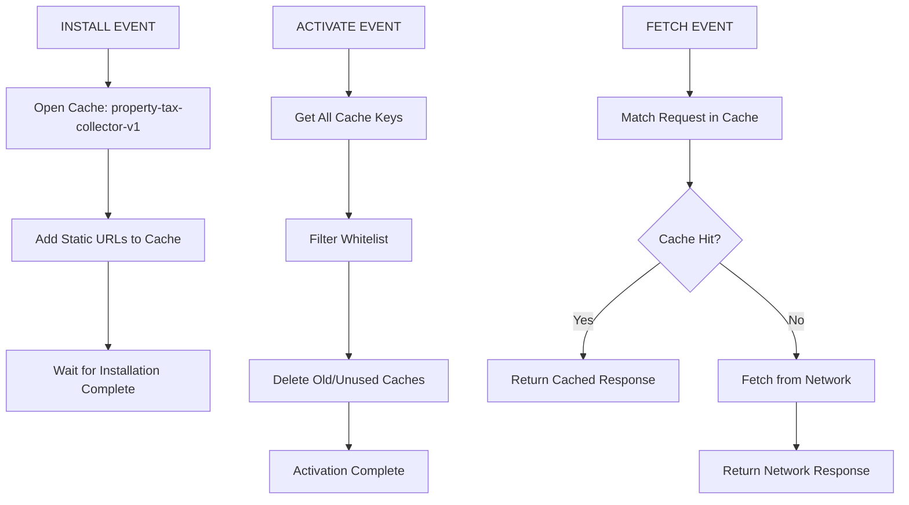
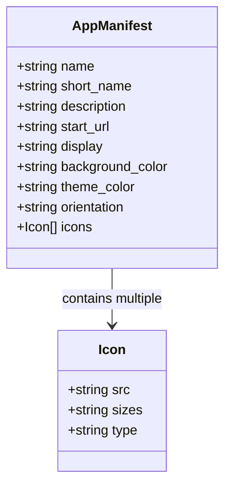
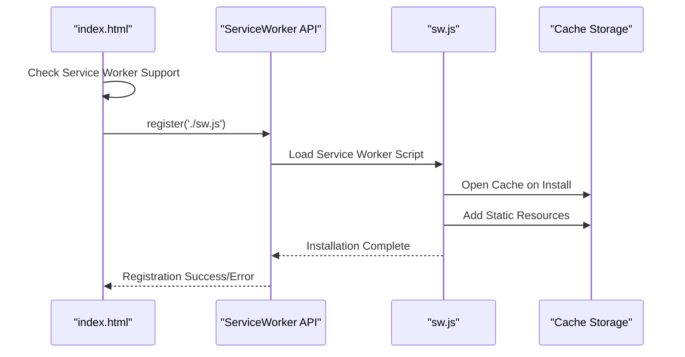
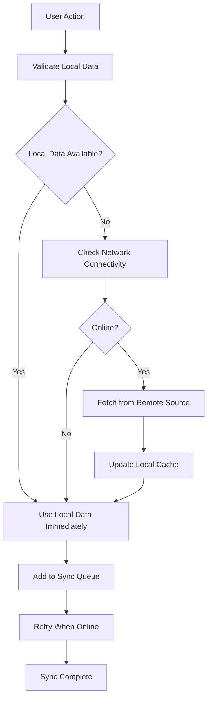
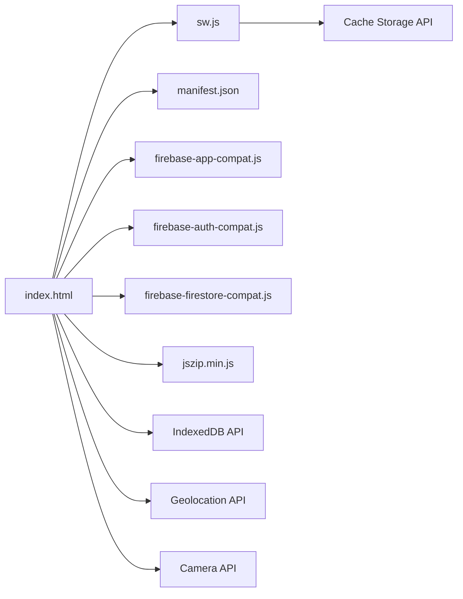

# Progressive Web App Implementation

<cite>
**Referenced Files in This Document**
- [index.html](file://index.html)
- [manifest.json](file://manifest.json)
- [sw.js](file://sw.js)
- [package.json](file://package.json)
- [README.md](file://README.md)
- [logic.test.js](file://test/logic.test.js)
</cite>

## Table of Contents
1. [Introduction](#introduction)
2. [Project Structure](#project-structure)
3. [Core Components](#core-components)
4. [Architecture Overview](#architecture-overview)
5. [Detailed Component Analysis](#detailed-component-analysis)
6. [Dependency Analysis](#dependency-analysis)
7. [Performance Considerations](#performance-considerations)
8. [Troubleshooting Guide](#troubleshooting-guide)
9. [Conclusion](#conclusion)

## Introduction
This document provides comprehensive documentation for the Progressive Web App (PWA) implementation of the Property Tax Collector application. It explains the PWA architecture including service worker registration, offline functionality, and app manifest configuration. It documents the service worker caching strategy, cache-first vs network-fallback patterns, and outlines the offline-first approach for field work scenarios, including local data storage, cache invalidation, and data synchronization when connectivity is restored. Practical examples of PWA features such as add-to-home-screen functionality and performance optimization techniques are included.

## Project Structure
The application is delivered as a single-page application packaged as a self-contained HTML file with supporting assets and a service worker for offline caching. The key files are:
- index.html: Main application entry point containing the UI, business logic, and PWA initialization
- manifest.json: Web app manifest defining installability and presentation metadata
- sw.js: Service worker implementing caching and offline behavior
- package.json: Project metadata and scripts
- README.md: Project overview and usage notes
- test/logic.test.js: Unit tests for core logic extracted from the main application

**Diagram sources**
- [index.html](file://index.html)
- [manifest.json](file://manifest.json)
- [sw.js](file://sw.js)

**Section sources**
- [README.md](file://README.md)
- [package.json](file://package.json)

## Core Components
The PWA implementation consists of three primary components:

### Service Worker (Offline Caching)
The service worker provides offline functionality through a cache-first strategy for core application resources. It registers cached URLs during installation and serves them during subsequent visits, falling back to network requests for dynamic content.

### App Manifest (Installability)
The manifest defines the application's appearance and behavior when installed as a standalone app, including display mode, theme colors, and icon assets for various screen densities.

### Application Logic (Online/Offline Coordination)
The main application manages authentication, data synchronization with Firebase, and user interface updates. It coordinates with the service worker to provide seamless offline experiences.

**Section sources**
- [sw.js](file://sw.js)
- [manifest.json](file://manifest.json)
- [index.html](file://index.html)

## Architecture Overview
The PWA architecture follows a client-side caching model with Firebase as the authoritative data source. The service worker intercepts network requests to serve cached resources when offline, while the application maintains real-time synchronization with Firestore.

**Diagram sources**
- [sw.js](file://sw.js)
- [index.html](file://index.html)

## Detailed Component Analysis

### Service Worker Implementation
The service worker implements a straightforward cache-first strategy optimized for a single-page application:

**Diagram sources**
- [sw.js](file://sw.js)

Key characteristics:
- **Cache Versioning**: Uses versioned cache name (`property-tax-collector-v1`) for controlled updates
- **Static Asset Caching**: Pre-caches core application files including HTML, manifest, and external libraries
- **Cache-First Strategy**: Always attempts cache lookup first, then falls back to network
- **Cache Management**: Implements whitelist cleanup to remove stale caches during activation

**Section sources**
- [sw.js](file://sw.js)

### App Manifest Configuration
The manifest defines the application's installability and presentation characteristics:

**Diagram sources**
- [manifest.json](file://manifest.json)

Manifest properties:
- **Name & Short Name**: Application identity for home screen and install prompts
- **Description**: User-facing description for install dialog
- **Start URL**: Entry point for standalone browsing
- **Display Mode**: `standalone` for full-screen app experience
- **Theme & Background Colors**: Consistent theming across browsers and OS
- **Orientation**: Locked portrait mode for mobile field work
- **Icons**: Multi-resolution icon set for various device densities

**Section sources**
- [manifest.json](file://manifest.json)

### Service Worker Registration and Integration
The application registers the service worker during page load with proper error handling:

**Diagram sources**
- [index.html](file://index.html)
- [sw.js](file://sw.js)

Registration behavior:
- **Conditional Registration**: Only attempts registration if service worker API is available
- **Load-Time Registration**: Registers immediately on page load
- **Error Handling**: Logs registration success/failure to console
- **Automatic Activation**: Service worker takes control after successful registration

**Section sources**
- [index.html](file://index.html)

### Offline-First Data Synchronization
The application implements an offline-first approach for field work scenarios:

Data flow characteristics:
- **Immediate Availability**: UI responds instantly using cached/local data
- **Background Sync**: Operations queued and retried when connectivity returns
- **Conflict Resolution**: Firebase handles concurrent updates and conflicts
- **Progressive Enhancement**: Feature-rich offline experience with automatic online sync

**Section sources**
- [index.html](file://index.html)

## Dependency Analysis
The PWA implementation has minimal external dependencies, relying primarily on browser APIs and Firebase services:

**Diagram sources**
- [index.html](file://index.html)
- [sw.js](file://sw.js)

Key dependencies:
- **Service Worker API**: Core PWA functionality
- **Cache Storage API**: Offline resource caching
- **Firebase Services**: Real-time database and authentication
- **Geolocation API**: GPS location capture for field work
- **Camera/Media Devices**: Photo capture functionality
- **JSZip**: Photo export compression

**Section sources**
- [index.html](file://index.html)
- [sw.js](file://sw.js)

## Performance Considerations
The PWA implementation incorporates several performance optimization strategies:

### Resource Optimization
- **Pre-cached Assets**: Critical application resources cached during installation
- **Lazy Loading**: Non-essential resources loaded on-demand
- **Image Compression**: Client-side photo processing with compression
- **Minimal Dependencies**: Single-page architecture reduces HTTP overhead

### Network Efficiency
- **Cache-First Strategy**: Reduces server requests and improves load times
- **Selective Caching**: Only essential resources cached locally
- **Efficient Updates**: Cache versioning enables controlled updates
- **Background Sync**: Deferred operations reduce immediate network burden

### Mobile Performance
- **Portrait Orientation**: Optimized for handheld devices
- **Touch-Friendly UI**: Large touch targets for field work
- **Offline Capability**: Reliable operation in low-connectivity areas
- **Battery Optimization**: Minimized background activity

## Troubleshooting Guide

### Service Worker Issues
Common problems and solutions:
- **Registration Failures**: Check browser compatibility and HTTPS requirements
- **Cache Not Updating**: Clear browser cache and reload application
- **Stale Content**: Force refresh with Ctrl+F5 to bypass cache
- **Debugging**: Open browser DevTools Application tab to inspect service worker status

### Offline Functionality
Troubleshooting offline behavior:
- **Verify Cache**: Check Cache Storage in DevTools for cached resources
- **Network Tab**: Monitor service worker interception of requests
- **Console Logs**: Look for service worker registration messages
- **Fallback Behavior**: Ensure network fallback works for dynamic content

### Data Synchronization
Common sync issues:
- **Connection Problems**: Verify Firebase connectivity and authentication
- **Permission Errors**: Check Firestore security rules and user permissions
- **Data Conflicts**: Monitor for concurrent update conflicts
- **Local Storage**: Clear browser data if local state becomes corrupted

**Section sources**
- [sw.js](file://sw.js)
- [index.html](file://index.html)

## Conclusion
The Property Tax Collector PWA implementation provides a robust offline-first solution for field data collection. Through strategic use of service worker caching, Firebase integration, and mobile-optimized design, it delivers reliable functionality in challenging connectivity environments. The implementation balances simplicity with effectiveness, using minimal dependencies while providing comprehensive offline capabilities. The modular architecture supports future enhancements including background sync, push notifications, and advanced caching strategies as requirements evolve.