# Single-File Application Architecture

<cite>
**Referenced Files in This Document**
- [index.html](file://index.html)
- [README.md](file://README.md)
- [package.json](file://package.json)
- [manifest.json](file://manifest.json)
- [sw.js](file://sw.js)
- [test/logic.test.js](file://test/logic.test.js)
- [FUTURE_PLANS.md](file://FUTURE_PLANS.md)
</cite>

## Update Summary
**Changes Made**
- Enhanced photo handling section with detailed canvas-based image processing
- Updated blob management documentation with optimized memory usage patterns
- Added comprehensive canvas processing workflow documentation
- Improved photo export system documentation with blob optimization
- Updated performance considerations for memory management

## Table of Contents
1. [Introduction](#introduction)
2. [Project Structure](#project-structure)
3. [Core Components](#core-components)
4. [Architecture Overview](#architecture-overview)
5. [Detailed Component Analysis](#detailed-component-analysis)
6. [Dependency Analysis](#dependency-analysis)
7. [Performance Considerations](#performance-considerations)
8. [Troubleshooting Guide](#troubleshooting-guide)
9. [Conclusion](#conclusion)

## Introduction

Property Tax Collector is a sophisticated single-file web application designed for offline-first property tax data collection in village council environments. This application demonstrates advanced architectural patterns within a monolithic HTML file approach, combining embedded CSS and JavaScript into a self-contained, production-ready solution.

The application serves as a comprehensive field data collection tool that works seamlessly offline, captures GPS locations and photos, manages complex property surveys with household demographics, and provides robust administrative oversight. Its single-file architecture ensures portability, simplicity of deployment, and optimal performance for resource-constrained field environments.

**Updated** Enhanced with improved photo handling logic, canvas-based image processing, and optimized blob management for better performance and memory usage.

## Project Structure

The entire application is contained within a single HTML file with supporting configuration files:

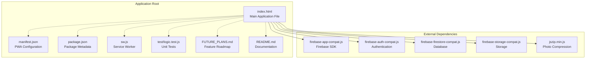

**Diagram sources**
- [index.html:14-18](file://index.html#L14-L18)
- [manifest.json:1-28](file://manifest.json#L1-L28)
- [package.json:1-10](file://package.json#L1-L10)
- [sw.js:1-45](file://sw.js#L1-L45)

**Section sources**
- [index.html:14-18](file://index.html#L14-L18)
- [manifest.json:1-28](file://manifest.json#L1-L28)
- [package.json:1-10](file://package.json#L1-L10)
- [sw.js:1-45](file://sw.js#L1-L45)

## Core Components

The single-file architecture implements a comprehensive modular JavaScript structure within the main HTML file:

### Authentication System
The application implements a dual-role authentication system with automatic role detection and secure session management:

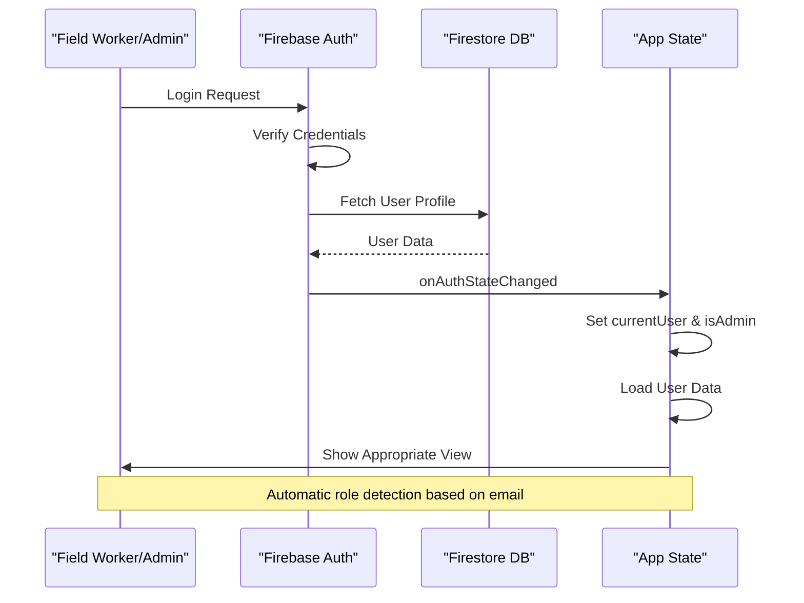

**Diagram sources**
- [index.html:893-947](file://index.html#L893-L947)
- [index.html:949-952](file://index.html#L949-L952)

### Form Wizard System
A sophisticated multi-step form wizard with conditional logic and validation:

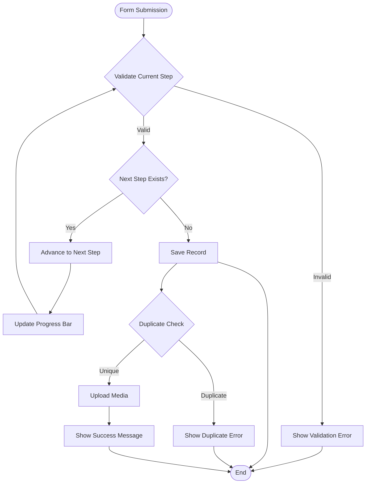

**Diagram sources**
- [index.html:1316-1341](file://index.html#L1316-L1341)
- [index.html:1484-1623](file://index.html#L1484-L1623)

### Data Management Layer
Centralized state management with real-time synchronization:

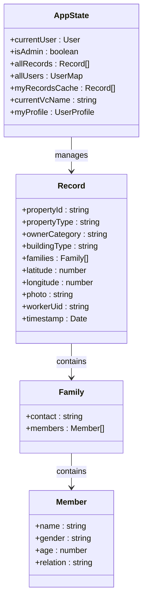

**Diagram sources**
- [index.html:882-890](file://index.html#L882-L890)
- [index.html:1548-1582](file://index.html#L1548-L1582)

**Section sources**
- [index.html:882-947](file://index.html#L882-L947)
- [index.html:1255-1341](file://index.html#L1255-L1341)
- [index.html:1484-1623](file://index.html#L1484-L1623)

## Architecture Overview

The application follows a component-based architecture within a single HTML file, implementing modern web development patterns:

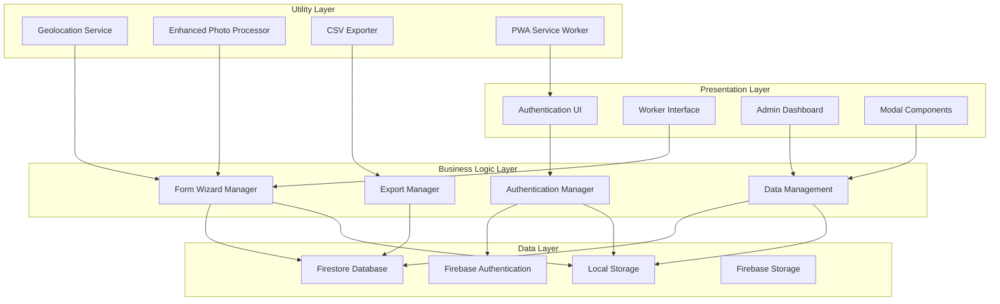

**Diagram sources**
- [index.html:814-880](file://index.html#L814-L880)
- [index.html:1751-1948](file://index.html#L1751-L1948)
- [index.html:2397-2520](file://index.html#L2397-L2520)

The architecture implements several key design patterns:

### Event-Driven Programming
All user interactions trigger event handlers that update the application state and UI components. The event-driven approach ensures responsive user experiences while maintaining clean separation between presentation and logic.

### State Management
Centralized state management through global variables and reactive updates. The application maintains separate states for different user roles and contexts, with automatic UI updates when state changes occur.

### Component-Based Design
Self-contained components with clear boundaries and responsibilities. Each major UI section (authentication, worker interface, admin dashboard) operates independently while sharing common utilities and data access patterns.

**Section sources**
- [index.html:814-880](file://index.html#L814-L880)
- [index.html:2554-2568](file://index.html#L2554-L2568)

## Detailed Component Analysis

### Authentication Module

The authentication system implements a robust role-based access control mechanism:

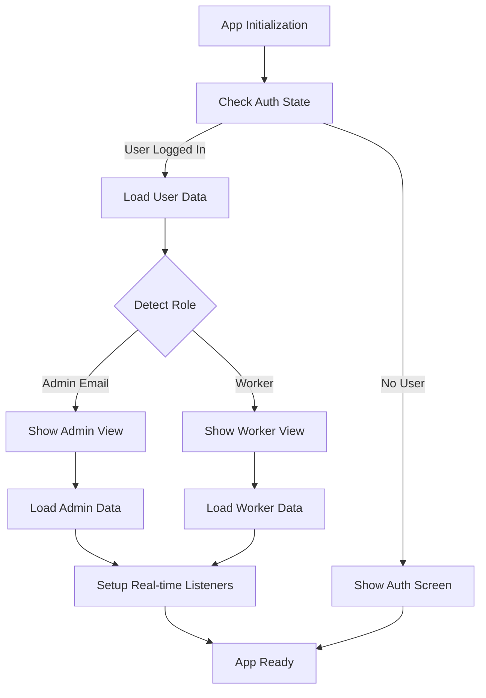

**Diagram sources**
- [index.html:893-947](file://index.html#L893-L947)
- [index.html:962-991](file://index.html#L962-L991)

Key authentication features include:
- **Dual-role support**: Automatic role detection based on email address
- **Secure credential handling**: Encrypted storage and validation
- **Real-time synchronization**: Automatic UI updates when user state changes
- **Profile management**: Separate worker and admin profile systems

**Section sources**
- [index.html:893-947](file://index.html#L893-L947)
- [index.html:962-991](file://index.html#L962-L991)

### Data Collection Form System

The form system implements a sophisticated wizard with conditional logic and validation:

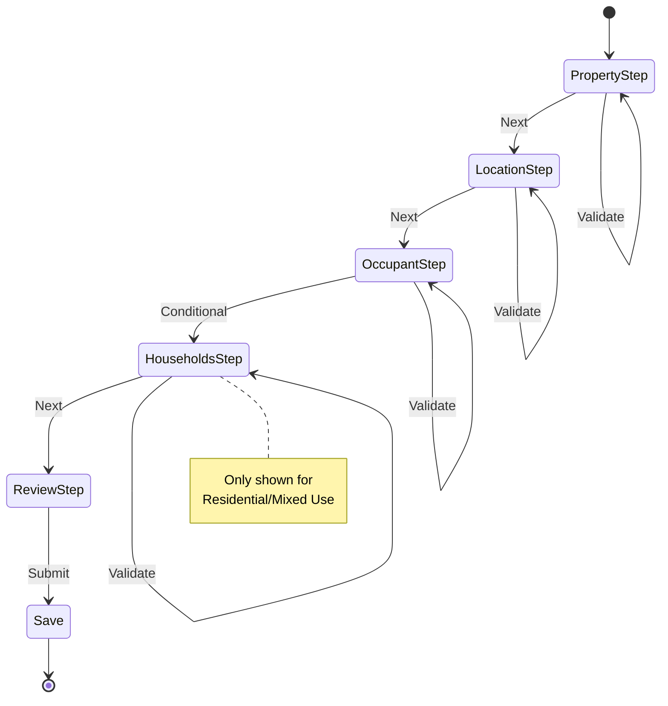

**Diagram sources**
- [index.html:1256-1262](file://index.html#L1256-L1262)
- [index.html:1267-1277](file://index.html#L1267-L1277)

The form system includes advanced features:
- **Conditional field visibility**: Dynamic field display based on property type
- **Real-time validation**: Immediate feedback on form completion
- **Household management**: Complex family composition tracking
- **Photo capture with GPS stamping**: Integrated media processing

**Section sources**
- [index.html:1255-1341](file://index.html#L1255-L1341)
- [index.html:1415-1452](file://index.html#L1415-L1452)

### Administrative Dashboard

The admin interface provides comprehensive oversight capabilities:

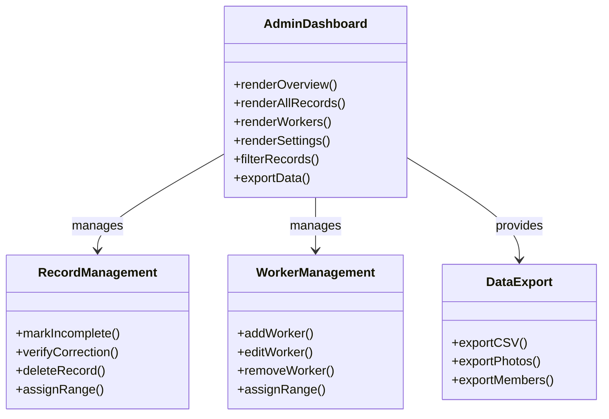

**Diagram sources**
- [index.html:2209-2395](file://index.html#L2209-L2395)
- [index.html:2141-2207](file://index.html#L2141-L2207)

**Section sources**
- [index.html:2209-2395](file://index.html#L2209-L2395)
- [index.html:2141-2207](file://index.html#L2141-L2207)

### Utility Functions and Services

The application includes several specialized utility modules:

#### Enhanced Photo Processing Engine
Advanced image manipulation with EXIF orientation handling, canvas-based processing, and optimized blob management:

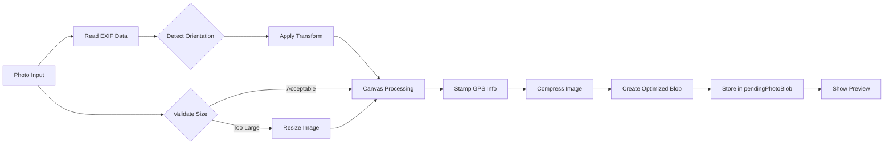

**Diagram sources**
- [index.html:1838-1916](file://index.html#L1838-L1916)
- [index.html:1755-1784](file://index.html#L1755-L1784)

**Updated** Enhanced with canvas-based image processing and optimized blob management for better performance and memory usage.

Key photo processing features include:
- **EXIF orientation detection**: Automatic detection and correction of image orientation
- **Canvas-based transformation**: Efficient image manipulation using HTML5 Canvas API
- **Optimized blob storage**: Memory-efficient blob management with automatic cleanup
- **GPS stamp integration**: Automatic addition of property ID, GPS coordinates, and timestamp
- **Compression optimization**: JPEG compression with configurable quality settings

#### Data Export System
Multi-format export capabilities with comprehensive filtering and optimized blob handling:

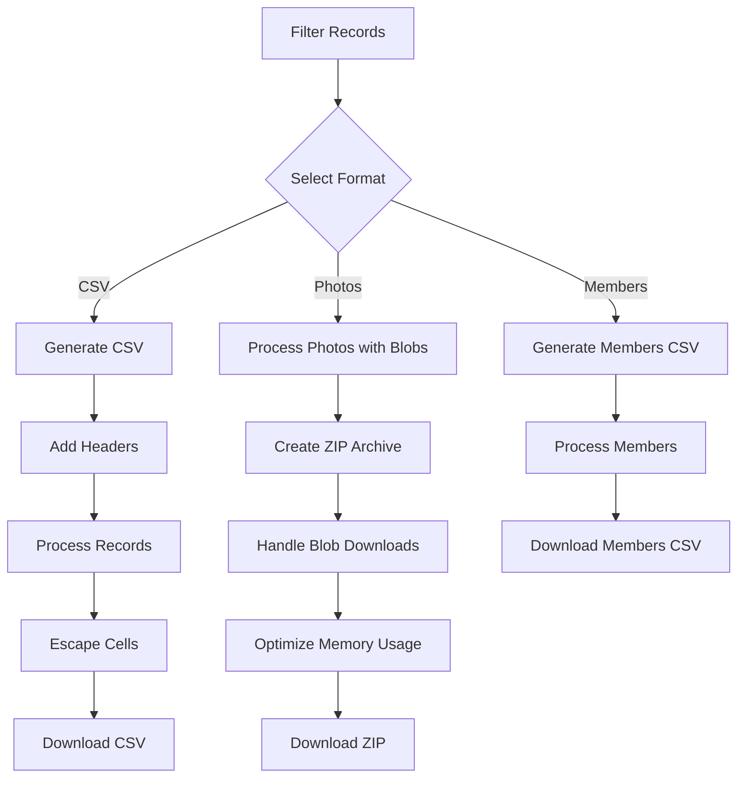

**Diagram sources**
- [index.html:2461-2520](file://index.html#L2461-L2520)
- [index.html:2400-2432](file://index.html#L2400-L2432)

**Updated** Enhanced with optimized blob handling and memory management for better performance during photo exports.

**Section sources**
- [index.html:1755-1916](file://index.html#L1755-L1916)
- [index.html:2400-2520](file://index.html#L2400-L2520)

## Dependency Analysis

The application maintains minimal external dependencies while leveraging powerful third-party libraries:

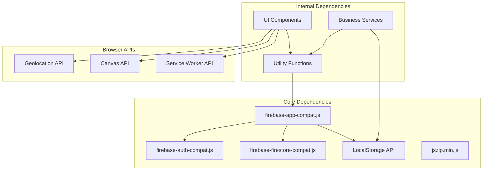

**Diagram sources**
- [index.html:14-18](file://index.html#L14-L18)
- [index.html:867-878](file://index.html#L867-L878)

The dependency management strategy emphasizes:
- **CDN-based loading**: External libraries loaded from reliable CDNs
- **Lazy initialization**: Non-critical features loaded on-demand
- **Fallback mechanisms**: Graceful degradation when dependencies fail
- **Offline caching**: Service worker ensures offline availability

**Section sources**
- [index.html:14-18](file://index.html#L14-L18)
- [index.html:867-878](file://index.html#L867-L878)

## Performance Considerations

The single-file architecture provides several performance advantages with enhanced optimizations:

### Memory Management
- **Modular scope**: Functions are scoped locally to minimize memory footprint
- **Event delegation**: Centralized event handling reduces memory overhead
- **Lazy loading**: Heavy features loaded only when needed
- **Optimized blob handling**: Enhanced memory management for photo blobs
- **Canvas reuse**: Efficient canvas-based image processing with automatic cleanup

### Network Optimization
- **Single request**: All resources served from one HTML file
- **Service worker caching**: Comprehensive offline functionality
- **Efficient data structures**: Optimized for mobile device constraints
- **Blob-based uploads**: Reduced memory usage during photo uploads

### Rendering Performance
- **Virtual DOM-like updates**: Minimal DOM manipulation
- **Batch updates**: Multiple state changes applied atomically
- **CSS-in-JS**: Dynamic styling with minimal overhead
- **Canvas rendering**: Efficient image processing without DOM overhead

### Browser Compatibility
The application targets modern browsers while maintaining compatibility with older versions through polyfills and graceful degradation strategies.

**Updated** Enhanced with optimized canvas-based image processing and improved blob memory management for better performance and reduced memory usage.

## Troubleshooting Guide

### Common Issues and Solutions

#### Authentication Problems
- **Symptom**: Users cannot log in
- **Solution**: Check Firebase configuration and network connectivity
- **Prevention**: Implement retry logic and user feedback

#### Form Validation Errors
- **Symptom**: Forms reject valid data
- **Solution**: Review validation rules and field requirements
- **Prevention**: Add comprehensive error messages

#### Photo Capture Failures
- **Symptom**: Camera access denied or images not processed
- **Solution**: Verify camera permissions and browser compatibility
- **Prevention**: Implement fallback mechanisms

#### Enhanced Photo Processing Issues
- **Symptom**: Images not properly oriented or processed
- **Solution**: Check EXIF orientation detection and canvas processing
- **Prevention**: Implement proper error handling for orientation detection

#### Data Synchronization Issues
- **Symptom**: Data appears inconsistent across devices
- **Solution**: Check Firestore security rules and connection status
- **Prevention**: Implement optimistic updates with conflict resolution

**Section sources**
- [index.html:1208-1219](file://index.html#L1208-L1219)
- [index.html:1926-1942](file://index.html#L1926-L1942)

## Conclusion

The Property Tax Collector demonstrates exceptional implementation of single-file application architecture with enhanced photo handling capabilities. By combining embedded CSS and JavaScript within a monolithic HTML structure, the application achieves optimal performance, portability, and maintainability while providing comprehensive functionality for field data collection.

**Updated** The recent enhancements to photo handling logic, canvas-based image processing, and optimized blob management significantly improve performance and memory usage, making the application more efficient for resource-constrained field environments.

The modular JavaScript structure, event-driven programming patterns, and centralized state management create a scalable foundation that can accommodate future enhancements. The component-based approach ensures clean separation of concerns while maintaining the simplicity benefits of single-file architecture.

Key architectural strengths include:
- **Performance optimization**: Minimal overhead through monolithic design with enhanced canvas processing
- **Enhanced photo handling**: Advanced image processing with EXIF orientation and optimized blob management
- **Offline capability**: Comprehensive PWA implementation
- **Scalability**: Modular structure supports future expansion
- **Maintainability**: Clear separation of concerns within single file
- **Memory efficiency**: Optimized blob handling reduces memory footprint
- **User experience**: Responsive design with smooth interactions

This architecture serves as an excellent model for similar field data collection applications, balancing simplicity with functionality while maintaining professional-grade reliability and performance. The enhanced photo processing capabilities make it particularly suitable for applications requiring high-quality image capture and processing in field conditions.