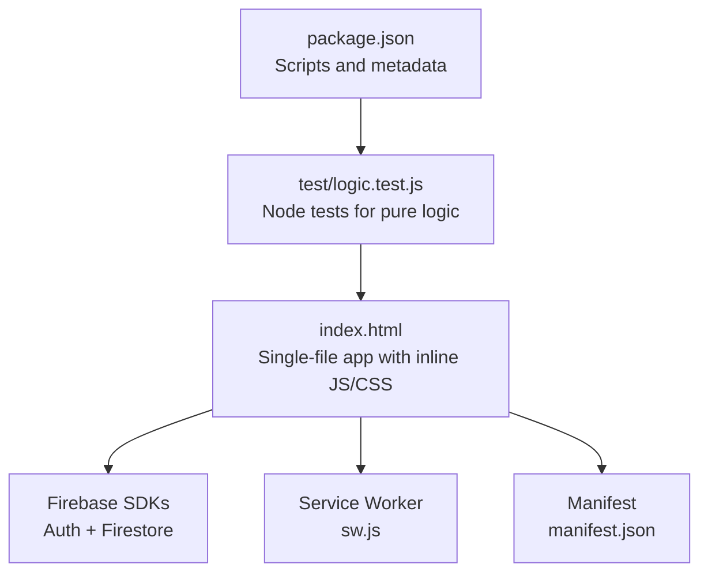
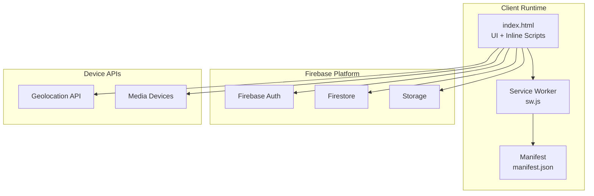
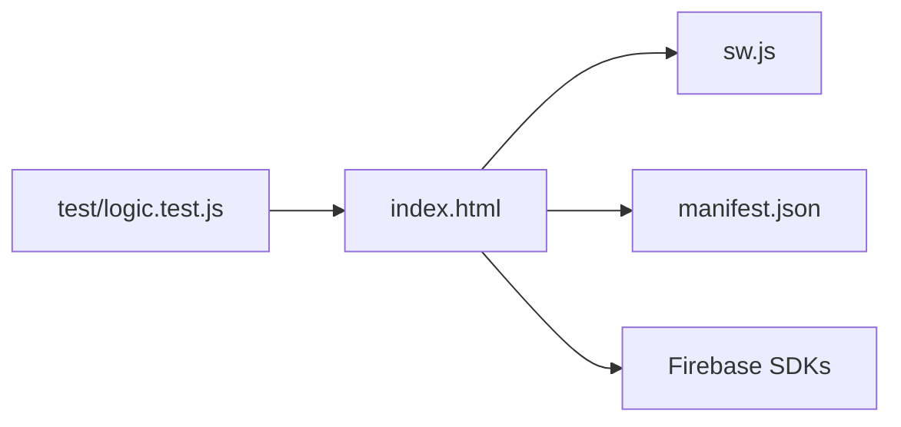
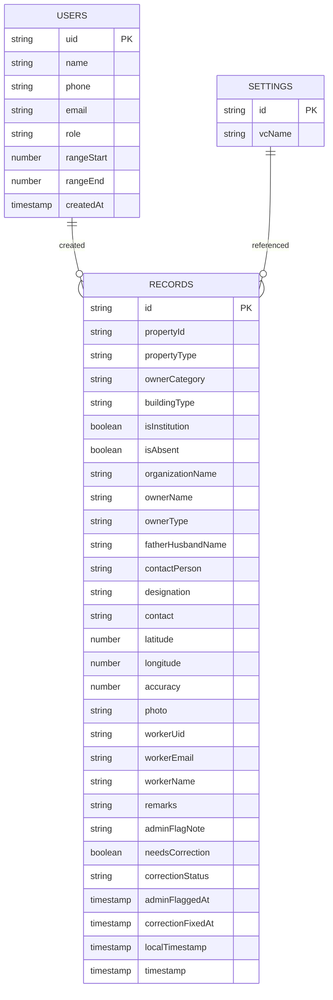
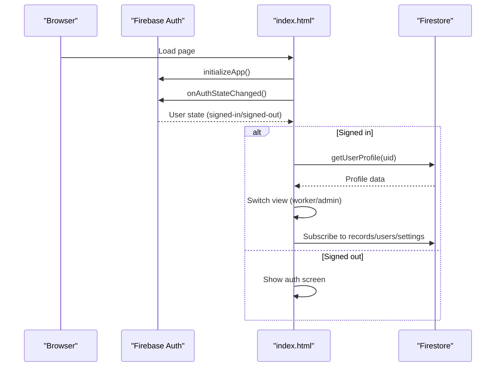
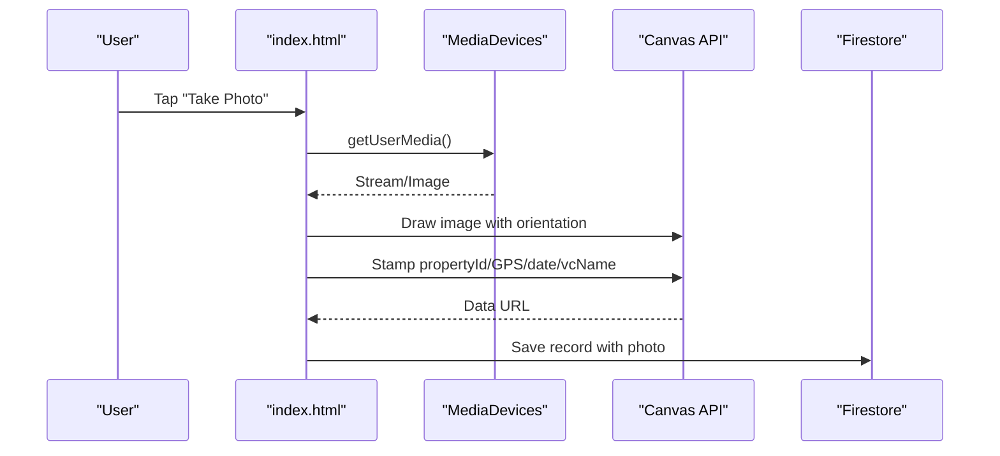
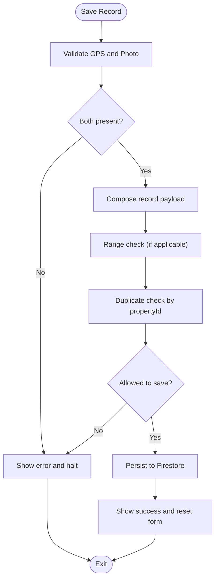

# Technical Architecture

<cite>
**Referenced Files in This Document**
- [index.html](file://index.html)
- [sw.js](file://sw.js)
- [manifest.json](file://manifest.json)
- [package.json](file://package.json)
- [README.md](file://README.md)
- [test/logic.test.js](file://test/logic.test.js)
- [FUTURE_PLANS.md](file://FUTURE_PLANS.md)
</cite>

## Table of Contents
1. [Introduction](#introduction)
2. [Project Structure](#project-structure)
3. [Core Components](#core-components)
4. [Architecture Overview](#architecture-overview)
5. [Detailed Component Analysis](#detailed-component-analysis)
6. [Dependency Analysis](#dependency-analysis)
7. [Performance Considerations](#performance-considerations)
8. [Troubleshooting Guide](#troubleshooting-guide)
9. [Conclusion](#conclusion)
10. [Appendices](#appendices)

## Introduction
This document describes the technical architecture of the Property Tax Collector Progressive Web App. It explains the single-file application design, the Progressive Web App (PWA) stack, the service worker caching strategy, Firebase integration for authentication, real-time database updates, and storage management. It also covers the event-driven programming model, state management approach, and modular JavaScript organization within the single HTML file. Finally, it documents system boundaries, data flow patterns, and integration points with external services such as Google Maps and device APIs.

## Project Structure
The application is delivered as a single HTML file with embedded styles and scripts, complemented by a service worker and a web app manifest. Tests are isolated to a dedicated module that extracts pure logic from the main file for Node-based verification.

**Diagram sources**
- [index.html](file://index.html)
- [sw.js](file://sw.js)
- [manifest.json](file://manifest.json)
- [package.json](file://package.json)
- [test/logic.test.js](file://test/logic.test.js)

**Section sources**
- [index.html](file://index.html)
- [sw.js](file://sw.js)
- [manifest.json](file://manifest.json)
- [package.json](file://package.json)
- [README.md](file://README.md)

## Core Components
- Single-file application: The entire UI, styling, and application logic are contained in a single HTML file. This simplifies distribution and deployment.
- Progressive Web App: Registered service worker, installable manifest, and offline-first behavior.
- Firebase integration: Authentication, Firestore for real-time data synchronization, and storage for photo exports.
- Event-driven programming: DOM events, Firebase listeners, and modal interactions drive the UI.
- State management: Local reactive state via DOM visibility, in-memory drafts, and Firebase snapshots.
- Modular JavaScript organization: Internalized modules for photo processing, CSV export, and administrative utilities.

**Section sources**
- [index.html](file://index.html)
- [sw.js](file://sw.js)
- [manifest.json](file://manifest.json)
- [README.md](file://README.md)

## Architecture Overview
The system is composed of:
- Client runtime: A single-page application hosted in the browser.
- Service Worker: Provides caching and offline availability for core assets and static resources.
- Firebase Platform: Authentication, Firestore, and Storage.
- Device APIs: Geolocation and camera via the browser’s media capabilities.
- External integrations: Google Maps links for location visualization.

**Diagram sources**
- [index.html](file://index.html)
- [sw.js](file://sw.js)
- [manifest.json](file://manifest.json)

## Detailed Component Analysis

### Progressive Web App Layer
- Manifest: Defines app identity, theme color, icons, and standalone display mode.
- Service Worker: Installs a cache of critical URLs, serves cached responses when offline, and activates a cache whitelist.
- Registration: The app registers the service worker on load and logs registration outcomes.

Key behaviors:
- Offline-first: Static assets and Firebase SDKs are cached for offline use.
- Activation cleanup: Removes stale caches to manage storage growth.

**Section sources**
- [manifest.json](file://manifest.json)
- [sw.js](file://sw.js)
- [index.html](file://index.html)

### Firebase Integration
- Authentication: Email/password sign-in/sign-out, password reset, and re-authentication for sensitive operations.
- Real-time database: Firestore collections for users, records, and settings; live listeners for two-way synchronization.
- Storage: Photo exports leverage JSZip to bundle images into a downloadable archive.

Patterns:
- Auth state listener initializes the app and switches views based on role.
- Snapshot listeners update local caches and trigger UI rendering.
- Batch writes for bulk deletions in administrative resets.

**Section sources**
- [index.html](file://index.html)

### Event-Driven Programming Model
- DOM events: Click handlers, form submissions, and input changes orchestrate UI transitions and data operations.
- Firebase listeners: onSnapshot subscriptions update state reactively.
- Modal lifecycle: Overlay visibility toggled via DOM manipulation and mutation observers to lock background scrolling.

**Section sources**
- [index.html](file://index.html)

### State Management Approach
- Reactive state: UI visibility, wizard step indices, and draft data are kept in memory and updated via DOM queries and Firebase callbacks.
- Caching: Worker records are cached locally and paginated; admin data is cached globally for filtering and reporting.
- Edit mode: Drafts are deep-copied from records to support safe editing and controlled saving.

**Section sources**
- [index.html](file://index.html)

### Modular JavaScript Organization Within a Single File
- Pure logic extraction: A dedicated test harness pulls a self-contained block of pure functions from the main file for Node-based testing.
- Feature modules: Photo processing (EXIF orientation, canvas stamping), CSV export, and administrative utilities are organized as cohesive blocks within the script.

Benefits:
- Single source of truth for logic.
- Isolated testing without DOM or Firebase dependencies.

**Section sources**
- [index.html](file://index.html)
- [test/logic.test.js](file://test/logic.test.js)

### Service Worker Implementation and Offline Functionality
- Cache strategy: Pre-caches the app shell (HTML, manifest, and external SDKs). On fetch, responds with cached assets when available; otherwise fetches from network.
- Activation: Deletes caches not in the whitelist to prevent unbounded growth.

Limitations:
- Background sync is not implemented in the current service worker.
- Network-first fallback for dynamic content; offline behavior is limited to cached assets.

**Section sources**
- [sw.js](file://sw.js)
- [index.html](file://index.html)

### Data Flow Patterns
- Authentication flow: onAuthStateChanged drives initialization and view switching.
- Collection flow: Wizard validates steps, composes a record payload, checks duplicates, and persists to Firestore.
- Admin workflow: Flags records for correction with granular permissions; workers resolve and verify.
- Reporting: Filters and exports are computed client-side from cached datasets.

**Section sources**
- [index.html](file://index.html)

### Integration Points with External Services
- Google Maps: Links generated from stored coordinates for quick navigation.
- Device APIs: Geolocation for GPS capture; camera for photo capture with EXIF-aware orientation handling.

**Section sources**
- [index.html](file://index.html)

## Dependency Analysis
The application exhibits a layered dependency graph:
- index.html depends on Firebase SDKs and the service worker.
- The service worker depends on the manifest for installation.
- Tests depend on the pure logic extracted from index.html.

**Diagram sources**
- [index.html](file://index.html)
- [sw.js](file://sw.js)
- [manifest.json](file://manifest.json)
- [test/logic.test.js](file://test/logic.test.js)

**Section sources**
- [index.html](file://index.html)
- [sw.js](file://sw.js)
- [manifest.json](file://manifest.json)
- [test/logic.test.js](file://test/logic.test.js)

## Performance Considerations
- Single-file delivery reduces HTTP overhead and simplifies caching.
- Canvas-based photo processing scales images and stamps metadata efficiently.
- Pagination and snapshot listeners minimize DOM updates and memory footprint.
- CSV export uses in-browser generation to avoid server round trips.

Recommendations:
- Lazy-load heavy libraries only when needed.
- Debounce geolocation requests to reduce battery drain.
- Consider indexedDB for larger datasets to offload Firestore snapshots.

[No sources needed since this section provides general guidance]

## Troubleshooting Guide
Common issues and remedies:
- Authentication failures: Friendly error messages map Firebase codes to user-friendly text.
- Duplicate property IDs: Validation prevents saving duplicates; admins can review and resolve conflicts.
- Missing required fields: Wizard enforces step-wise validation; review screen highlights missing data.
- Offline behavior: Service worker serves cached assets; dynamic content requires connectivity.
- Photo export: Requires JSZip; if unavailable, the app prompts to check connectivity.

**Section sources**
- [index.html](file://index.html)

## Conclusion
The Property Tax Collector application demonstrates a pragmatic, single-file Progressive Web App architecture. It leverages Firebase for authentication and real-time data synchronization, a service worker for offline readiness, and device APIs for field data capture. The event-driven model and in-memory state management provide a responsive user experience, while modularized logic ensures testability and maintainability. Future enhancements could include background sync, multi-tenant separation, and expanded export formats.

[No sources needed since this section summarizes without analyzing specific files]

## Appendices

### System Boundaries
- Client boundary: index.html encapsulates UI, logic, and styling.
- Service boundary: sw.js controls caching and offline behavior.
- Data boundary: Firestore collections for users, records, and settings; Storage for photo exports.
- External boundary: Google Maps links and browser device APIs.

**Section sources**
- [index.html](file://index.html)
- [sw.js](file://sw.js)
- [manifest.json](file://manifest.json)

### Data Models Overview
- Users: Profiles with roles and optional sticker ranges.
- Records: Property details, owner/institution info, GPS, photo, families, and correction history.
- Settings: App-wide configuration such as village council name.

**Diagram sources**
- [index.html](file://index.html)

### Sequence Diagram: Authentication and Initialization

**Diagram sources**
- [index.html](file://index.html)

### Sequence Diagram: Photo Capture and Stamping

**Diagram sources**
- [index.html](file://index.html)

### Flowchart: Record Save Validation and Persistence

**Diagram sources**
- [index.html](file://index.html)