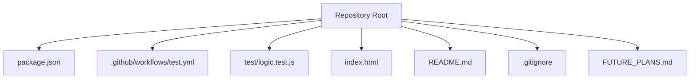
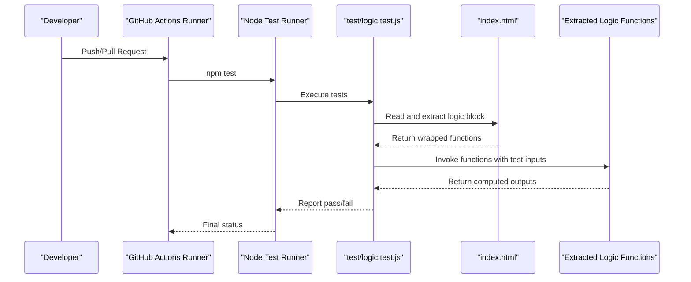
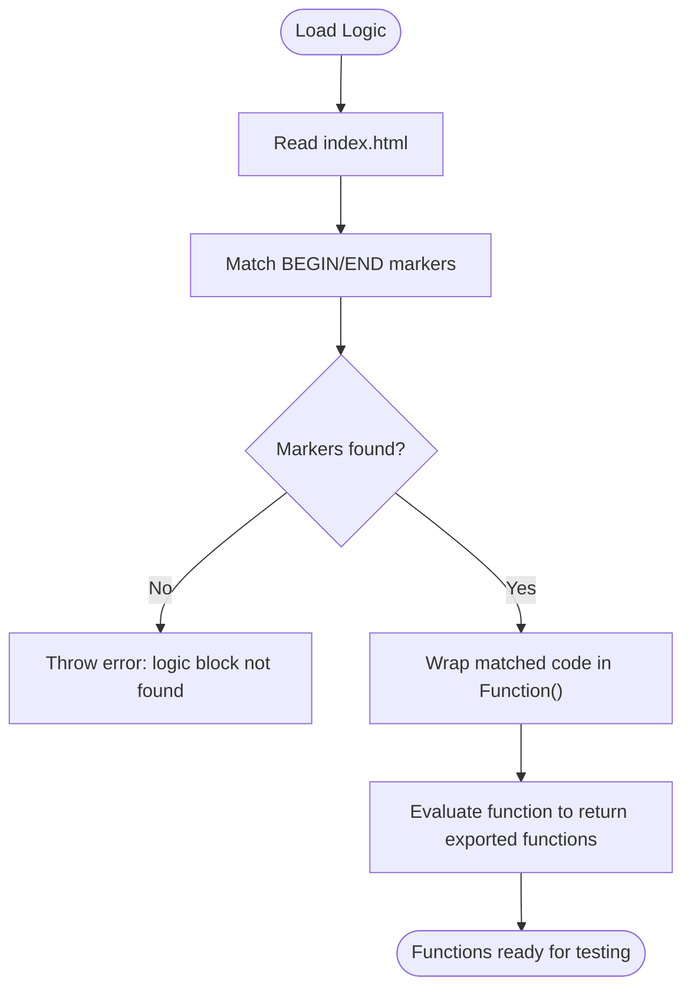
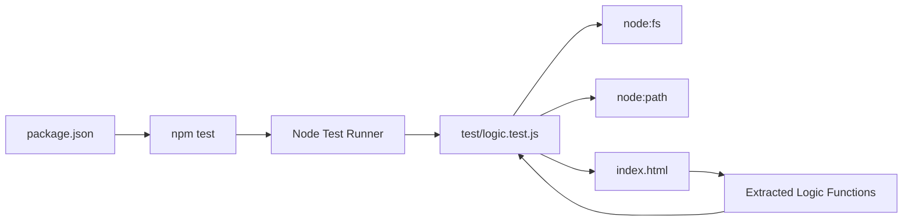

# Testing and Quality Assurance

<cite>
**Referenced Files in This Document**
- [package.json](file://package.json)
- [.github/workflows/test.yml](file://.github/workflows/test.yml)
- [test/logic.test.js](file://test/logic.test.js)
- [index.html](file://index.html)
- [README.md](file://README.md)
- [.gitignore](file://.gitignore)
- [FUTURE_PLANS.md](file://FUTURE_PLANS.md)
</cite>

## Table of Contents
1. [Introduction](#introduction)
2. [Project Structure](#project-structure)
3. [Core Components](#core-components)
4. [Architecture Overview](#architecture-overview)
5. [Detailed Component Analysis](#detailed-component-analysis)
6. [Dependency Analysis](#dependency-analysis)
7. [Performance Considerations](#performance-considerations)
8. [Troubleshooting Guide](#troubleshooting-guide)
9. [Conclusion](#conclusion)
10. [Appendices](#appendices)

## Introduction
This document provides comprehensive testing and quality assurance guidance for the Property Tax Collector application. It covers the unit testing framework using Node’s built-in test runner, continuous integration via GitHub Actions, and practical strategies for validating business logic, form validation, data processing, and authentication flows. It also includes guidelines for writing effective tests, debugging failures, maintaining coverage, and performing manual QA checks prior to production deployment.

## Project Structure
The repository is a single-page web application packaged as a static HTML file with embedded logic. Tests are organized under a dedicated test folder and executed using Node’s native test runner. CI is configured through a GitHub Actions workflow that runs tests on pushes and pull requests.

**Diagram sources**
- [package.json:1-10](file://package.json#L1-L10)
- [.github/workflows/test.yml:1-19](file://.github/workflows/test.yml#L1-L19)
- [test/logic.test.js:1-223](file://test/logic.test.js#L1-L223)
- [index.html:1-2605](file://index.html#L1-L2605)
- [README.md:1-36](file://README.md#L1-L36)
- [.gitignore:1-4](file://.gitignore#L1-L4)
- [FUTURE_PLANS.md:1-51](file://FUTURE_PLANS.md#L1-L51)

**Section sources**
- [package.json:1-10](file://package.json#L1-L10)
- [.github/workflows/test.yml:1-19](file://.github/workflows/test.yml#L1-L19)
- [test/logic.test.js:1-223](file://test/logic.test.js#L1-L223)
- [index.html:1-2605](file://index.html#L1-L2605)
- [README.md:1-36](file://README.md#L1-L36)
- [.gitignore:1-4](file://.gitignore#L1-L4)
- [FUTURE_PLANS.md:1-51](file://FUTURE_PLANS.md#L1-L51)

## Core Components
- Unit testing framework: Node’s built-in test runner invoked via npm scripts.
- Test suite: A single test module that validates core business logic extracted from the main application.
- Continuous integration: GitHub Actions workflow that installs Node, checks out code, and runs tests.
- Business logic under test: Functions for photo EXIF orientation parsing, form validation helpers, absence detection, follow-up determination, household statistics aggregation, and correction state resolution.

Key responsibilities:
- Validate correctness of pure logic functions against documented behaviors.
- Ensure parity between test logic and production logic by extracting and evaluating the exact same code path.
- Enforce quality gates through automated CI checks.

**Section sources**
- [package.json:6-8](file://package.json#L6-L8)
- [test/logic.test.js:12-21](file://test/logic.test.js#L12-L21)
- [.github/workflows/test.yml:10-18](file://.github/workflows/test.yml#L10-L18)

## Architecture Overview
The testing architecture centers on isolating and validating pure logic functions from the main application. Tests read the exact logic block from the main HTML file, wrap it in a function factory, and execute assertions against the returned functions. CI automates this process on every push and pull request.

**Diagram sources**
- [.github/workflows/test.yml:10-18](file://.github/workflows/test.yml#L10-L18)
- [test/logic.test.js:12-21](file://test/logic.test.js#L12-L21)
- [index.html:1752-1836](file://index.html#L1752-L1836)

## Detailed Component Analysis

### Unit Testing Framework and Organization
- Test runner: Node’s built-in test runner invoked by the npm script.
- Test organization: Single module consolidates all logic validations, grouped by function under test.
- Test discovery: Uses Node’s test runner discovery mechanism; no external test framework is required.

Best practices reflected in the setup:
- Minimal dependencies: relies solely on Node’s built-in APIs.
- Self-contained logic extraction: ensures tests run against the exact production code path.

**Section sources**
- [package.json:6-8](file://package.json#L6-L8)
- [test/logic.test.js:1-223](file://test/logic.test.js#L1-L223)

### Logic Extraction Strategy
Tests programmatically extract the “testable logic” block from the main HTML file and evaluate it in isolation. This guarantees that:
- The tested code is identical to the production code.
- Edge cases and error handling are validated without browser dependencies.

**Diagram sources**
- [test/logic.test.js:12-19](file://test/logic.test.js#L12-L19)
- [index.html:1752-1836](file://index.html#L1752-L1836)

**Section sources**
- [test/logic.test.js:12-19](file://test/logic.test.js#L12-L19)
- [index.html:1752-1836](file://index.html#L1752-L1836)

### Form Validation Logic Tests
- Function under test: missingFields
- Coverage:
  - Resident records: owner name, father/husband name, phone number.
  - Institution records: organization name, contact person, designation, phone number.
  - Mixed scenarios: partial presence, empty values, and institution vs resident field sets.

Validation outcomes:
- Returns an empty array for complete records.
- Reports only genuinely missing fields.
- Correctly distinguishes between resident and institution field sets.

Edge cases covered:
- Blank/empty fields are treated as missing.
- Presence of one field does not imply others are present.

**Section sources**
- [test/logic.test.js:23-54](file://test/logic.test.js#L23-L54)

### Absence Detection Logic Tests
- Function under test: isRecordAbsent
- Coverage:
  - Boolean flag isAbsent takes precedence.
  - Legacy fallback: absent if owner name is missing for non-institution records.
  - Legacy fallback: institutions are never absent without the flag.

Validation outcomes:
- Respects stored flags.
- Maintains backward compatibility for older records.

**Section sources**
- [test/logic.test.js:56-73](file://test/logic.test.js#L56-L73)

### Follow-Up Determination Logic Tests
- Function under test: needsFollowUp
- Coverage:
  - Absent records require follow-up.
  - Admin-flagged corrections require follow-up even if present.
  - Complete present records do not require follow-up.

Validation outcomes:
- Consistent with absence detection and correction flags.

**Section sources**
- [test/logic.test.js:75-87](file://test/logic.test.js#L75-L87)

### Household Statistics Aggregation Tests
- Function under test: householdStats
- Coverage:
  - Empty or missing families produce zeroed metrics.
  - Counts families, population, and gender buckets.
  - Child/adult boundaries: age strictly less than 18 is a child.
  - Blank/unknown gender not counted in gender buckets.
  - Blank/unknown age not counted as child or adult.

Validation outcomes:
- Accurate tallies across diverse inputs.
- Robust handling of missing/invalid data.

**Section sources**
- [test/logic.test.js:89-149](file://test/logic.test.js#L89-L149)

### Correction State Resolution Tests
- Function under test: correctionState
- Coverage:
  - Explicit statuses pass through unchanged.
  - Legacy needsCorrection flag maps to pending.
  - Verified status supersedes lingering legacy flags.

Validation outcomes:
- Clear state transitions aligned with admin workflow.

**Section sources**
- [test/logic.test.js:151-169](file://test/logic.test.js#L151-L169)

### EXIF Orientation Parsing Tests
- Function under test: getExifOrientation
- Coverage:
  - Little-endian and big-endian orientations.
  - Normal orientation (1) round-trips.
  - Non-JPEG inputs fall back to 1.
  - JPEG without EXIF segment falls back to 1.
  - Truncated/garbage buffers fall back to 1 without throwing.

Validation outcomes:
- Robust parsing with safe defaults.
- No exceptions thrown on malformed inputs.

**Section sources**
- [test/logic.test.js:171-222](file://test/logic.test.js#L171-L222)

### Authentication Flow Considerations
- Authentication is handled by external libraries loaded in the main HTML file.
- Tests focus on pure logic functions; authentication flows are not unit-tested here.
- Manual QA should validate authentication UX and Firebase integration in the browser.

**Section sources**
- [index.html:14-16](file://index.html#L14-L16)

## Dependency Analysis
- Internal dependencies:
  - test/logic.test.js depends on index.html for the logic block.
  - Node built-ins: node:test, node:assert/strict, node:fs, node:path.
- External dependencies:
  - None for unit tests; CI uses Node runtime only.
- CI dependencies:
  - GitHub Actions: checkout, setup-node, and npm test.

**Diagram sources**
- [package.json:6-8](file://package.json#L6-L8)
- [test/logic.test.js:3-6](file://test/logic.test.js#L3-L6)
- [index.html:1752-1836](file://index.html#L1752-L1836)

**Section sources**
- [package.json:6-8](file://package.json#L6-L8)
- [test/logic.test.js:3-6](file://test/logic.test.js#L3-L6)
- [index.html:1752-1836](file://index.html#L1752-L1836)

## Performance Considerations
- Test performance:
  - Pure logic tests are fast and deterministic.
  - Logic extraction occurs once per test run; caching is not required.
- CI performance:
  - Minimal setup: no dependency installation.
  - Quick feedback loops on PRs and pushes.

[No sources needed since this section provides general guidance]

## Troubleshooting Guide
Common issues and resolutions:
- Logic block not found:
  - Cause: BEGIN/END markers missing or altered in index.html.
  - Action: Ensure markers match exactly and enclose the intended logic block.
  - Reference: [test/logic.test.js:12-19](file://test/logic.test.js#L12-L19), [index.html:1752-1836](file://index.html#L1752-L1836)
- Test failures due to logic drift:
  - Cause: Production logic changed without updating tests.
  - Action: Run tests locally and compare outputs; update tests to reflect new expectations.
  - Reference: [test/logic.test.js:12-21](file://test/logic.test.js#L12-L21)
- CI failures on pull requests:
  - Cause: Local environment differences or uncommitted changes.
  - Action: Re-run npm test locally; ensure consistent Node version; commit changes.
  - Reference: [.github/workflows/test.yml:10-18](file://.github/workflows/test.yml#L10-L18)
- Debugging assertion failures:
  - Use Node’s built-in test runner verbose mode to inspect failing inputs and outputs.
  - Add temporary logs inside the extracted logic block to trace execution.
  - Reference: [package.json:6-8](file://package.json#L6-L8)

**Section sources**
- [test/logic.test.js:12-19](file://test/logic.test.js#L12-L19)
- [index.html:1752-1836](file://index.html#L1752-L1836)
- [.github/workflows/test.yml:10-18](file://.github/workflows/test.yml#L10-L18)
- [package.json:6-8](file://package.json#L6-L8)

## Conclusion
The Property Tax Collector employs a pragmatic, minimal testing approach focused on validating pure logic functions extracted from the main application. The CI pipeline ensures consistent quality gates, while the test suite comprehensively covers critical business logic including form validation, absence detection, follow-up determination, household statistics, correction state resolution, and EXIF orientation parsing. Extending tests to cover authentication and UI interactions remains a logical next step for broader QA coverage.

[No sources needed since this section summarizes without analyzing specific files]

## Appendices

### Writing Effective Tests
- Keep tests focused: one function per test group.
- Cover edge cases: empty inputs, missing fields, invalid data, and legacy fallbacks.
- Use descriptive names: mirror the function name and expected outcome.
- Validate outputs precisely: assert exact values or arrays, not approximate behavior.
- Maintain parity: ensure the logic under test is identical to production.

[No sources needed since this section provides general guidance]

### Debugging Test Failures
- Reproduce locally: run npm test and inspect failing assertions.
- Narrow scope: temporarily isolate the failing test group to reduce noise.
- Add diagnostics: instrument the extracted logic with temporary logging.
- Compare expectations: print actual vs expected values to identify discrepancies.

[No sources needed since this section provides general guidance]

### Maintaining Test Coverage
- Track coverage: consider adding a coverage tool if requirements evolve.
- Review changes: ensure new logic is accompanied by tests.
- Refactor safely: modify tests alongside logic changes to preserve coverage.

[No sources needed since this section provides general guidance]

### Manual Testing Procedures and QA Checklists
Pre-deployment checklist:
- Authentication:
  - Verify login/register flows with valid credentials.
  - Confirm logout and session persistence behavior.
- Forms:
  - Test required fields highlighting and submission.
  - Validate institution vs resident field visibility and validation.
- Data collection:
  - Capture GPS and photo; verify stamps and previews.
  - Submit records and verify offline persistence and sync behavior.
- Workflows:
  - Follow-up tab displays pending corrections.
  - Admin marking records for correction and verification.
- Export:
  - CSV export includes UTF-8 BOM and sanitized content.
- Accessibility and responsiveness:
  - Test on various device sizes and orientations.
- Browser compatibility:
  - Validate on supported browsers and mobile environments.

[No sources needed since this section provides general guidance]