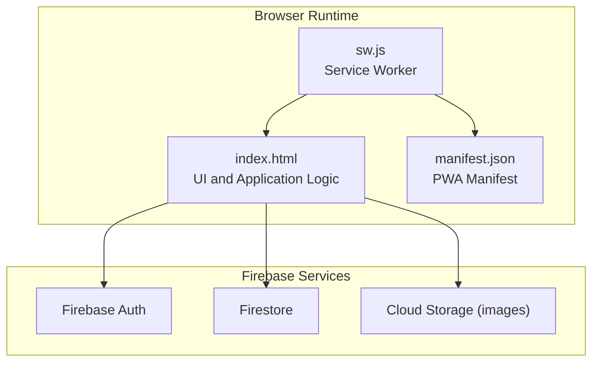
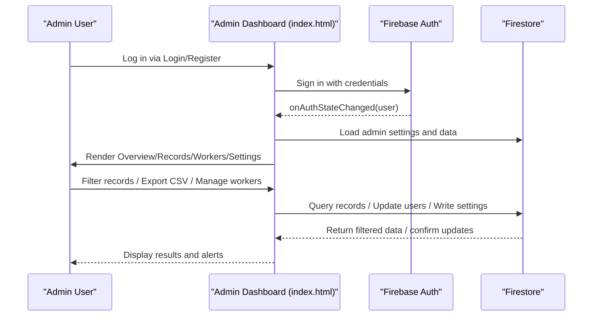
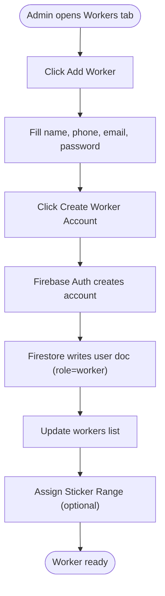
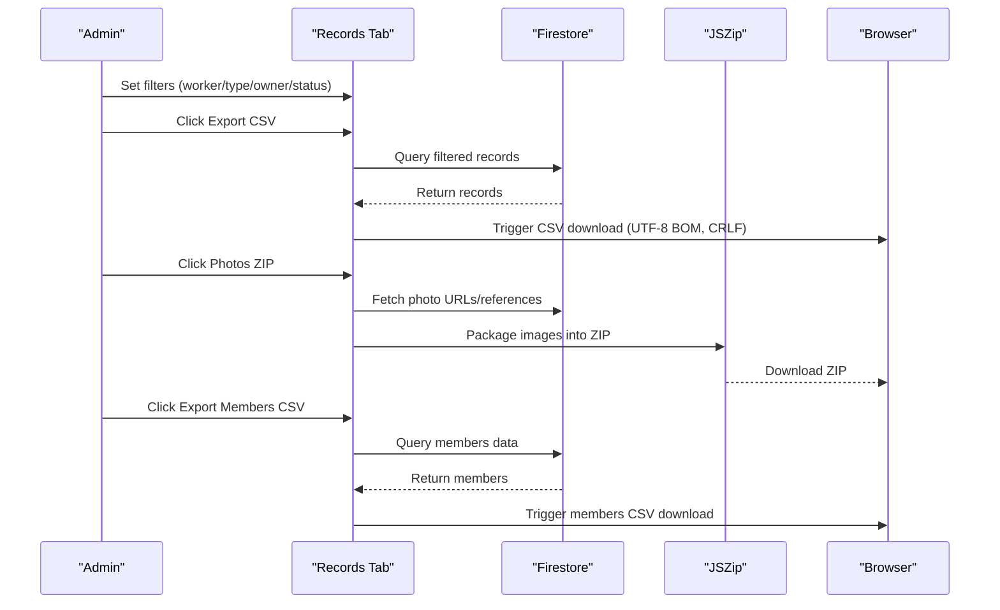
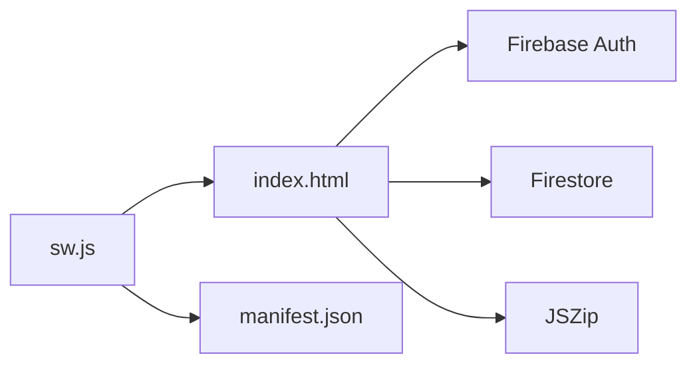

# Administrator Guide

<cite>
**Referenced Files in This Document**
- [README.md](file://README.md)
- [index.html](file://index.html)
- [sw.js](file://sw.js)
- [manifest.json](file://manifest.json)
- [package.json](file://package.json)
- [FUTURE_PLANS.md](file://FUTURE_PLANS.md)
- [test/logic.test.js](file://test/logic.test.js)
</cite>

## Table of Contents
1. [Introduction](#introduction)
2. [Project Structure](#project-structure)
3. [Core Components](#core-components)
4. [Architecture Overview](#architecture-overview)
5. [Detailed Component Analysis](#detailed-component-analysis)
6. [Dependency Analysis](#dependency-analysis)
7. [Performance Considerations](#performance-considerations)
8. [Troubleshooting Guide](#troubleshooting-guide)
9. [Conclusion](#conclusion)
10. [Appendices](#appendices)

## Introduction
This Administrator Guide documents the Property Tax Collector application for administrators managing data collection campaigns. It covers the administration dashboard overview, analytics and reporting capabilities, worker management procedures, and data export functionality. It also explains the worker addition and management process, performance monitoring, range assignments, analytics dashboards, export formats and procedures, system configuration, user role management, correction workflows, and security and maintenance considerations.

## Project Structure
The application is a single-page, offline-capable web app packaged as a Progressive Web App (PWA). It uses Firebase Authentication and Cloud Firestore for identity and data persistence, and a service worker for caching and offline availability.

**Diagram sources**
- [index.html:815-827](file://index.html#L815-L827)
- [sw.js:1-45](file://sw.js#L1-L45)
- [manifest.json:1-28](file://manifest.json#L1-L28)

**Section sources**
- [README.md:1-36](file://README.md#L1-L36)
- [index.html:815-827](file://index.html#L815-L827)
- [sw.js:1-45](file://sw.js#L1-L45)
- [manifest.json:1-28](file://manifest.json#L1-L28)

## Core Components
- Authentication and Authorization
  - Firebase Authentication handles login, registration, and password reset.
  - Admin role is determined by a predefined admin email.
- Data Layer
  - Firestore stores users, records, and related metadata.
  - Images are stored in Cloud Storage; references are kept in Firestore.
- Administration Dashboard
  - Overview tab displays totals, completion percentage, and population analytics.
  - Records tab supports filtering and exporting data.
  - Workers tab manages worker accounts and sticker ranges.
  - Settings tab configures the Village Council name and resets data.
- Worker Management
  - Add/remove/edit workers, assign sticker ranges, and manage profiles.
- Analytics and Reporting
  - Overview and My Work tabs compute completion statistics and population metrics.
  - Export buttons produce CSV and ZIP archives for filtered datasets and members.

**Section sources**
- [index.html:893-947](file://index.html#L893-L947)
- [index.html:488-632](file://index.html#L488-L632)
- [index.html:558-596](file://index.html#L558-L596)
- [index.html:598-611](file://index.html#L598-L611)
- [index.html:613-631](file://index.html#L613-L631)

## Architecture Overview
The admin workflow integrates UI rendering, Firebase authentication and Firestore queries, and export utilities. Administrators use the dashboard to monitor progress, filter and export data, manage workers, and configure settings.

**Diagram sources**
- [index.html:893-947](file://index.html#L893-L947)
- [index.html:558-596](file://index.html#L558-L596)
- [index.html:598-611](file://index.html#L598-L611)
- [index.html:613-631](file://index.html#L613-L631)

## Detailed Component Analysis

### Administration Dashboard Overview
- Navigation
  - Tabs: Overview, Records, Workers, Settings.
- Metrics
  - Total records, today’s count, incomplete, worker count, overall completion percentage.
  - Population and household breakdowns (families, population, children, male, female).
  - Worker activity today.
- Correction Line
  - Highlights admin-flagged correction messages.

**Section sources**
- [index.html:510-556](file://index.html#L510-L556)

### Analytics and Reporting Capabilities
- Overview Tab
  - Completion statistics and population analytics.
- My Work Tab (Worker View)
  - Personal stats: total, complete, absent, today.
  - Property and building type breakdowns.
  - Population and gender analytics.
- Data Validation Utilities
  - Logic tests validate missing fields, absence detection, correction state, and household statistics.

**Section sources**
- [index.html:425-476](file://index.html#L425-L476)
- [test/logic.test.js:23-170](file://test/logic.test.js#L23-L170)

### Worker Management Procedures
- Add Worker
  - Fields: name, phone, email, password.
  - Creates a new Firebase Auth account and a Firestore user document with role “worker”.
- Edit Worker
  - Update name and phone; email is managed by admin.
- Remove Worker
  - Removes from worker list; records remain intact.
- Assign Sticker Range
  - Assign start/end numbers for property ID ranges.
- Profile Management
  - Admin and worker profiles support editing name and password.

**Diagram sources**
- [index.html:993-1009](file://index.html#L993-L1009)
- [index.html:1003-1009](file://index.html#L1003-L1009)
- [index.html:598-611](file://index.html#L598-L611)
- [index.html:706-724](file://index.html#L706-L724)

**Section sources**
- [index.html:993-1009](file://index.html#L993-L1009)
- [index.html:706-724](file://index.html#L706-L724)
- [index.html:680-691](file://index.html#L680-L691)
- [index.html:663-677](file://index.html#L663-L677)

### Data Export Functionality
- Export Buttons
  - Export CSV (filtered records).
  - Photos ZIP (filtered records’ photos).
  - Export Members CSV (members per property).
- Export Formats and Safety
  - CSV generation uses UTF-8 BOM, formula-injection protection, and CRLF line endings.
  - ZIP packaging leverages JSZip for photo bundles.
- Filtering Options
  - Worker, Property Type, Owner Type, Status (Complete, Incomplete, Needs Correction).
- Download Procedure
  - Admin selects filters, clicks export, and downloads generated files.

**Diagram sources**
- [index.html:558-596](file://index.html#L558-L596)
- [index.html:2460-2500](file://index.html#L2460-L2500)
- [index.html:2501-2510](file://index.html#L2501-L2510)

**Section sources**
- [index.html:558-596](file://index.html#L558-L596)
- [index.html:2460-2510](file://index.html#L2460-L2510)
- [README.md:12-12](file://README.md#L12-L12)

### Worker Addition and Management Process
- Registration and Activation
  - Workers register themselves; supervisors activate accounts.
- Sticker Range Assignment
  - Admin assigns numeric ranges for property IDs (e.g., NSN-XXXX).
- Profile Updates
  - Workers and admins can update names; passwords changed via dedicated modal.

**Section sources**
- [index.html:975-991](file://index.html#L975-L991)
- [index.html:706-724](file://index.html#L706-L724)
- [index.html:663-677](file://index.html#L663-L677)
- [index.html:679-691](file://index.html#L679-L691)

### Performance Monitoring
- Completion Metrics
  - Admin Overview tracks total, today, incomplete, and completion percentage.
- Worker Activity
  - Worker activity today card lists recent contributions.
- Personal Metrics
  - Worker My Work tab shows personal stats and population analytics.

**Section sources**
- [index.html:510-556](file://index.html#L510-L556)
- [index.html:425-476](file://index.html#L425-L476)

### Range Assignments
- Purpose
  - Ensures unique property IDs per worker.
- Process
  - Admin opens Assign Range modal, sets start/end numbers, saves.

**Section sources**
- [index.html:706-724](file://index.html#L706-L724)

### Analytics Dashboard Details
- Overview
  - Totals, completion bar, population breakdowns, building/property/owner type distributions.
- Worker Activity
  - Lists today’s activity by worker.
- My Work
  - Personalized stats and population analytics.

**Section sources**
- [index.html:510-556](file://index.html#L510-L556)
- [index.html:425-476](file://index.html#L425-L476)

### Data Export System Details
- CSV Generation
  - Uses UTF-8 BOM, formula-injection protection, CRLF line endings.
- Members CSV
  - Dedicated export for family/member-level details.
- Photos ZIP
  - Bundles photos for filtered records.

**Section sources**
- [index.html:2460-2510](file://index.html#L2460-L2510)
- [README.md:12-12](file://README.md#L12-L12)

### System Configuration and User Role Management
- Admin Role
  - Determined by email equality against a configured admin email.
- App Settings
  - Configure Village Council name; save settings.
- Danger Zone
  - Reset Everything permanently deletes all records and workers (irreversible).

**Section sources**
- [index.html:897-897](file://index.html#L897-L897)
- [index.html:613-631](file://index.html#L613-L631)

### Correction Workflow Processes
- Admin Flags Records
  - Opens Send for Correction modal, specifies fixes (GPS, photo, details).
- Worker Resolves
  - Edits and resubmits; admin reviews.
- Audit History
  - Full audit trail maintained in Firestore.

**Section sources**
- [index.html:641-661](file://index.html#L641-L661)
- [index.html:1598-1610](file://index.html#L1598-L1610)

### Security Considerations
- Authentication
  - Firebase Auth secures sign-in/sign-up/password reset.
- Authorization
  - Admin-only actions gated by admin email check.
- Data Protection
  - CSV generation includes formula-injection protection and uses UTF-8 BOM.
- Privacy
  - Consider multi-tenancy and data separation for future deployments.

**Section sources**
- [index.html:962-973](file://index.html#L962-L973)
- [index.html:975-991](file://index.html#L975-L991)
- [index.html:1598-1610](file://index.html#L1598-L1610)
- [README.md:12-12](file://README.md#L12-L12)
- [FUTURE_PLANS.md:7-36](file://FUTURE_PLANS.md#L7-L36)

### Backup and Maintenance Tasks
- Backup
  - Export all records and members regularly; maintain backups of CSV exports.
- Maintenance
  - Periodically review worker accounts, ranges, and correction queues.
  - Use Reset Everything carefully; export before resetting.

**Section sources**
- [index.html:623-631](file://index.html#L623-L631)

## Dependency Analysis
- Internal Dependencies
  - UI components depend on Firebase Auth and Firestore.
  - Export utilities depend on JSZip for photo bundling.
- External Dependencies
  - Firebase SDKs (auth, firestore).
  - JSZip for ZIP creation.
- PWA Dependencies
  - Service worker caches core assets; manifest defines app metadata.

**Diagram sources**
- [index.html:13-17](file://index.html#L13-L17)
- [index.html](file://index.html#L17)
- [sw.js:1-45](file://sw.js#L1-L45)
- [manifest.json:1-28](file://manifest.json#L1-L28)

**Section sources**
- [index.html:13-17](file://index.html#L13-L17)
- [sw.js:1-45](file://sw.js#L1-L45)
- [manifest.json:1-28](file://manifest.json#L1-L28)

## Performance Considerations
- Offline Availability
  - Service worker caches core resources to enable offline operation.
- Image Handling
  - Photos are resized and stamped before upload; EXIF orientation is corrected.
- Export Scalability
  - Large exports may be memory-intensive; filter datasets before exporting.

**Section sources**
- [sw.js:12-29](file://sw.js#L12-L29)
- [index.html:1838-1949](file://index.html#L1838-L1949)

## Troubleshooting Guide
- Authentication Issues
  - Verify credentials and network connectivity; use forgot password modal.
- Export Failures
  - Ensure filters are set appropriately; check browser download prompts.
- Photo Problems
  - Confirm camera permissions and device compatibility; verify GPS accuracy.
- Data Reset
  - Use Reset Everything with extreme caution; export before resetting.

**Section sources**
- [index.html:962-973](file://index.html#L962-L973)
- [index.html:741-754](file://index.html#L741-L754)
- [index.html:623-631](file://index.html#L623-L631)

## Conclusion
Administrators can efficiently manage data collection campaigns using the Property Tax Collector dashboard. The system provides robust analytics, secure worker management, and reliable export capabilities. Adhering to the outlined procedures ensures smooth operations, data integrity, and compliance with security and privacy expectations.

## Appendices
- Administrative Reports Examples
  - Overview summary: totals, completion percentage, population analytics.
  - Worker performance evaluation: daily counts, property type distribution, population metrics.
  - Data quality assessment: missing fields, correction queue, audit history.
- Version and Metadata
  - App version and metadata are embedded in the UI and manifest.

**Section sources**
- [index.html:860-865](file://index.html#L860-L865)
- [package.json:1-10](file://package.json#L1-L10)