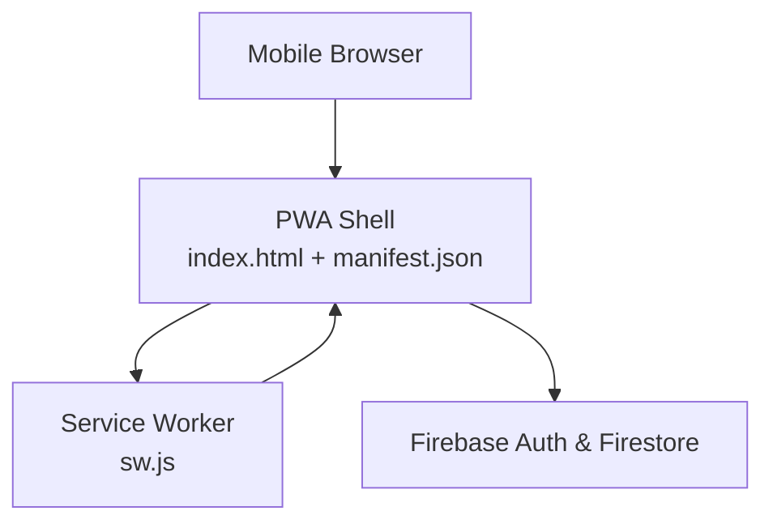
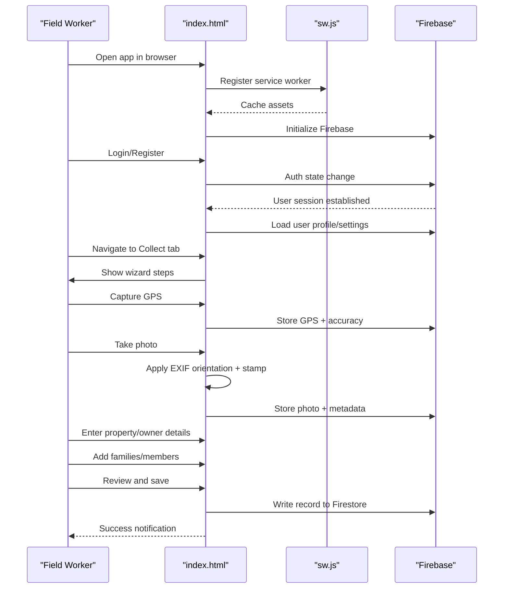
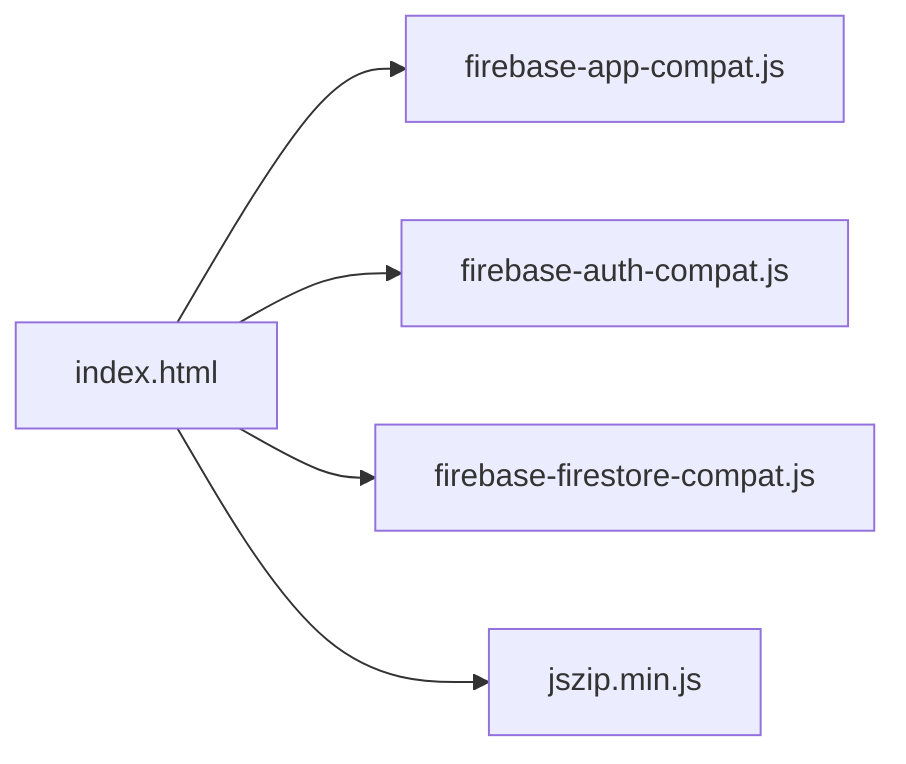

# Field Worker Guide

<cite>
**Referenced Files in This Document**
- [index.html](file://index.html)
- [README.md](file://README.md)
- [package.json](file://package.json)
- [manifest.json](file://manifest.json)
- [sw.js](file://sw.js)
- [test/logic.test.js](file://test/logic.test.js)
- [FUTURE_PLANS.md](file://FUTURE_PLANS.md)
</cite>

## Table of Contents
1. [Introduction](#introduction)
2. [Project Structure](#project-structure)
3. [Core Components](#core-components)
4. [Architecture Overview](#architecture-overview)
5. [Detailed Component Analysis](#detailed-component-analysis)
6. [Dependency Analysis](#dependency-analysis)
7. [Performance Considerations](#performance-considerations)
8. [Troubleshooting Guide](#troubleshooting-guide)
9. [Conclusion](#conclusion)
10. [Appendices](#appendices)

## Introduction
This guide explains how to use the Property Tax Collector application as a field worker. It covers authentication, navigating the dashboard, and the end-to-end property data collection workflow. You will learn how to capture GPS location, take photos with automatic EXIF orientation handling and a property stamp, enter owner/occupant details, collect household demographics, validate and review your entries, and save records. Practical examples and troubleshooting tips help you work efficiently in rural conditions.

## Project Structure
The application is a single-page web app packaged as a Progressive Web App (PWA). It uses Firebase for authentication and data persistence, and a service worker for offline caching.

**Diagram sources**
- [index.html:867-878](file://index.html#L867-L878)
- [sw.js:1-45](file://sw.js#L1-L45)
- [index.html:814-880](file://index.html#L814-L880)

**Section sources**
- [README.md:1-36](file://README.md#L1-L36)
- [package.json:1-10](file://package.json#L1-L10)
- [manifest.json:1-28](file://manifest.json#L1-L28)
- [sw.js:1-45](file://sw.js#L1-L45)
- [index.html:814-880](file://index.html#L814-L880)

## Core Components
- Authentication and user roles: login/register, worker/admin roles, password reset, profile management.
- Data collection wizard: Property → Location & Photo → Occupant → Households → Review.
- GPS capture with accuracy feedback.
- Camera integration with EXIF orientation handling and automatic photo stamping.
- Household demographic entry with family head identification and auto-counts.
- Validation, review, and saving with follow-up and correction workflows.
- Export capabilities for CSV and ZIP of photos.

**Section sources**
- [index.html:892-947](file://index.html#L892-L947)
- [index.html:1255-1341](file://index.html#L1255-L1341)
- [index.html:1751-1948](file://index.html#L1751-L1948)
- [index.html:1240-1465](file://index.html#L1240-L1465)
- [index.html:1484-1623](file://index.html#L1484-L1623)
- [index.html:2353-2520](file://index.html#L2353-L2520)

## Architecture Overview
The app runs entirely in the browser. On startup, it registers a service worker to cache assets for offline use. Authentication is handled by Firebase Auth, and Firestore stores user profiles, records, and settings. The main UI is a wizard-driven form with tabs for collecting, reviewing, and exporting data.

**Diagram sources**
- [index.html:867-878](file://index.html#L867-L878)
- [index.html:814-880](file://index.html#L814-L880)
- [index.html:1926-1948](file://index.html#L1926-L1948)
- [index.html:1838-1916](file://index.html#L1838-L1916)
- [index.html:1484-1623](file://index.html#L1484-L1623)

## Detailed Component Analysis

### Authentication and User Management
- Login and registration screens support email/password and password reset.
- Worker accounts are created with role “worker”; admin is identified by a configured email.
- Worker profile includes name, phone, and assigned sticker range (NSN-XXXX).
- Password change requires re-authentication.

Key behaviors:
- Friendly error messages for common auth failures.
- Auto-heal for missing worker profiles on sign-in.
- Logout confirmation modal.

**Section sources**
- [index.html:962-991](file://index.html#L962-L991)
- [index.html:993-1018](file://index.html#L993-L1018)
- [index.html:1071-1089](file://index.html#L1071-L1089)
- [index.html:1166-1196](file://index.html#L1166-L1196)
- [index.html:948-952](file://index.html#L948-L952)
- [index.html:1199-1206](file://index.html#L1199-L1206)

### Dashboard Navigation
- Bottom navigation tabs: Collect, My Work, Follow Up.
- Collect tab hosts the guided wizard.
- My Work tab shows your statistics and records.
- Follow Up tab lists records requiring correction or missing details.

**Section sources**
- [index.html:275-279](file://index.html#L275-L279)
- [index.html:281-423](file://index.html#L281-L423)
- [index.html:425-486](file://index.html#L425-L486)
- [index.html:478-486](file://index.html#L478-L486)

### Property Information Entry (Wizard)
The wizard guides you through five steps:

1) Property details
- Property ID: 4-digit number; NSN- prefix is applied automatically.
- Property Type: Residential, Commercial, Mixed Use, Institutional/Public.
- Owner Type: Individual, Religious, NGO, Government.
- Building Type: RCC, Semi RCC, Assam Type.

2) Location & Photo
- Capture GPS with accuracy indicator.
- Take a photo; the app applies EXIF orientation and stamps the image with property ID, GPS coordinates, timestamp, and village council name.

3) Occupant
- For individuals: Owner name, Father/Husband name, Contact number.
- For institutions: Organization name, Contact person, Designation, Contact number.

4) Households (residential/mixed use only)
- Add families; the first member of each family is the head.
- Add members with name, gender, age, and relation to head.
- Auto-summary shows families, population, children, and gender counts.

5) Review & Save
- Review all fields; correct any mistakes by tapping edit links.
- Save and sync to Firestore.

Validation highlights required fields and enforces GPS/photo presence before moving forward.

**Section sources**
- [index.html:291-328](file://index.html#L291-L328)
- [index.html:330-353](file://index.html#L330-L353)
- [index.html:355-394](file://index.html#L355-L394)
- [index.html:396-403](file://index.html#L396-L403)
- [index.html:405-422](file://index.html#L405-L422)
- [index.html:1315-1341](file://index.html#L1315-L1341)
- [index.html:1343-1375](file://index.html#L1343-L1375)
- [index.html:1240-1253](file://index.html#L1240-L1253)
- [index.html:1415-1452](file://index.html#L1415-L1452)
- [index.html:1454-1465](file://index.html#L1454-L1465)

### GPS Location Capture
- Uses browser geolocation with high accuracy settings.
- Displays coordinates and accuracy in meters.
- Clears previous values when resetting.

Accuracy indicators:
- Success: shows coordinates and accuracy.
- Error: prompts enabling location services.

**Section sources**
- [index.html:1926-1948](file://index.html#L1926-L1948)
- [index.html:1944-1948](file://index.html#L1944-L1948)

### Camera Integration and Photo Capture
- Opens device camera to capture a photo.
- Reads EXIF orientation from the JPEG buffer.
- Draws the image on a canvas, applying transforms to make it upright.
- Stamps the image with property ID, GPS coordinates, timestamp, and village council name.
- Compresses and displays the final photo.

Photo status:
- Needed: no photo taken yet.
- OK: photo captured and stamped.

**Section sources**
- [index.html:1838-1916](file://index.html#L1838-L1916)
- [test/logic.test.js:171-222](file://test/logic.test.js#L171-L222)

### Household Demographic Entry
- Families are added per property; each family’s ID is derived from the property ID (e.g., NSN-0001/1).
- The head of the family is the first member with relation “Head”.
- Members include name, gender, age, and relation to head.
- Auto-counts: families, population, children (age < 18), and gender distribution.

**Section sources**
- [index.html:1240-1253](file://index.html#L1240-L1253)
- [index.html:1381-1382](file://index.html#L1381-L1382)
- [index.html:1384-1386](file://index.html#L1384-L1386)
- [index.html:1415-1452](file://index.html#L1415-L1452)
- [index.html:1809-1829](file://index.html#L1809-L1829)

### Form Validation and Review
- Per-step validation enforces required fields.
- GPS and photo are mandatory before advancing.
- Review screen shows a summary of all inputs and allows editing specific steps.
- Absent records are flagged if owner/institution details are missing.

**Section sources**
- [index.html:1315-1341](file://index.html#L1315-L1341)
- [index.html:1343-1375](file://index.html#L1343-L1375)
- [index.html:1506-1515](file://index.html#L1506-L1515)

### Saving Records and Follow-Up
- Saves to Firestore with metadata: property ID, type, owner category, building type, GPS, accuracy, photo, families, remarks, worker info, timestamps.
- Duplicate detection prevents saving identical property IDs.
- Range check ensures the entered Property ID falls within your assigned sticker range.
- After save, a success overlay appears; the form resets for the next property.

**Section sources**
- [index.html:1484-1623](file://index.html#L1484-L1623)
- [index.html:1518-1525](file://index.html#L1518-L1525)
- [index.html:1530-1545](file://index.html#L1530-L1545)
- [index.html:2570-2583](file://index.html#L2570-L2583)

### Exporting Data
- Export CSV of records with property details, owner info, GPS accuracy, remarks, and household stats.
- Export members CSV with one row per family member.
- Export photos as a ZIP archive.

**Section sources**
- [index.html:2353-2362](file://index.html#L2353-L2362)
- [index.html:2461-2520](file://index.html#L2461-L2520)
- [index.html:2400-2432](file://index.html#L2400-L2432)

## Dependency Analysis
- External libraries:
  - Firebase SDKs for app, auth, and Firestore.
  - JSZip for photo export.
- Internal dependencies:
  - Wizard logic, validation, photo processing, and export utilities are embedded in the HTML.

**Diagram sources**
- [index.html:14-17](file://index.html#L14-L17)
- [sw.js:6-9](file://sw.js#L6-L9)

**Section sources**
- [index.html:14-17](file://index.html#L14-L17)
- [sw.js:6-9](file://sw.js#L6-L9)

## Performance Considerations
- Offline-first: service worker caches core assets for offline use.
- Lightweight: single HTML file with inline styles and scripts.
- Efficient photo handling: canvas scaling and compression reduce upload sizes.
- Minimal network requests: relies on Firestore for all data operations.

Practical tips:
- Use airplane mode to verify offline capability.
- Ensure good lighting for photos to minimize retakes.
- Stand still and wait for GPS accuracy before capturing.

**Section sources**
- [sw.js:1-45](file://sw.js#L1-L45)
- [index.html:1849-1854](file://index.html#L1849-L1854)
- [index.html:1926-1948](file://index.html#L1926-L1948)

## Troubleshooting Guide

Common issues and resolutions:

- GPS accuracy problems
  - Symptoms: low accuracy or repeated prompts.
  - Actions: stand still, wait for satellite lock, enable high accuracy, retry.
  - Reference: [index.html:1926-1948](file://index.html#L1926-L1948)

- Photo quality or orientation issues
  - Symptoms: blurry images or rotated photos.
  - Actions: ensure camera is steady, hold phone upright, allow EXIF orientation to be processed.
  - Reference: [index.html:1838-1916](file://index.html#L1838-L1916), [test/logic.test.js:171-222](file://test/logic.test.js#L171-L222)

- Form validation errors
  - Symptoms: alerts indicating missing required fields.
  - Actions: fill all required fields (Property ID, Property Type, Owner Type, Building Type, GPS, Photo), then proceed.
  - Reference: [index.html:1315-1341](file://index.html#L1315-L1341)

- Duplicate Property ID
  - Symptoms: error about existing property ID.
  - Actions: verify sticker number, ensure uniqueness, or edit existing record.
  - Reference: [index.html:1530-1545](file://index.html#L1530-L1545)

- Sticker range mismatch
  - Symptoms: error about sticker number outside assigned range.
  - Actions: check your assigned range and re-enter the correct Property ID.
  - Reference: [index.html:1518-1525](file://index.html#L1518-L1525), [index.html:1469-1482](file://index.html#L1469-L1482)

- Export failures
  - Symptoms: alert about missing library or photos.
  - Actions: ensure online connectivity, verify records have photos, retry export.
  - Reference: [index.html:2400-2432](file://index.html#L2400-L2432), [index.html:2359-2361](file://index.html#L2359-L2361)

Best practices for rural field conditions:
- Carry a charged device with cellular data off and Wi-Fi on for initial sync.
- Use the Follow Up tab to revisit incomplete records.
- Keep the app updated; version is shown in footer and auth screen.
- Use the Review step to catch errors before saving.

**Section sources**
- [index.html:1926-1948](file://index.html#L1926-L1948)
- [index.html:1838-1916](file://index.html#L1838-L1916)
- [test/logic.test.js:171-222](file://test/logic.test.js#L171-L222)
- [index.html:1315-1341](file://index.html#L1315-L1341)
- [index.html:1530-1545](file://index.html#L1530-L1545)
- [index.html:1518-1525](file://index.html#L1518-L1525)
- [index.html:1469-1482](file://index.html#L1469-L1482)
- [index.html:2400-2432](file://index.html#L2400-L2432)
- [index.html:2359-2361](file://index.html#L2359-L2361)
- [index.html:2570-2583](file://index.html#L2570-L2583)

## Conclusion
The Property Tax Collector app streamlines field data collection with a guided wizard, robust validation, and offline-first capabilities. By following the steps outlined here—logging in, capturing GPS and photos, entering property and household details, reviewing, and saving—you can efficiently collect accurate property tax data even in challenging environments. Use the Follow Up tab to manage corrections and rely on exports for reporting.

## Appendices

### Practical Examples
- Property types: Residential, Commercial, Mixed Use, Institutional/Public.
- Owner classifications: Individual, Religious, NGO, Government.
- Building materials: RCC, Semi RCC, Assam Type.
- Family head identification: The first member of a family is the head; if not explicitly labeled, the first member becomes the head.

**Section sources**
- [index.html:300-307](file://index.html#L300-L307)
- [index.html:311-317](file://index.html#L311-L317)
- [index.html:321-326](file://index.html#L321-L326)
- [index.html:1384-1386](file://index.html#L1384-L1386)

### Version and Background
- App version is displayed in the footer and auth screen.
- Created for Village Council Property Tax Collection.

**Section sources**
- [index.html:860-865](file://index.html#L860-L865)
- [README.md:35-36](file://README.md#L35-L36)