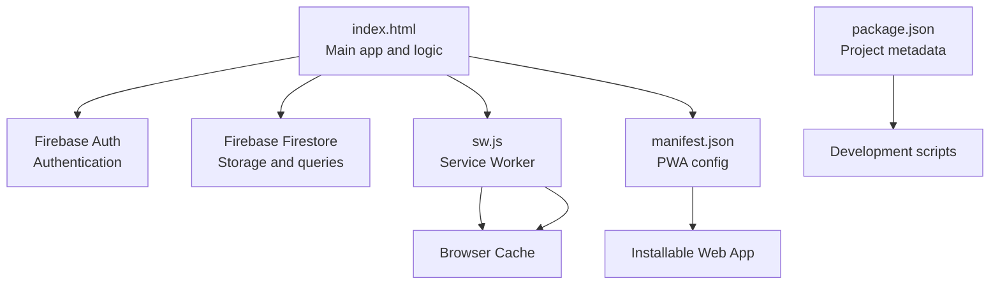
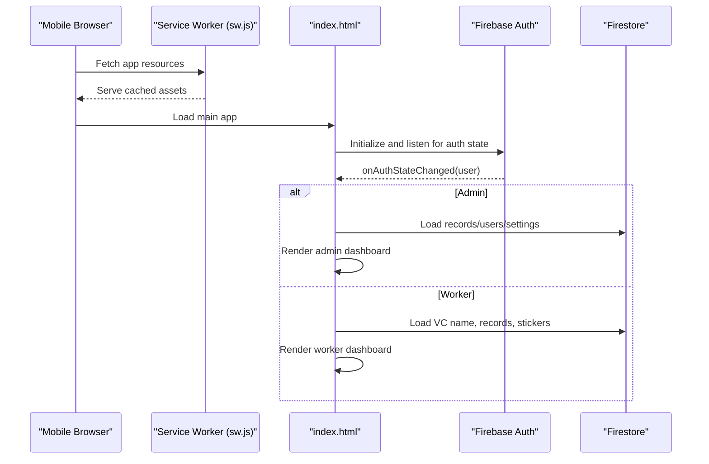
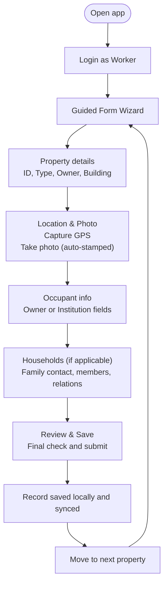
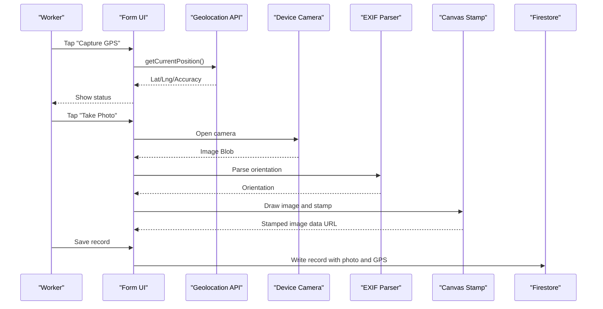
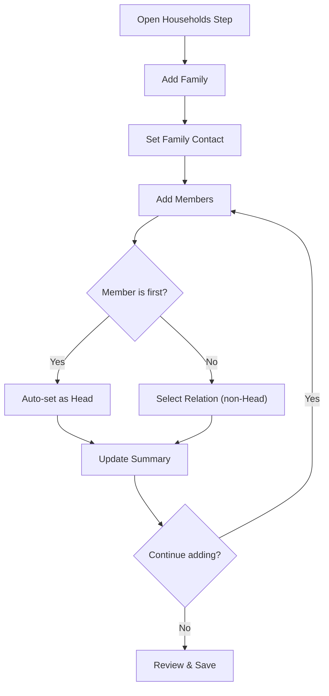
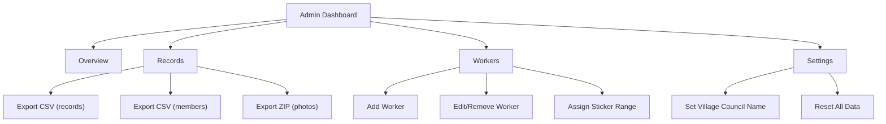
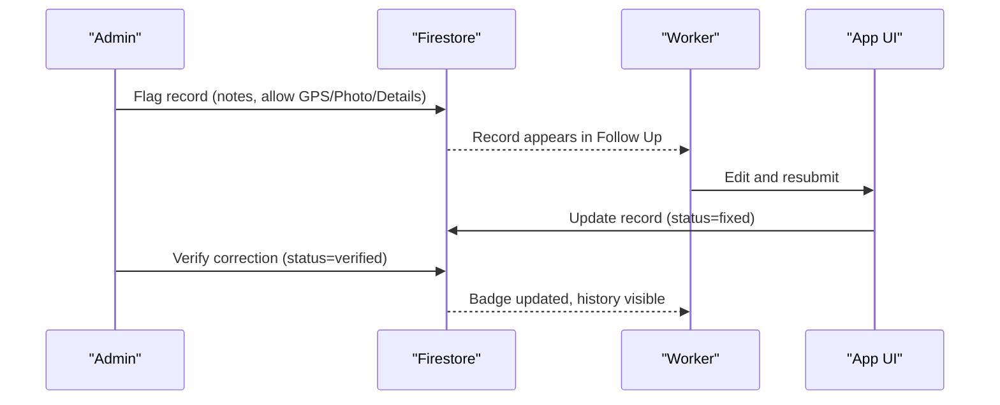
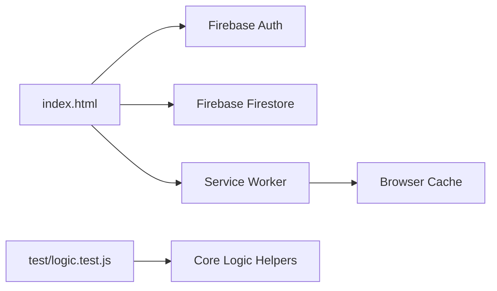

# User Guide

<cite>
**Referenced Files in This Document**
- [README.md](file://README.md)
- [index.html](file://index.html)
- [sw.js](file://sw.js)
- [manifest.json](file://manifest.json)
- [package.json](file://package.json)
- [test/logic.test.js](file://test/logic.test.js)
</cite>

## Table of Contents
1. [Introduction](#introduction)
2. [Project Structure](#project-structure)
3. [Core Components](#core-components)
4. [Architecture Overview](#architecture-overview)
5. [Detailed Component Analysis](#detailed-component-analysis)
6. [Dependency Analysis](#dependency-analysis)
7. [Performance Considerations](#performance-considerations)
8. [Troubleshooting Guide](#troubleshooting-guide)
9. [Conclusion](#con conclusion)
10. [Appendices](#appendices)

## Introduction
Property Tax Collector is a mobile-friendly, offline-capable web application designed for door-to-door property tax data collection. It captures property details, GPS location, photos, and household demographics, and supports a correction workflow with audit history. Administrators can manage workers, monitor progress, export data, and oversee quality control.

Key capabilities:
- Offline-first operation via a service worker
- GPS location capture and photo stamping with metadata
- Guided, step-by-step form wizard
- Household/family entry with auto-derived counts
- CSV export with safety measures and ZIP export for photos
- Correction workflow: admin flags → worker fixes → admin verifies
- Worker and admin dashboards with analytics and filtering

**Section sources**
- [README.md:1-36](file://README.md#L1-L36)

## Project Structure
The application is delivered as a single HTML file with embedded styles, scripts, and logic. Supporting assets include a manifest for Progressive Web App behavior and a service worker for caching.

**Diagram sources**
- [index.html:815-880](file://index.html#L815-L880)
- [sw.js:1-41](file://sw.js#L1-L41)
- [manifest.json:1-28](file://manifest.json#L1-L28)
- [package.json:1-10](file://package.json#L1-L10)

**Section sources**
- [index.html:815-880](file://index.html#L815-L880)
- [sw.js:1-41](file://sw.js#L1-L41)
- [manifest.json:1-28](file://manifest.json#L1-L28)
- [package.json:1-10](file://package.json#L1-L10)

## Core Components
- Authentication and routing
  - Login/register screens and role-based view switching (worker/admin)
  - Firebase Authentication and Firestore integration
- Data collection wizard
  - Property details, location/photo capture, occupant info, households, and review/save
- Data rendering and summaries
  - Worker My Work dashboard, Follow Up tab, and admin Overview/Records/Workers/Settings
- Export and admin tools
  - CSV exports (records and members), ZIP of photos, worker management, and settings

**Section sources**
- [index.html:892-947](file://index.html#L892-L947)
- [index.html:1255-1341](file://index.html#L1255-L1341)
- [index.html:1947-2045](file://index.html#L1947-L2045)
- [index.html:2206-2382](file://index.html#L2206-L2382)
- [index.html:2384-2507](file://index.html#L2384-L2507)

## Architecture Overview
The app uses a client-side architecture with Firebase for identity and persistence. The service worker enables offline availability, and the PWA manifest allows installation on devices.

**Diagram sources**
- [index.html:892-947](file://index.html#L892-L947)
- [index.html:867-880](file://index.html#L867-L880)
- [sw.js:15-25](file://sw.js#L15-L25)

## Detailed Component Analysis

### Field Worker Workflow
End-to-end data collection from property entry to saving.

- Property ID normalization and validation
  - Accepts numeric input; auto-prefixed with NSN- and zero-padded to four digits
  - Required fields: property type, owner category, building type
- GPS and photo capture
  - High-accuracy geolocation capture with status feedback
  - Photo taken via device camera, auto-stamped with property ID, GPS, timestamp, and village council name
- Occupant section
  - Conditional fields: owner/institution depending on owner category
- Households section
  - Optional for vacant properties
  - Family head defaults to first member; relations auto-derived
- Review and save
  - Final validation gates: GPS and photo required
  - Save triggers Firestore write and local updates

**Diagram sources**
- [index.html:1255-1341](file://index.html#L1255-L1341)
- [index.html:1316-1341](file://index.html#L1316-L1341)
- [index.html:1835-1913](file://index.html#L1835-L1913)
- [index.html:1923-1939](file://index.html#L1923-L1939)
- [index.html:1483-1520](file://index.html#L1483-L1520)

**Section sources**
- [index.html:1255-1341](file://index.html#L1255-L1341)
- [index.html:1316-1341](file://index.html#L1316-L1341)
- [index.html:1835-1913](file://index.html#L1835-L1913)
- [index.html:1923-1939](file://index.html#L1923-L1939)
- [index.html:1483-1520](file://index.html#L1483-L1520)

### GPS and Photo Capture
- GPS
  - Uses high-accuracy mode with timeout and maximum age
  - Displays latitude/longitude and accuracy
- Photo
  - Reads EXIF orientation to correct rotation
  - Draws a semi-transparent banner with property ID, GPS, timestamp, and village council name
  - Compresses image and previews before saving

**Diagram sources**
- [index.html:1923-1939](file://index.html#L1923-L1939)
- [index.html:1835-1913](file://index.html#L1835-L1913)
- [index.html:1755-1784](file://index.html#L1755-L1784)

**Section sources**
- [index.html:1923-1939](file://index.html#L1923-L1939)
- [index.html:1835-1913](file://index.html#L1835-L1913)
- [test/logic.test.js:160-212](file://test/logic.test.js#L160-L212)

### Household Demographics Entry
- Families and members
  - Each family can have a contact number and a list of members
  - First member is the head by default; relations include Head and others
- Auto-derived statistics
  - Families, population, children (<18), males, females, others
- Validation and editing
  - Required fields validated per owner type
  - Editable until review step

**Diagram sources**
- [index.html:1388-1449](file://index.html#L1388-L1449)
- [index.html:1809-1826](file://index.html#L1809-L1826)

**Section sources**
- [index.html:1388-1449](file://index.html#L1388-L1449)
- [index.html:1809-1826](file://index.html#L1809-L1826)

### Review and Validation
- Review screen aggregates all inputs and highlights completeness
- Validation gates:
  - Property step: all required fields
  - Location step: GPS and photo present
- Save writes to Firestore and updates local counters and badges

**Section sources**
- [index.html:1316-1341](file://index.html#L1316-L1341)
- [index.html:1343-1375](file://index.html#L1343-L1375)
- [index.html:1483-1520](file://index.html#L1483-L1520)

### Administration Dashboard
- Overview
  - Totals, completion percentage, breakdowns by building/type/owner, population stats, worker activity today
- Records
  - Filter by worker, property type, owner type, status
  - Export CSV (records), CSV (members), ZIP of photos
- Workers
  - Add worker accounts, edit/remove, assign sticker ranges
- Settings
  - Update village council name, reset all data (danger zone)

**Diagram sources**
- [index.html:503-631](file://index.html#L503-L631)
- [index.html:2321-2382](file://index.html#L2321-L2382)
- [index.html:2384-2507](file://index.html#L2384-L2507)

**Section sources**
- [index.html:503-631](file://index.html#L503-L631)
- [index.html:2321-2382](file://index.html#L2321-L2382)
- [index.html:2384-2507](file://index.html#L2384-L2507)

### Correction Workflow and Audit Trail
- Admin flags records needing correction with notes and allowed redo actions
- Worker receives Follow Up item; edits and resubmits
- Admin verifies corrections; record history tracks status changes

**Diagram sources**
- [index.html:2138-2188](file://index.html#L2138-L2188)
- [index.html:2031-2045](file://index.html#L2031-L2045)
- [index.html:1785-1832](file://index.html#L1785-L1832)

**Section sources**
- [index.html:2138-2188](file://index.html#L2138-L2188)
- [index.html:2031-2045](file://index.html#L2031-L2045)
- [index.html:1785-1832](file://index.html#L1785-L1832)

### Export and Reporting
- CSV exports
  - Records CSV: includes property ID, location, types, status, missing fields, owner info, GPS accuracy, remarks, counts, worker, timestamp
  - Members CSV: one row per family member with family ID and relations
- Photo ZIP export
  - Downloads a ZIP of photos filtered by current selections
- Formula-injection protection and encoding
  - CSV cells are quoted and escaped; leading special characters are neutralized

**Section sources**
- [index.html:2448-2486](file://index.html#L2448-L2486)
- [index.html:2488-2507](file://index.html#L2488-L2507)
- [index.html:2384-2419](file://index.html#L2384-L2419)

## Dependency Analysis
- Firebase
  - Authentication and Firestore are initialized and used throughout
- Service Worker and PWA
  - Caches core assets for offline use
- Testing
  - Logic tests validate core helpers in isolation

**Diagram sources**
- [index.html:815-880](file://index.html#L815-L880)
- [sw.js:15-25](file://sw.js#L15-L25)
- [test/logic.test.js:12-19](file://test/logic.test.js#L12-L19)

**Section sources**
- [index.html:815-880](file://index.html#L815-L880)
- [sw.js:15-25](file://sw.js#L15-L25)
- [test/logic.test.js:12-19](file://test/logic.test.js#L12-L19)

## Performance Considerations
- Offline readiness
  - Service worker caches core pages; ensure connectivity for initial load and subsequent updates
- Image handling
  - Photos are resized and compressed before saving; EXIF orientation parsing adds minimal overhead
- Real-time listeners
  - Admin and worker dashboards subscribe to Firestore snapshots; unsubscribe when leaving tabs to reduce bandwidth
- Filtering and export
  - Export operates on filtered sets; large exports may take time and memory

[No sources needed since this section provides general guidance]

## Troubleshooting Guide
- GPS not supported or permission denied
  - Ensure device supports geolocation and permissions are granted
- Photo not captured or preview blank
  - Retake photo at the property; ensure camera access is allowed
- Missing required fields on save
  - Review the “Missing” indicators in the Follow Up tab and record detail view
- Cannot log in or register
  - Confirm credentials and network connectivity; check alerts for specific errors
- Export fails
  - Ensure filters yield results; verify internet connection for photo ZIP; retry with smaller sets

**Section sources**
- [index.html:1923-1939](file://index.html#L1923-L1939)
- [index.html:1835-1913](file://index.html#L1835-L1913)
- [index.html:2138-2188](file://index.html#L2138-L2188)

## Conclusion
Property Tax Collector streamlines field data collection with a guided form, robust offline support, and a clear correction workflow. Administrators gain powerful analytics, filtering, and export tools, while workers benefit from intuitive navigation and immediate feedback.

[No sources needed since this section summarizes without analyzing specific files]

## Appendices

### Best Practices and Tips
- Efficient data collection
  - Stand at the property when capturing GPS and taking photos
  - Fill occupant details accurately to avoid follow-ups
  - Use the Review step to catch missing fields before saving
- Worker tips
  - Keep the Follow Up tab handy; address corrections promptly
  - Use stickers consistently to avoid ID mismatches
- Administrative tips
  - Use filters to isolate incomplete or correction-pending records
  - Export daily summaries and share with supervisors
  - Assign sticker ranges to workers to minimize ID collisions

[No sources needed since this section provides general guidance]